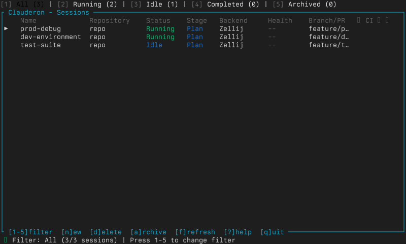
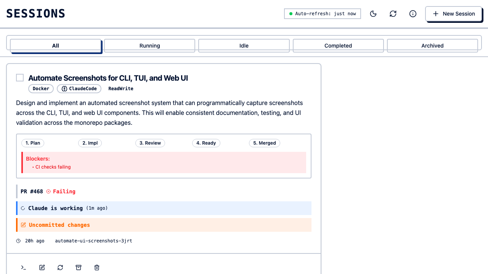

**clauderon** manages AI coding agent sessions from one place — terminal, browser, or phone.

Run Claude Code, Codex, and Gemini side by side. Monitor from any device. Switch backends for different isolation needs.

## Features

- **Agents**: Claude Code (default), Codex, Gemini
- **Interfaces**: TUI, Web UI (`localhost:3030`), Mobile, CLI
- **Backends**: Zellij (lightweight, host tools) or Docker (full isolation)
- **Security**: Audit logging
- **Persistence**: SQLite storage, session archiving, resume across restarts





## Architecture

```
┌─────────────────────────────────────┐
│           clauderon daemon          │
├─────────────────────────────────────┤
│  HTTP API :3030  │ Session Manager  │
└─────────────────────────────────────┘
       │                    │
       ▼                    ▼
   Web/Mobile/TUI     Docker/Zellij
                       Backends
```

## Quick Example

```bash
clauderon daemon
clauderon create --repo ~/my-project --prompt "Fix the login bug"
clauderon list
clauderon attach <session-name>
```

Next: [Installation](/getting-started/installation/)
