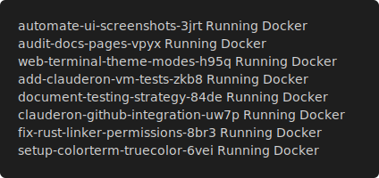

## 1. Start the Daemon

```bash
clauderon daemon
```

## 2. Create a Session

```bash
clauderon create --repo ~/my-project --prompt "Fix the login bug"
```

Options: `--backend` (zellij/docker), `--agent` (claude/codex/gemini).

Or use the TUI (`clauderon tui`, press `n`) or Web UI (`http://localhost:3030`).


## 3. Session Lifecycle

```bash
clauderon list                        # List sessions
clauderon list --archived             # Include archived
clauderon attach <session-name>       # Attach to terminal
clauderon archive <session-name>      # Hide but preserve
clauderon delete <session-name>       # Delete permanently
```



## Example Workflows

```bash
# Docker-isolated session
clauderon create --backend docker --repo ~/project --prompt "Refactor database layer"
```
