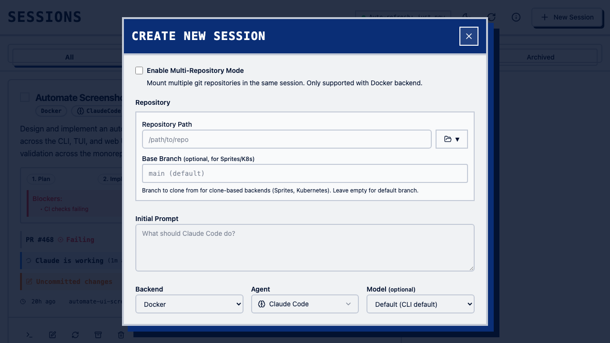

import { Card, CardGrid } from "@astrojs/starlight/components";

<CardGrid stagger>
  <Card title="Multi-Agent Support" icon="star">
    Claude Code, Codex, and Gemini from one interface.
  </Card>

<Card title="Access Anywhere" icon="laptop">
  TUI, Web UI, Mobile, or CLI.
</Card>

<Card title="Multiple Backends" icon="rocket">
  Docker or Zellij — choose your isolation level.
</Card>

  <Card title="Session Management" icon="shield">
    SQLite persistence, session archiving, and resume across restarts.
  </Card>
</CardGrid>

## Terminal UI


## Web UI





## Quick Install

```bash
curl -fsSL https://github.com/shepherdjerred/monorepo/releases/latest/download/clauderon-linux-x86_64 -o clauderon
chmod +x clauderon && sudo mv clauderon /usr/local/bin/
clauderon daemon
```
