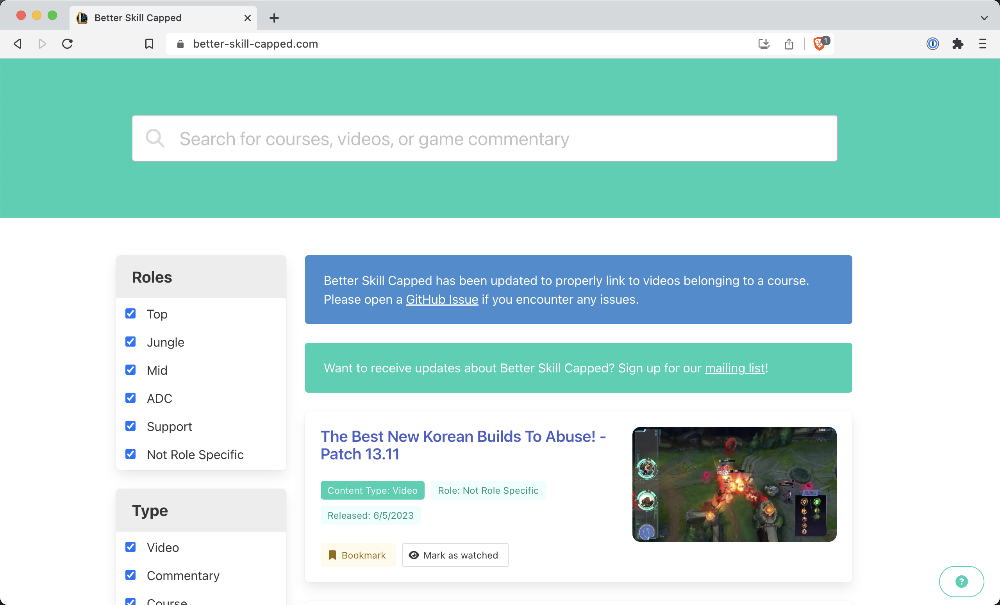

# Better Skill Capped

[Skill Capped](https://www.skill-capped.com/) has some great content, but the website leaves much to be desired. It doesn't have search functionality, the video player is minimal, and figuring out what to watch next is more difficult than it should be.

Luckily Skill Capped provides a manifest of all their video data embeded right into the HTML they serve! This is a small React app that renders the video data in a nice interface.



## Commands

```bash
cd packages/better-skill-capped
bun run start       # Vite dev server (--host); /data proxies to production
bun run build       # production build to dist/
bun run test        # bun test
bun run lint        # eslint .
bun run typecheck   # tsc --noEmit
bun run deploy      # bun ../../scripts/deploy-site.ts better-skill-capped
```

`deploy` syncs `dist/` to the `better-skill-capped` SeaweedFS bucket serving
<https://better-skill-capped.com>. The deploy excludes `data/*`: a Temporal
workflow refreshes `data/manifest.json` daily, and the SPA fetches it at
runtime.

## Architecture

React 19 + TanStack Query/Router + Tailwind v4 (shadcn on Base UI) + Orama
search. Data flows manifest → parser → search index → UI:

- **Manifest**: TanStack Query fetches `/data/manifest.json`, validates it
  with the strict Zod schema in `src/parser/manifest.ts`, and persists it via
  the localStorage persister. `MANIFEST_SCHEMA_VERSION` busts the cache on
  schema changes instead of crashing on stale data.
- **Domain model**: `src/parser/parser.ts` is a pure `parseManifest` into the
  `kind`-discriminated union in `src/model/content.ts` (videos, courses with
  tags/curation badges, commentaries with matchup/KDA/coach data, staff,
  patch info).
- **Search**: `src/search/` builds one Orama index per manifest (BM25 field
  boosts, typo tolerance, champion-name normalization so "kaisa" matches
  Kai'Sa) and `runSearch` layers facet counts, localStorage-backed
  watched/bookmark post-filters, sorting, and pagination on top.
- **Routing**: TanStack Router (`src/routes/`) keeps the entire search state
  — query, facets, tri-state watched/bookmarked, sort, page — in typed URL
  search params, so every view is shareable. `/course/:uuid` serves course
  detail pages.
- **User state**: `src/storage/` versioned localStorage stores
  (`bsc.bookmarks.v2`, `bsc.watch-status.v2`) hold `{uuid, kind, timestamp}`
  entries behind strict Zod schemas, with a one-time salvaging migration from
  the legacy snapshot format.
