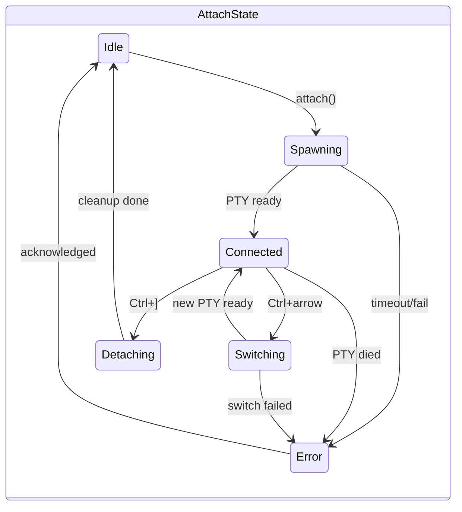

# Production-Ready Session Attachment

## Architecture




## File Structure

```javascript
src/tui/
├── mod.rs                    # Main loop (modify)
├── app.rs                    # App state (modify)
├── events.rs                 # Event handling (modify)
├── ui.rs                     # Rendering dispatch (modify)
├── pty/
│   ├── mod.rs               # PTY module exports
│   ├── session.rs           # PtySession: spawn, read, write, resize
│   ├── buffer.rs            # UTF-8 buffering for partial reads
│   └── config.rs            # Configurable timeouts, limits
├── terminal/
│   ├── mod.rs               # Terminal emulation exports
│   ├── renderer.rs          # vt100 -> ratatui conversion
│   └── mouse.rs             # Mouse event encoding/decoding
├── attach/
│   ├── mod.rs               # Attach state machine
│   ├── state.rs             # AttachState enum and transitions
│   └── controller.rs        # Orchestrates attach/detach/switch
└── components/
    ├── attached_view.rs     # Renders terminal + status bar
    └── transition.rs        # Loading/switching overlays
```


## Success Criteria

- [ ] Attach to Zellij session, see Claude Code, interact normally
- [ ] Attach to Docker container, see shell, interact normally
- [ ] Detach with Ctrl+], return to session list
- [ ] Switch sessions with Ctrl+Left/Right
- [ ] Session dies -> graceful return to list