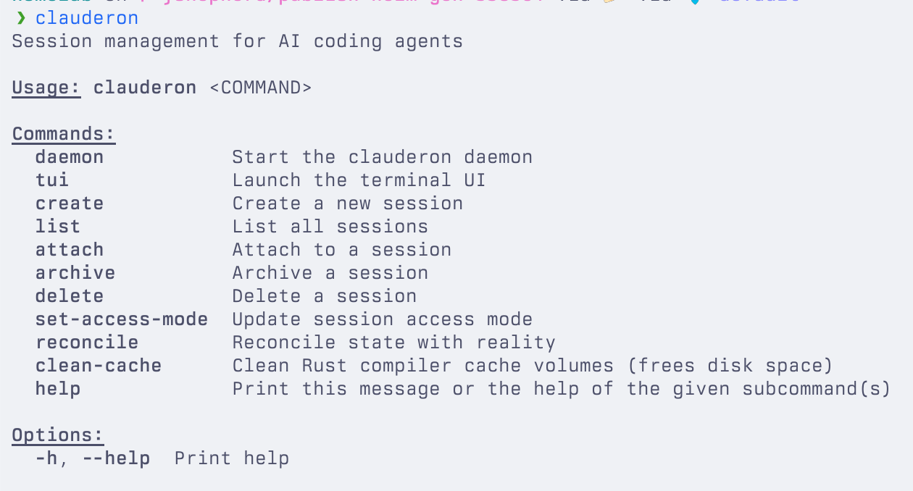

# Clauderon

A Rust-based session manager for running isolated Claude Code or Codex sessions in Docker containers or Kubernetes pods.

## Features

- **Session Isolation**: Run Claude Code or Codex in isolated Docker containers or K8s pods with Git worktrees
- **Zero-Credential Proxy**: Containers have access to zero credentials (even Claude Code creds), enabling safer use of bypass-all-permissions mode
- **Multiple Interfaces**: Manage sessions via CLI, TUI, web UI, or mobile app
- **Direct Terminal Access**: Attach to sessions directly via Docker attach or through the web browser
- **Full Environment Control**: Use any Docker image, connect to local networks, and customize the runtime environment

## Screenshots

### CLI



### TUI (Terminal UI)

| Session List | Create Session |
|:---:|:---:|
|  |  |

| Terminal | File System |
|:---:|:---:|
|  |  |

### Web Interface

| Session List | Create Session |
|:---:|:---:|
|  |  |

| Chat | Terminal |
|:---:|:---:|
|  |  |

| File System | File System (Detail) |
|:---:|:---:|
|  |  |

| Session Info |
|:---:|
|  |

### iOS App

| Session List | Chat | Settings |
|:---:|:---:|:---:|
|  |  |  |

## Prerequisites

- **Rust** (1.85+) - Install via [rustup](https://rustup.rs/)
- **Bun** (1.3.5+) - Install via [bun.sh](https://bun.sh/)
- **typeshare-cli** - Install via `cargo install typeshare-cli`
- **Claude Code CLI** - `claude` on PATH (for Claude sessions)
- **Codex CLI** - `codex` on PATH (for Codex sessions)

If you use Codex with the proxy enabled, clauderon reads the host Codex auth file:
- `~/.codex/auth.json` (override with `CODEX_AUTH_JSON_PATH`)
- or `CODEX_ACCESS_TOKEN`, `CODEX_REFRESH_TOKEN`, `CODEX_ID_TOKEN`, `CODEX_ACCOUNT_ID` env vars

You can provide an OpenAI API key via:
- `OPENAI_API_KEY` or `CODEX_API_KEY` environment variables, or
- `~/.clauderon/secrets/openai_api_key` (for the clauderon proxy to inject)

## Custom Container Images

Clauderon uses container images to run isolated Claude Code or Codex sessions. The default image is `ghcr.io/shepherdjerred/dotfiles`.

### Using a custom image

You can use any Docker image that meets Clauderon's requirements:

```bash
clauderon create --image your-image:tag --name session-name --repository /path/to/repo
```

### Image requirements

Your image must have:
- `claude` or `codex` CLI in PATH
- `bash` shell (not just `/bin/sh`)
- Writable `/workspace` directory
- `curl` binary
- Standard Unix utilities: `mkdir`, `chmod`, `cat`, `date`

Strongly recommended:
- `git` CLI (for git operations)

See [`docs/IMAGE_COMPATIBILITY.md`](docs/IMAGE_COMPATIBILITY.md) for complete requirements and troubleshooting.

### Example Dockerfiles

See [`examples/`](examples/) for minimal and recommended Dockerfile examples.

## Build Order

The frontend must be built before the Rust binary because static files are embedded at compile time.

```bash
# 1. Install web dependencies
cd web && bun install && cd ..

# 2. Build frontend (generates dist/ with static files)
cd web/frontend && bun run build && cd ../..

# 3. Build Rust binary (embeds frontend dist/)
cargo build --release
```

Or use the full build command:

```bash
cd web && bun run build && cd .. && cargo build --release
```

## Running the Web Interface

Start the daemon with HTTP server enabled:

```bash
# Start daemon with web interface on port 3030
./target/release/clauderon daemon --http-port 3030
```

Then open http://localhost:3030 in your browser.

### Network Binding

By default, the HTTP server binds to `127.0.0.1` (localhost only). For Docker container hooks to work with specific IP bindings (e.g., Tailscale), Clauderon automatically creates an additional `127.0.0.1` listener:

```bash
# Default: localhost only
clauderon daemon

# All interfaces: single listener on 0.0.0.0
CLAUDERON_BIND_ADDR=0.0.0.0 clauderon daemon

# Specific IP: Creates BOTH specific IP and 127.0.0.1 listeners
# (127.0.0.1 listener allows Docker containers to reach daemon via host.docker.internal)
CLAUDERON_BIND_ADDR=100.64.1.1 CLAUDERON_ORIGIN=http://hostname:3030 clauderon daemon
```

**Note**: Binding to a specific IP (not `127.0.0.1` or `0.0.0.0`) requires setting `CLAUDERON_ORIGIN` for WebAuthn authentication, or using `CLAUDERON_DISABLE_AUTH=true` (not recommended for production).

### CLI Options

```bash
clauderon daemon --help

Options:
  --http-port <PORT>  Enable HTTP server on specified port
  --socket <PATH>     Unix socket path (default: ~/.clauderon/clauderon.sock)
```

## Development

### Web Packages

The web interface is split into three packages in `web/`:

- **@clauderon/shared** - Shared types (generated from Rust via typeshare)
- **@clauderon/client** - TypeScript API client library
- **@clauderon/frontend** - React frontend application

```bash
cd web

# Development
bun run dev           # Start frontend dev server

# Testing
bun run test          # Run all web tests

# Linting
bun run lint          # Lint all web packages

# Building
bun run build         # Build all web packages
```

### Rust Development

```bash
# Run tests
cargo test

# Format code
cargo fmt

# Lint
cargo clippy

# Run daemon in development
cargo run -- daemon --http-port 3030
```

### Regenerating Types

When Rust types change, regenerate TypeScript types:

```bash
typeshare . --lang=typescript --output-file=web/shared/src/generated/index.ts
```

This is automatically run during `cargo build`.

## Architecture

```
clauderon/
├── src/              # Rust source code
│   ├── api/          # HTTP/WebSocket API
│   ├── core/         # Session management
│   ├── tui/          # Terminal UI
│   └── main.rs       # CLI entry point
├── web/              # TypeScript packages
│   ├── shared/       # Shared types
│   ├── client/       # API client
│   └── frontend/     # React UI
└── build.rs          # Build script (typeshare + embed)
```

## Security Architecture

### Zero-Credential Container Design

Clauderon containers run with zero real credentials. The host proxy intercepts HTTPS requests and injects authentication tokens, so containers never see actual API keys.

#### What's Mounted in Containers

Containers receive minimal mounts for functionality:

- **`~/.clauderon/uploads/{session-id}/`** → **`/workspace/.clauderon/uploads/{session-id}/`** (read-write)
  - Image attachments uploaded via API
  - Per-session isolation

- **`~/.clauderon/proxy-ca.pem`** → **`/etc/clauderon/proxy-ca.pem`** (read-only)
  - CA certificate for TLS interception
  - Required for proxy functionality

- **`~/.clauderon/codex/`** → **`/etc/clauderon/codex/`** (read-only)
  - Dummy Codex authentication files
  - Real tokens injected by proxy

- **`~/.clauderon/talos/`** → **`/etc/clauderon/talos/`** (read-only, optional)
  - Talos kubeconfig for Kubernetes operations
  - Only mounted if Talos configured

- **`~/.clauderon/claude.json`** → **`/workspace/.claude.json`** (read-write)
  - Onboarding state and permissions preferences
  - Claude Code writes to this file

- **`~/.clauderon/managed-settings.json`** → **`/etc/claude-code/managed-settings.json`** (read-only, with proxy)
  - Enforces bypass permissions mode in proxy environments

#### What's NOT Mounted (Security)

These files remain on the host only:

- **`~/.clauderon/secrets/`** - Real OAuth tokens and API keys
- **`~/.clauderon/db.sqlite`** - Session database
- **`~/.clauderon/audit.jsonl`** - HTTP proxy audit logs
- **`~/.clauderon/*.sock`** - Unix sockets for daemon IPC
- **`~/.clauderon/proxy-ca-key.pem`** - CA private key
- **`~/.clauderon/daemon.info`** - Daemon process metadata
- **`~/.clauderon/logs/`** - Daemon log files

#### Hooks Directory

The `/workspace/.clauderon/hooks/` directory exists inside containers but is NOT mounted from the host. Instead:

1. Container starts with no hooks directory
2. Daemon uses `docker exec` to create `/workspace/.clauderon/hooks/` inside container
3. Daemon writes `send_status.sh` script inside container
4. Claude Code hooks execute the script to send events to daemon via HTTP

This design ensures hooks are isolated per container and don't require host filesystem access.

## API Endpoints

### REST API

- `GET /api/sessions` - List all sessions
- `GET /api/sessions/:id` - Get session by ID
- `POST /api/sessions` - Create new session
- `DELETE /api/sessions/:id` - Delete session
- `POST /api/sessions/:id/archive` - Archive session
- `POST /api/sessions/:id/access-mode` - Update access mode
- `GET /api/recent-repos` - List recent repositories

### WebSocket Endpoints

- `/ws/console/:session_id` - Terminal console stream
- `/ws/events` - Real-time session events

## Alternatives

- [hapi](https://github.com/tiann/hapi/) - Headless API for Claude Code
- [Happy Engineering](https://happy.engineering/) - Claude Code session management
- [Omnara](https://www.omnara.com/) - AI coding assistant platform
- [ClawdBot](https://github.com/clawdbot/clawdbot) - Claude Code automation tool
