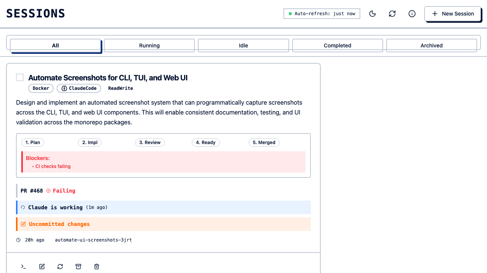
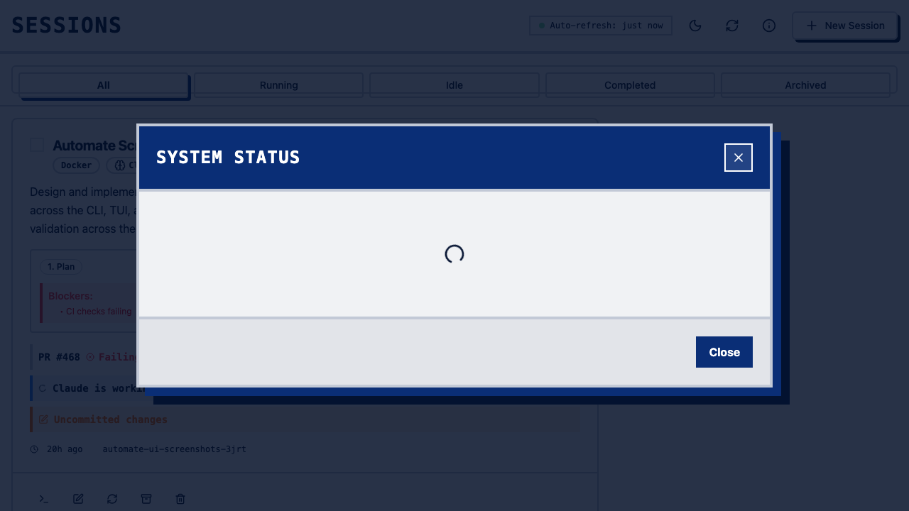

```bash
clauderon daemon
# Open http://localhost:3030
```

## Authentication



WebAuthn passwordless authentication (optional).

## Dashboard


Shows all sessions with status, backend, agent, access mode, and timestamps. Filter by status, backend, agent:




## Create Session


Click "New Session" to configure: repository path, prompt, backend, agent, access mode.

## Session Details

Click a session to view chat history, task status, token usage, logs, and file changes. Real-time updates via WebSocket.

## Session Management

- **Archive** - Hide completed sessions (toggle "Show Archived" to view)
- **Delete** - Permanently removes worktree, backend resources, and DB record
- **Access Mode** - Toggle read-only/read-write from session dropdown

## Authentication Setup

Default: no auth, localhost only.

```bash
# Enable WebAuthn
clauderon daemon --enable-webauthn-auth
```

```toml
# ~/.clauderon/config.toml
[feature_flags]
webauthn_auth = true
```

## Remote Access

**SSH Tunnel:**
```bash
ssh -L 3030:localhost:3030 user@server
```

**Reverse Proxy (nginx):**
```nginx
server {
    listen 443 ssl;
    server_name clauderon.example.com;
    ssl_certificate /path/to/cert.pem;
    ssl_certificate_key /path/to/key.pem;
    location / {
        proxy_pass http://localhost:3030;
        proxy_http_version 1.1;
        proxy_set_header Upgrade $http_upgrade;
        proxy_set_header Connection "upgrade";
        proxy_set_header Host $host;
    }
}
```

## Keyboard Shortcuts

| Shortcut  | Action               |
| --------- | -------------------- |
| `n`       | New session          |
| `j` / `k` | Navigate sessions    |
| `Enter`   | Open session details |
| `a`       | Archive session      |
| `d`       | Delete session       |
| `/`       | Focus search         |
| `?`       | Show shortcuts       |

## Development Mode

```bash
clauderon daemon --dev   # serves frontend from filesystem with hot reload
```

## Troubleshooting

| Problem | Solution |
| ------- | -------- |
| Page not loading | `curl http://localhost:3030/health` |
| WebSocket disconnected | Auto-reconnects |
| Session not appearing | Refresh or `clauderon list` |
| Slow performance | Archive old sessions |
