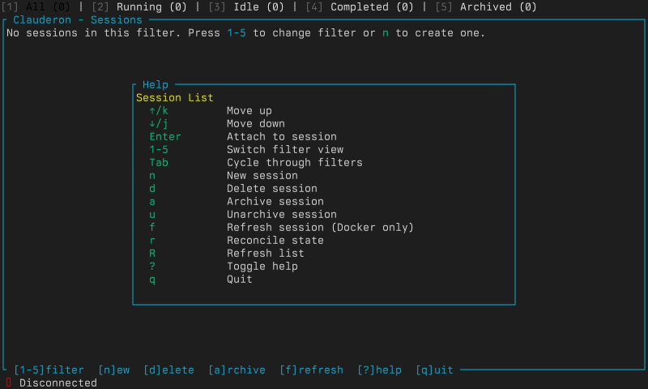
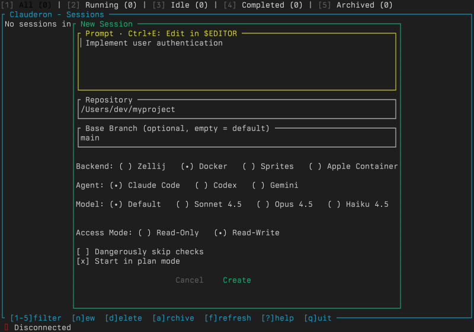
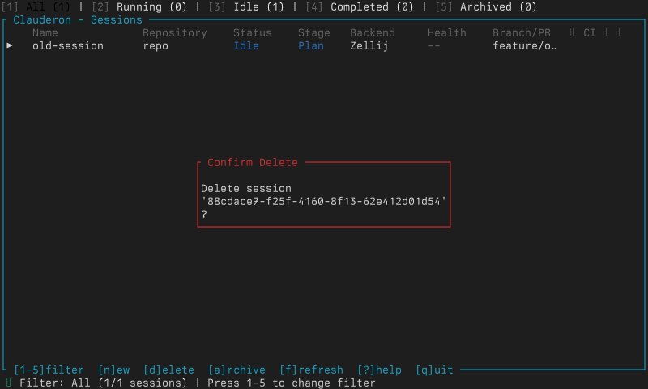

```bash
clauderon tui
```

## Session List


Displays sessions with name, status, health (color-coded), backend, agent, and timestamps.

### Filters

Press `1-5` to filter: All / Running / Idle / Completed / Archived.

## Keyboard Shortcuts

### Session List

| Key         | Action                     |
| ----------- | -------------------------- |
| `n`         | Create new session         |
| `Enter`     | Attach to session          |
| `a`         | Archive session            |
| `d`         | Delete session             |
| `j`/`↓`    | Move down                  |
| `k`/`↑`    | Move up                    |
| `g` / `G`  | Jump to top / bottom       |
| `/`         | Search by name             |
| `r`         | Toggle auto-refresh (2s)   |
| `h`         | Health status modal        |
| `1-5`       | Filter by status           |
| `?`         | Show help                  |
| `q`         | Quit                       |



### Attached Mode

Default is "locked" -- all keystrokes forwarded to container. Press `Ctrl+L` to unlock.

| Key      | Action                        |
| -------- | ----------------------------- |
| `Ctrl+L` | Toggle locked/unlocked mode   |
| `Ctrl+M` | Signal menu (SIGINT, etc.)    |
| `Ctrl+P` | Previous session              |
| `Ctrl+N` | Next session                  |
| `Ctrl+Q` | Detach (return to list)       |

### Copy Mode (from unlocked)

| Key          | Action              |
| ------------ | ------------------- |
| `[`          | Enter copy mode     |
| `h/j/k/l`   | Navigate (if enabled) |
| `v`          | Start selection     |
| `y`          | Copy to clipboard   |
| `ESC`        | Exit copy mode      |

### Scroll Mode

`↑/↓` line-by-line, `Page Up/Down`, `Home/End`. Scrollback: 10,000 lines.

## Session Creation



Press `n` to open. Configure: repository (recent/browse/manual path), backend, agent, access mode, plan mode, model override, base branch. Use `Ctrl+E` to edit prompt in `$EDITOR`. Press `i` to attach images (PNG, JPG, GIF, WebP).

### Docker-specific options

Image selection, volume mode, resource limits, network mode.

## Health Status Modal

Press `h` on a session:

| State      | Actions                           |
| ---------- | --------------------------------- |
| Healthy    | Recreate, Cleanup                 |
| Stopped    | Start, Recreate, Cleanup          |
| Hibernated | Wake, Recreate, Cleanup           |
| Error      | Recreate, Recreate Fresh, Cleanup |
| Missing    | Recreate, Recreate Fresh, Cleanup |
| CrashLoop  | Recreate Fresh, Cleanup           |

Data preservation: ✅ preserves data, ⚠️ fresh start (committed only), ❌ destructive.



## Limitations vs Web UI

- No chat/message history view
- No metadata editing
- No system status dashboard
- No multi-repo sessions
- No bulk operations
- No file upload to running sessions

## Troubleshooting

| Problem | Solution |
| ------- | -------- |
| Terminal resize issues | `pkill -SIGWINCH clauderon` or restart |
| "Connection lost" | Check daemon running; check DB permissions |
| Shortcuts not working | Press `Ctrl+L` to unlock; check terminal emulator conflicts |
| Sluggish | Disable auto-refresh (`r`); archive old sessions; use filters |
| Garbled display | Try different terminal; fall back to CLI |
| Attachment hangs | Check session health (`h`); check backend status |
