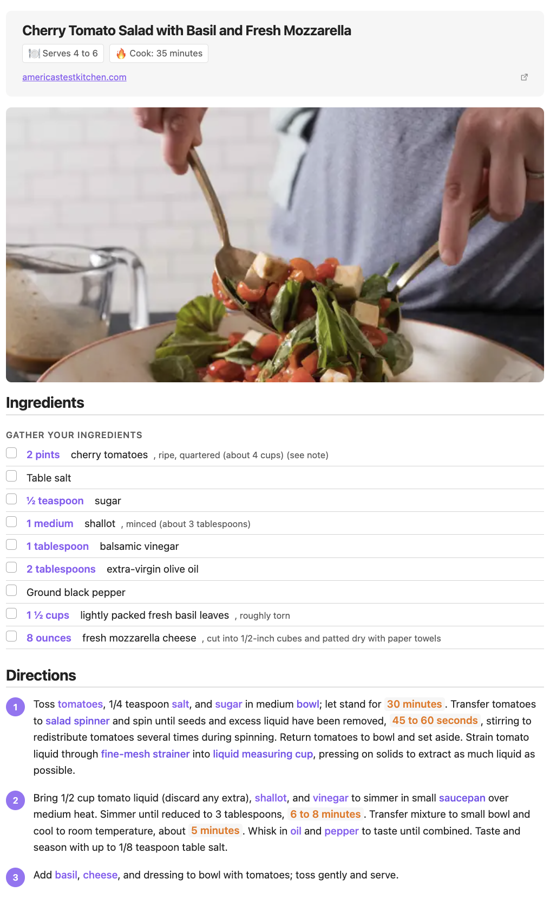
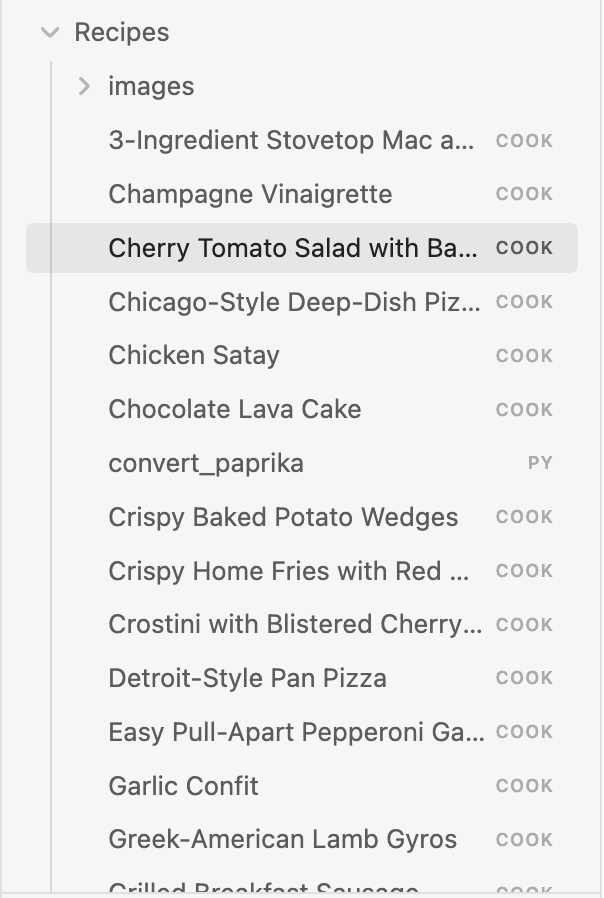
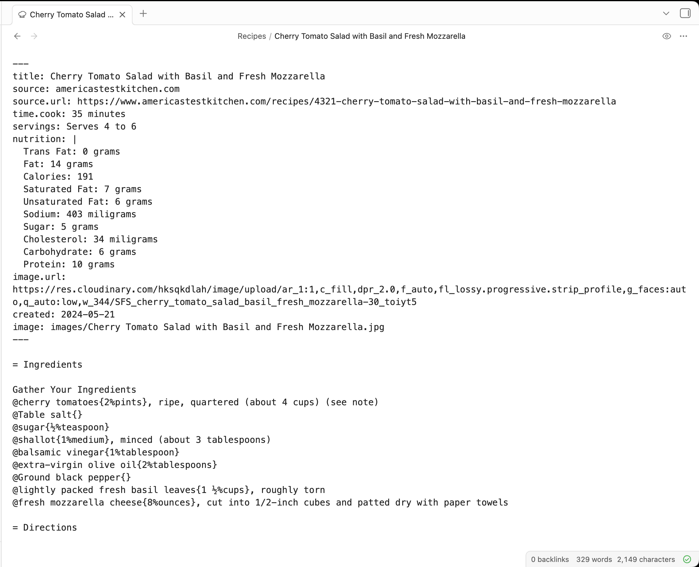

# Cooklang Rich Preview

An [Obsidian](https://obsidian.md) plugin for previewing [Cooklang](https://cooklang.org/) `.cook` recipe files.



## Features

- Rich recipe rendering with ingredients, cookware, and timers highlighted
- YAML frontmatter support for metadata (title, servings, prep time, etc.)
- Section-aware rendering (ingredients list, directions with step numbers)
- Inline quantity display for ingredients
- Checkbox support for ingredient lists
- Syntax highlighting for `.cook` files
- Supports both Cooklang markup and plain-text recipes

## Installation

### From Obsidian Community Plugins

1. Open Settings > Community plugins
2. Search for "Cooklang"
3. Click Install, then Enable

### Manual Installation

1. Download `main.js`, `manifest.json`, and `styles.css` from the [latest release](https://github.com/shepherdjerred/cooklang-for-obsidian/releases/latest)
2. Create a folder `cooklang-rich-preview` in your vault's `.obsidian/plugins/` directory
3. Copy the downloaded files into that folder
4. Restart Obsidian and enable the plugin in Settings > Community plugins

## Screenshots

### File Explorer

`.cook` files appear in your vault alongside your other notes.



### Source View

Write recipes using Cooklang syntax with YAML frontmatter for metadata.



### Rich Preview

Ingredients are highlighted with quantities, directions are numbered, and timers stand out.


## Cooklang Syntax

```
Preheat #oven{} to 350°F.

Mix @flour{2%cups} and @sugar{1%cup} in a #bowl{}.

Bake for ~{30%minutes}.
```

- `@ingredient{quantity%unit}` — ingredients
- `#cookware{}` — cookware
- `~{quantity%unit}` — timers

## License

GPL-3.0 — see [LICENSE](LICENSE) for details.
