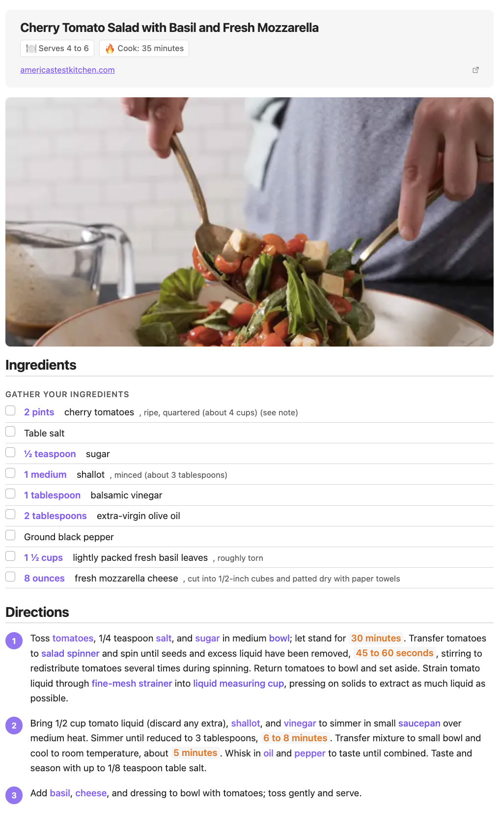
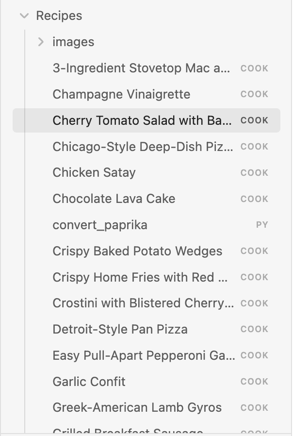
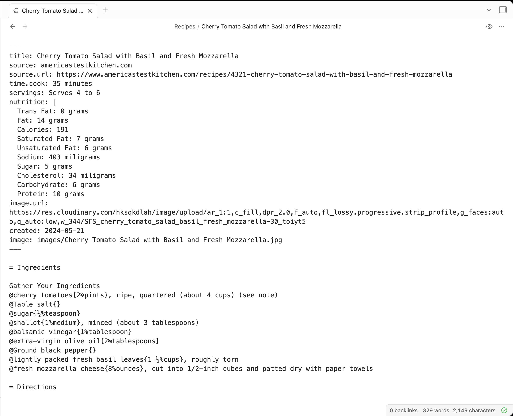

# Cooklang Rich Preview

An [Obsidian](https://obsidian.md) plugin for previewing [Cooklang](https://cooklang.org/) `.cook` recipe files. The plugin's canonical id and name are `cooklang-rich-preview` / "Cooklang Rich Preview" (see `manifest.json`); the workspace package is named `cooklang-for-obsidian`.



## Features

- Rich recipe rendering with ingredients, cookware, and timers highlighted
- YAML frontmatter support for metadata (title, servings, prep time, etc.)
- Section-aware rendering (ingredients list, directions with step numbers)
- Nutrition section rendering
- Inline quantity display for ingredients
- Checkbox support for ingredient lists
- Syntax highlighting for `.cook` files
- Supports both Cooklang markup and plain-text recipes

## Installation

### From Obsidian Community Plugins

1. Open Settings > Community plugins
2. Install [Cooklang Rich Preview from the Obsidian Community Plugins
   directory](https://community.obsidian.md/plugins/cooklang-rich-preview)
3. Click Install, then Enable

### Manual Installation

Releases are published to the separate plugin repository
[shepherdjerred/cooklang-for-obsidian](https://github.com/shepherdjerred/cooklang-for-obsidian)
(not to the monorepo) by `scripts/publish.ts`.

1. Download `main.js`, `manifest.json`, and `styles.css` from the [latest release](https://github.com/shepherdjerred/cooklang-for-obsidian/releases/latest)
2. Create a folder `cooklang-rich-preview` in your vault's `.obsidian/plugins/` directory
3. Copy the downloaded files into that folder
4. Restart Obsidian and enable the plugin in Settings > Community plugins

## Settings

| Setting                | Default   | Effect                                                  |
| ---------------------- | --------- | ------------------------------------------------------- |
| Default view           | `preview` | View used when opening a recipe (`preview` or `source`) |
| Show inline quantities | off       | Show ingredient quantities inline in the directions     |
| Show nutrition info    | on        | Render the nutrition section when the recipe has one    |
| Ingredient checkboxes  | on        | Show checkboxes next to ingredients                     |

## Development

```bash
cd packages/cooklang-for-obsidian
bun run dev              # esbuild watch build
bun run build            # production build (main.js)
bun run test             # bun run test
bun run lint             # eslint src
bun run typecheck        # tsc --noEmit
bun run publish:plugin   # scripts/publish.ts — build, release to the plugin repo, version-bump PR
```

The parser (`src/cook-parser.ts`) uses a chevrotain lexer with a hand-written
token-stream parser; `src/cook-renderer.ts` renders the parsed recipe, and
`src/syntax/cook-language.ts` provides a CodeMirror 6 `StreamLanguage` mode
for `.cook` syntax highlighting in source view.

## Screenshots

### File Explorer

`.cook` files appear in your vault alongside your other notes.



### Source View

Write recipes using Cooklang syntax with YAML frontmatter for metadata.



### Rich Preview

Ingredients are highlighted with quantities, directions are numbered, and timers stand out.


## Cooklang Syntax

```
Preheat #oven{} to 350°F.

Mix @flour{2%cups} and @sugar{1%cup} in a #bowl{}.

Bake for ~{30%minutes}.
```

- `@ingredient{quantity%unit}` — ingredients
- `#cookware{}` — cookware
- `~{quantity%unit}` — timers

## License

GPL-3.0 — see [LICENSE](LICENSE) for details.
