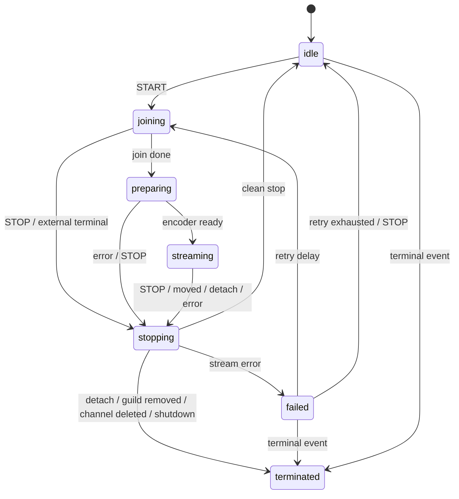
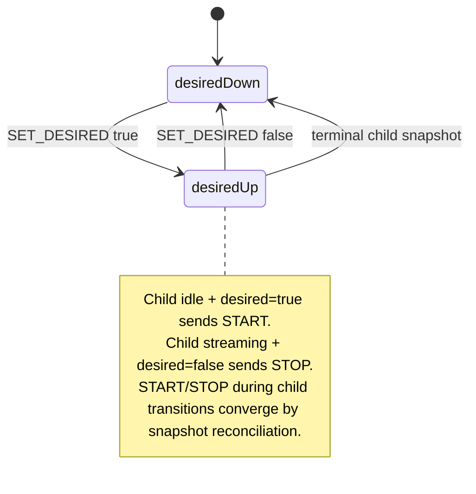

# @shepherdjerred/discord-stream-lifecycle

Shared XState v5 lifecycle machines for Discord Go-Live streaming services.

This package intentionally sits above `@shepherdjerred/discord-video-stream`.
The video package owns the low-level Discord media transport and ffmpeg helpers;
this package owns state-machine modeling for joining voice, preparing encoders,
streaming, stopping, retrying, reacting to Discord topology events, and
reconciling desired stream state.

## Diagrams

