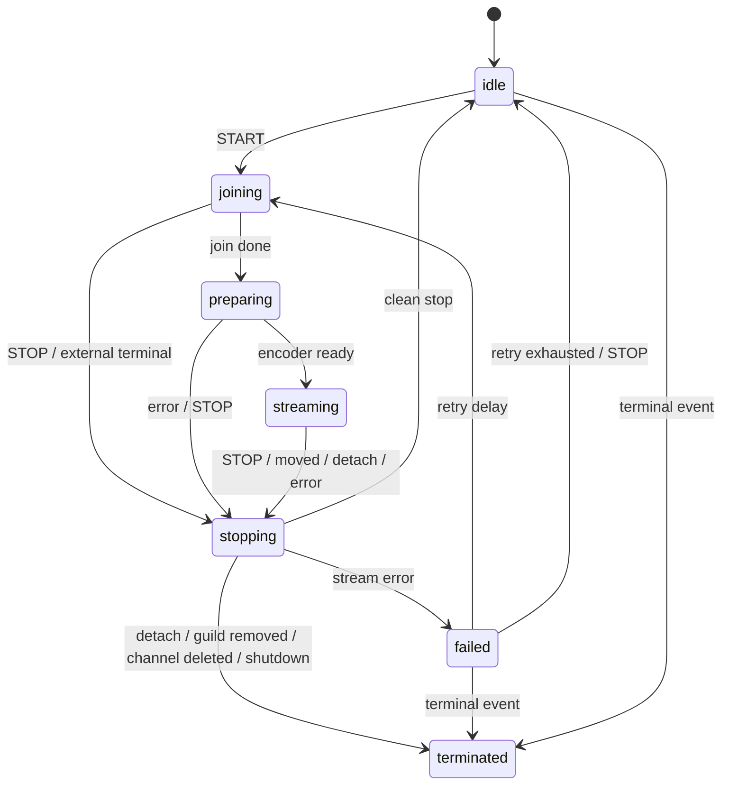
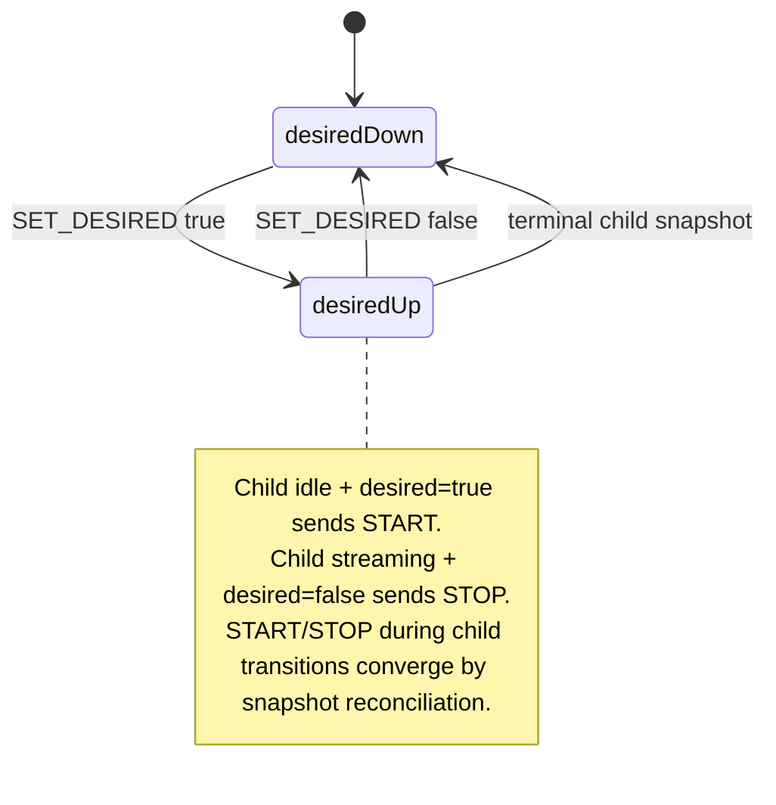

# @shepherdjerred/discord-stream-lifecycle

Shared XState v5 lifecycle machines for Discord Go-Live streaming services.

This package intentionally sits above `@shepherdjerred/discord-video-stream`.
The video package owns the low-level Discord media transport and ffmpeg helpers;
this package owns state-machine modeling for joining voice, preparing encoders,
streaming, stopping, retrying, reacting to Discord topology events, and
reconciling desired stream state.

## Subsystems

- `src/raw-go-live-machine.ts` / `src/desired-stream-machine.ts` — the two
  core XState machines (diagrammed below)
- `src/pool/` — `userbot-pool.ts` (`UserbotPool`), `pooled-userbot.ts`, and
  `selfbot-client.ts` for managing pooled self-bot streaming accounts
- `src/session/` — `session-manager.ts` (single-slot session ownership),
  `session.ts`, and `auto-leave.ts` (leave voice when the last human leaves)
- `src/discord/` — slash-command registration plus the play/stop commands
- `src/lifecycle/` — `game-bot.ts` and `game-driver.ts` primitives for
  game-streaming bots built on the machines
- `src/persistence/` — `session-paths.ts` for on-disk session state locations
- `src/debug/` — `transition-logger.ts` for state-transition logging
- `src/viewer-presence.ts` — voice-channel viewer presence tracking

## Imports

Only the two machine factories are exported from the root entry point.
Everything else is consumed via subpath imports through the `./*` pattern in
`package.json#exports` (the root deliberately re-exports nothing else — the
no-re-exports rule):

```ts
import { UserbotPool } from "@shepherdjerred/discord-stream-lifecycle/pool/userbot-pool";
import { SingleSlotSessionManager } from "@shepherdjerred/discord-stream-lifecycle/session/session-manager";
```

## Build and test

Subpath exports resolve against `dist/`, so the package must be built before
anything imports it; `test`, `typecheck`, and `lint` all chain `bun run build`
first. Run them per-package:

```bash
cd packages/discord-stream-lifecycle
bun run build       # tsc -p tsconfig.build.json → dist/
bun run test        # build + bun test test/
bun run typecheck   # build + tsc --noEmit
bun run lint        # build + eslint
```

## Diagrams


```mermaid
stateDiagram-v2
  [*] --> idle
  idle --> joining: START
  joining --> preparing: join done
  joining --> stopping: STOP / external terminal
  preparing --> streaming: encoder ready
  preparing --> stopping: error / STOP
  streaming --> stopping: STOP / moved / detach / error
  stopping --> idle: clean stop
  stopping --> failed: stream error
  stopping --> terminated: detach / guild removed / channel deleted / shutdown
  failed --> joining: retry delay
  failed --> idle: retry exhausted / STOP
  failed --> terminated: terminal event
  idle --> terminated: terminal event
```


```mermaid
stateDiagram-v2
  [*] --> desiredDown
  desiredDown --> desiredUp: SET_DESIRED true
  desiredUp --> desiredDown: SET_DESIRED false
  desiredUp --> desiredDown: terminal child snapshot
  note right of desiredUp
    Child idle + desired=true sends START.
    Child streaming + desired=false sends STOP.
    START/STOP during child transitions converge by snapshot reconciliation.
  end note
```
