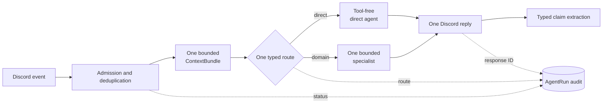

Birmel 3.0's target architecture is an explicit pipeline around one AI SDK
agent run. It replaces framework-owned conversation memory and nested agent
handoffs with bounded inputs, typed decisions, and durable records whose purpose
is visible in the product model.

## A turn has one owner

Admission is a code boundary, not a model decision. The bot accepts direct
triggers, eligible conversational follow-ups, and messages in active session
threads only from the trusted-user allowlist. That same allowlist governs every
capability—including editor, shell, and scheduled work—and a queued job's
original actor is checked again when the job executes.

Each Discord message ID uniquely identifies an `AgentRun`. This makes retries
and restarts idempotent while recording the trigger, route, status, failure
reference, and response-message linkage. A per-channel or per-session queue
keeps simultaneous turns ordered; it does not share model state. Assembled
prompts and model reasoning are never audit fields.

After admission, a structured router must choose exactly one of `direct`,
`messaging`, `server`, `moderation`, `music`, `automation`, or `editor`:

- `direct` is a tool-free conversational run.
- Every other route invokes one AI SDK `ToolLoopAgent` specialist, with at most
  eight model/tool steps and the turn's overall timeout.

A specialist receives a compact task packet—not a manager transcript, another
agent's tool trace, or a recursively assembled prompt. Tools keep stable IDs and
typed inputs, validate their outputs, declare ownership and risk metadata, and
derive Discord identity from trusted runtime context rather than model-supplied
IDs. The accepted turn produces one Discord message, edited in place if
progress needs to be shown. Failures produce a short reference for the user;
diagnostic detail stays in logs and traces.

## Context is a bounded value

One immutable `ContextBundle` is assembled for every turn. It has named source
records and a 48,000-character ceiling: core policy, a compact elected-persona
projection, relevant lore and durable claims, and recent raw Discord messages.
The transcript considers at most 50 messages from the preceding hour and keeps
the newest messages that fit.

The current message and system policy are never removed. If the bundle is too
large, it drops the oldest transcript messages first, then the lowest-ranked
lore and claims. Message IDs are deduplicated, and the bundle is used for the
current run only—it is not written to SQLite or fed back into the next turn.

Persona remains pervasive: its compact projection influences admission,
routing, direct conversation, specialists, and claim extraction. Typed schemas,
safety rules, authority checks, and tool limits always outrank persona. Glitter
context is retrieved just in time by resolving mentioned people and aliases,
then selecting only the relevant relationships and lore instead of injecting a
full social and style corpus into every call.

## Memory is claims plus provenance

After a successful reply, a separate typed extraction pass reads raw recent
Discord messages only. It cannot infer new facts from retrieved memory or from
an assembled prompt. Candidates become scoped `MemoryClaim` records—guild,
channel, persona, user, or relationship—with confidence, salience, origin, and
temporal validity. Append-only `MemoryRevision` events preserve the source
message, author and channel provenance, extractor model, and every create,
confirmation, correction, supersession, or forget operation.

Deterministic identity keys turn duplicates into confirmations. Explicit
statements outrank inferences; newer contradictions supersede older values
without deleting their history; unresolved conflicts remain visibly uncertain.
Retrieval always includes applicable rules and explicit preferences, then ranks
facts and relationships by scope, textual and semantic relevance, confidence,
salience, and recency. At most twelve claims enter a turn.

Users still have explicit remember, inspect, correct, history, forget, and
privacy-erasure operations. Forgetting tombstones ordinary claims so their
history remains auditable. Privacy erasure physically removes the claim,
revisions, and embedding.

## Sessions and jobs are product state

A session is one real Discord thread, with at most one active session per
thread. Allowed users can continue the thread without repeating a mention.
User, assistant, and summarized tool events append with Discord provenance and
monotonic sequence numbers; reasoning is never stored. A versioned summary plus
recent events reconstructs the session under the same `ContextBundle` budget,
and archive, cancel, and resume actions change message admission rather than
maintaining inert metadata.

One `manage-job` surface owns delayed and recurring work. A job contains a
message, deterministic tool call, or isolated agent payload, and may deliver
into an active session thread. Atomic claims prevent duplicate execution,
retries survive restarts, scheduler ticks cannot overlap, and execution carries
the original trusted actor's request context. Thread messages steer live
sessions; jobs are the explicit mechanism for background work.

Every external write and Discord delivery crosses a durable effect checkpoint.
If a crash or cancellation leaves the outcome unknown, the job pauses instead
of replaying. The `manage-job` resolution action can record that the effect was
applied and finalize it without replay. An ambiguous occurrence cannot be
marked not applied or retried in place because its prior executor may still
settle.

## Persistence and health are explicit too

Prisma migrations own the product database schema, including agent runs,
claims and revisions, session events, and jobs. Deployment readiness requires
completed migrations, a working database connection, Discord readiness, and a
started scheduler; liveness checks only whether the process can keep running.
Content-free telemetry records lifecycle stages, route, source sizes, model
usage, duration, and error class without putting message or memory contents in
metric attributes.

The historical `mastra-memory.db` remains untouched as a forensic archive.
Birmel 3.0 neither opens it nor imports its framework-derived memory; rollback
can preserve the old artifact without allowing hidden history back into the
new runtime.

## Why this shape

The constraint is deliberately simple: one implementation for context, durable
memory, sessions, jobs, and orchestration. Explicit boundaries make repeated
turns stable in size, make tool authority independently enforceable, and let an
operator explain a response from source records and lifecycle status without
retaining private prompt bodies or depending on framework internals.

Implementation lives in
[`packages/birmel`](https://github.com/shepherdjerred/monorepo/tree/main/packages/birmel);
the related durable Discord corpus and context refresh are explained in
[Glitter workflows](/temporal/workflows/glitter/).
