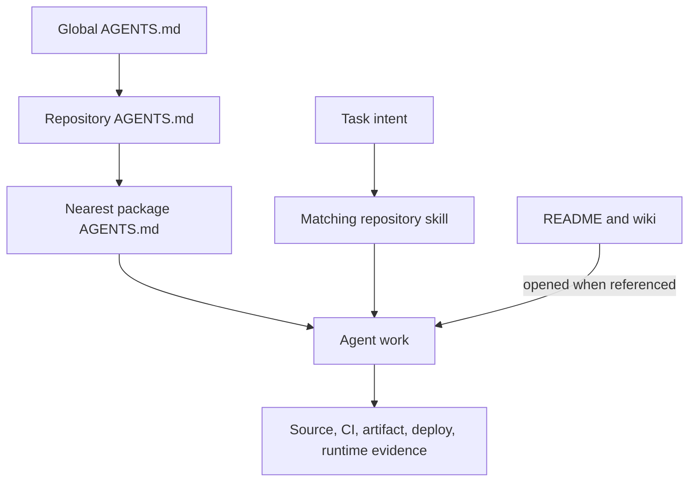

Agent guidance is a small routing layer over durable repository knowledge, not
a second documentation system.

The repository once accumulated commands, architecture, incidents, and rollout
history in large instruction files. Every agent loaded that material even when
the task did not need it. Copies for individual clients then drifted from the
source and from the system they described.

## One fact has one owner

The new design chooses an owner by how and when information is used.

| Information                            | Owner                      | Why                                                 |
| -------------------------------------- | -------------------------- | --------------------------------------------------- |
| Personal behavior across repositories  | global `AGENTS.md`         | always relevant to Jerred's sessions                |
| Repository or package invariant        | nearest `AGENTS.md`        | applies automatically in that source scope          |
| Repeatable task procedure              | `.agents/skills`           | loaded only when the task matches                   |
| Package API and contributor reference  | package README             | durable and useful to humans and tools              |
| Architecture and operational rationale | this wiki                  | human-first explanation and how-to guidance         |
| Plans and unfinished work              | Linear or the pull request | state changes independently of source documentation |

This keeps the [root agent guidance](https://github.com/shepherdjerred/monorepo/blob/main/AGENTS.md)
focused on decisions that would otherwise be easy to miss.

## Context follows the task

Always-on files state the homelab boundary, ownership, traps, and acceptance
requirements. A matching skill supplies the procedure. The agent opens a README
or wiki page only when the task needs its detailed model.

The distinction is especially important here. Every first-party hosted workload
uses the homelab's repository-owned infrastructure and GitOps path. Native apps,
extensions, libraries, packages, and external services do not. Loading the
entire homelab runbook for a library edit would obscure that simple boundary.

## Compatibility without copies

`AGENTS.md` and `.agents/skills` are the open core. Claude consumes symlinked
compatibility paths. Codex, Cursor, OpenCode, and Antigravity receive the same
source through native discovery or a tiny pointer.

An adapter contains no independent policy. Its only job is to lead a client to
the canonical source. Deleting duplicated prose removes the possibility that
two agents receive different rules for the same checkout.

## Budgets are architecture checks

The size guard protects the layering decision. A file that exceeds its budget
is usually mixing always-on constraints with reference or procedure.

The guard also verifies skill identity, discovery metadata, compatibility
symlinks, and the absence of repository Cursor rule copies. It does not judge
whether prose is wise. Fresh-session discovery tests remain the behavioral
proof.

## Delivery evidence remains layered

Guidance follows the same acceptance model as the homelab. Source, Buildkite,
artifacts, ArgoCD reconciliation, and observed runtime behavior are independent
claims. An instruction should route an agent toward the missing evidence rather
than collapse those layers into a generic definition of done.

## Related

- [How to maintain agent guidance](/how-to/maintain-agent-guidance/)
- [The monorepo](/explanation/monorepo/)
- [Homelab overview](/explanation/homelab/overview/)
