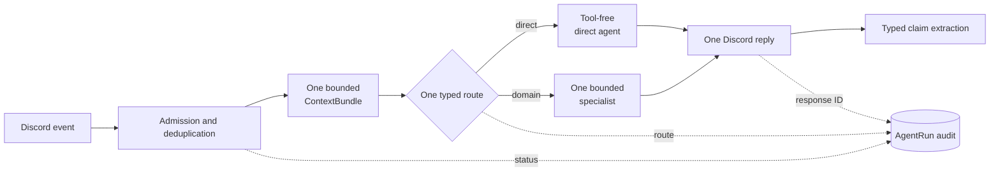

Birmel is a Discord bot built around exactly one AI SDK agent run per turn. Its
design is a reaction against the alternative: a framework that owns conversation
memory, spawns nested agents, and assembles prompts you cannot inspect.

The constraint is deliberately simple — **one implementation for context,
memory, sessions, jobs, and orchestration**.

## A turn has exactly one owner

Admission is a code boundary, not a model decision. The bot accepts direct
triggers, eligible follow-ups, and active session threads — only from the
trusted-user allowlist.

That same allowlist governs every capability, including editor, shell, and
scheduled work. A queued job re-checks its original actor when it executes,
because authority at enqueue time is not authority at run time.

Each Discord message ID identifies one `AgentRun`, which makes retries and
restarts idempotent. Assembled prompts and model reasoning are never audit
fields — the record says what happened, not what was said to the model.

After admission a structured router picks exactly one route. `direct` is a
tool-free conversation; everything else invokes one specialist with at most
eight model or tool steps.

A specialist receives a compact task packet. Not a manager transcript, not
another agent's tool trace, not a recursively assembled prompt. That is the
whole point: a nested-agent architecture makes it impossible to say why a
response happened.

## Context is a bounded value, not a growing history

One immutable `ContextBundle` is assembled per turn, with a 48,000-character
ceiling: core policy, a compact persona projection, relevant lore and claims,
and recent raw messages.

When it overflows it drops the oldest transcript messages first, then the
lowest-ranked lore. The current message and system policy are never removed.

Crucially, the bundle is used for that run only. It is never written to the
database or fed into the next turn. Turns stay stable in size no matter how long
a conversation runs.

## Memory is claims plus provenance

A separate extraction pass reads **raw recent Discord messages only**. It cannot
infer new facts from retrieved memory or from an assembled prompt, which is what
stops the bot from slowly believing its own hallucinations.

Candidates become scoped `MemoryClaim` records with confidence, salience,
origin, and temporal validity. Append-only `MemoryRevision` events preserve the
source message, provenance, extractor model, and every create, confirmation,
correction, supersession, or forget.

Explicit statements outrank inferences. Newer contradictions supersede older
values without deleting their history. Unresolved conflicts stay visibly
uncertain rather than being silently resolved.

Forgetting tombstones a claim so its history stays auditable. Privacy erasure is
different and stronger: it physically removes the claim, its revisions, and its
embedding.

## Sessions and jobs are product state

A session is one real Discord thread. Events append with provenance and
monotonic sequence numbers; reasoning is never stored. A versioned summary plus
recent events reconstructs it under the same context budget.

One `manage-job` surface owns delayed and recurring work. Every external write
and Discord delivery crosses a durable effect checkpoint — if a crash leaves the
outcome unknown, the job **pauses instead of replaying**.

That asymmetry is intentional. An ambiguous occurrence cannot be marked
not-applied or retried in place, because its prior executor may still settle.
Duplicating a real-world effect is worse than stalling.

## Why this shape

Explicit boundaries make repeated turns stable in size, make tool authority
independently enforceable, and let you explain any response from source records
and lifecycle status — without retaining private prompt bodies or depending on
framework internals.

The historical `mastra-memory.db` is untouched as a forensic archive. Birmel
neither opens nor imports it, so a rollback cannot let framework-derived hidden
history back into the runtime.

## Related

- [Glitter corpus](/how-to/operate-glitter-corpus/) — where the social context comes from
- [Implementation](https://github.com/shepherdjerred/monorepo/tree/main/packages/birmel)
