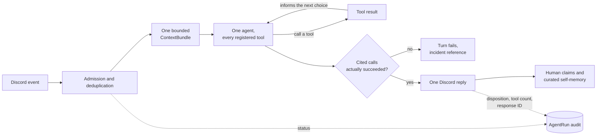

Birmel is one server-scoped Discord personality built around exactly one AI SDK
agent run per turn. Its identity, relationships, accepted names, and verified
experiences can follow it across trusted users and channels, but never across
servers.

Its design rejects framework-owned memory, nested agents, and opaque prompt
assembly. The constraint is deliberately simple: **one implementation for
context, memory, sessions, jobs, and orchestration**.

## A turn has exactly one owner

[Admission](https://github.com/shepherdjerred/monorepo/blob/main/packages/birmel/src/discord/events/message-create.ts)
is mostly a code boundary. The bot deterministically accepts mentions, replies
to Birmel, active sessions, configured wake words, and learned aliases from the
trusted-user allowlist. Only ambiguous engaged chatter reaches a classifier,
and classifier errors fail closed. Messages are admitted in channel order, so
an alias trigger establishes engagement before an immediate follow-up is
evaluated. The bounded queue covers admission only, rejects bot and untrusted
traffic before enqueueing, and releases before the agent turn runs.

An accepted alias is a persona claim for one guild. It becomes a wake name for
every trusted user and channel in that guild. The same name has no effect in a
different guild.

That same allowlist governs every capability, including shell and scheduled
work. A queued job re-checks its original actor when it executes,
because authority at enqueue time is not authority at run time.

Each Discord message ID identifies one
[`AgentRun`](https://github.com/shepherdjerred/monorepo/blob/main/packages/birmel/src/agent-runtime/agent-runs.ts),
which makes retries and restarts idempotent. Assembled prompts and model
reasoning are never audit fields. The record says what happened, not what was
said to the model.

After admission the turn goes to a single
[agent](https://github.com/shepherdjerred/monorepo/blob/main/packages/birmel/src/agent-runtime/agent.ts)
holding every registered tool. It investigates, and what it finds is allowed to
change which tool it reaches for next. Picking a tool, learning it was the
wrong one, and trying another is an ordinary path through a turn.

This replaced a structured router that chose one specialist and one primary
tool from assembled context alone — before any tool had run — and then required
that pre-named tool to succeed. The cheapest model in the system committed the
turn, and a perfectly recoverable "this actually needs a different tool" became
a failed turn and an incident reference. Conversation and unsupported routes
were tool-free, so a question that merely needed one lookup was answered from
memory instead of checked.

The turn ends with a structured answer carrying its own disposition —
conversation, supported, or unsupported — which is the first moment that is
actually known. Every tool call the answer cites must correspond to a call that
really succeeded, so the bot cannot claim an action it did not take. That check
covers the whole reply, where the old rule only proved one pre-named tool ran.

The registry is generated from
[executable tool registration](https://github.com/shepherdjerred/monorepo/blob/main/packages/birmel/src/agent-tools/tools/tool-sets.ts),
and startup refuses to boot if tool metadata and the executable inventory
disagree. Birmel has scoped activity queries but no generic SQL access.

Ordinary supported writes are allowed for trusted users. The
[core policy](https://github.com/shepherdjerred/monorepo/blob/main/packages/birmel/src/agent-runtime/prompts.ts)
blocks only bulk destructive and bulk-creation effects. It does not disguise
missing integrations as safety refusals.

The agent receives a compact task packet. Not a manager transcript, not another
agent's tool trace, not a recursively assembled prompt. That is the whole point:
a nested-agent architecture makes it impossible to say why a response happened.

## Context is a bounded value, not a growing history

One immutable `ContextBundle` is assembled per turn, with a 48,000-character
ceiling: core policy, a compact persona projection, relevant lore and claims,
and recent raw messages.

When it overflows it drops the oldest transcript messages first, then the
lowest-ranked lore. The current message and system policy are never removed.

Crucially, the bundle is used for that run only. It is never written to the
database or fed into the next turn. Turns stay stable in size no matter how long
a conversation runs.

## Memory separates human claims from self-memory

A separate
[extraction pass](https://github.com/shepherdjerred/monorepo/blob/main/packages/birmel/src/agent-runtime/memory-extraction.ts)
creates human claims from raw human-authored Discord messages. It cannot cite
retrieved memory, assembled prompts, or bot-authored history. This stops Birmel
from slowly treating old generated text as evidence.

Self-memory is narrower. It may retain an accepted alias, a durable commitment,
or an experience backed by a specific successful tool invocation and its
bounded, redacted result summary in the current turn. Its only evidence is the
current user message and Birmel's delivered reply.

Aliases use the canonical `identity.alias` predicate at persona scope.
Their wake names must have a bounded shape and explicit proposal and acceptance
language, so incidental words do not become server-wide triggers. Human claims
cannot create this predicate, nor can another self-memory kind; aliases only
enter through curated acceptance. Alias whitespace is canonicalized, and
matching uses Unicode-aware letter and number boundaries.
Negated proposals and rejection language fail closed rather than becoming wake
names.
Commitments may belong to the guild, persona, or one named user. Tool
experiences are rejected unless they cite the exact successful call and copy
its result summary. A commitment copies explicit commitment language from the
delivered reply into canonical claim fields, and any targeted user must be
grounded by the current turn. A grounded topic identifies its claim family, so
unrelated promises coexist while an update to the same topic can supersede its
predecessor. Any invalid
self-memory candidate is logged and rejected independently, so it cannot
discard valid human claims from the same turn.

Candidates become scoped `MemoryClaim` records with confidence, salience,
origin, and temporal validity. Append-only `MemoryRevision` events preserve the
source message, provenance, extractor model, and every create, confirmation,
correction, supersession, or forget.

Explicit statements outrank inferences. Newer contradictions supersede older
values without deleting their history. Unresolved conflicts stay visibly
uncertain rather than being silently resolved.

Forgetting tombstones a claim so its history stays auditable. Privacy erasure is
different and stronger: it physically removes the claim, its revisions, and its
embedding.

## Sessions and jobs are product state

A session is one real Discord thread. Events append with provenance and
monotonic sequence numbers; reasoning is never stored. A versioned summary plus
recent events reconstructs it under the same context budget.

One `manage-job` surface owns delayed and recurring work. Every external write
and Discord delivery crosses a durable effect checkpoint — if a crash leaves the
outcome unknown, the job **pauses instead of replaying**.

That asymmetry is intentional. An ambiguous occurrence cannot be marked
not-applied or retried in place, because its prior executor may still settle.
Duplicating a real-world effect is worse than stalling.

## Why this shape

Explicit boundaries make repeated turns stable in size and make tool authority
independently enforceable. They also let you explain a response from source
records and lifecycle status without retaining private prompt bodies or
depending on framework internals.

The historical `mastra-memory.db` is untouched as a forensic archive. Birmel
neither opens nor imports it, so a rollback cannot let framework-derived hidden
history back into the runtime.

## Related

- [Glitter corpus](/how-to/operate-glitter-corpus/) — where the social context comes from
- [Implementation](https://github.com/shepherdjerred/monorepo/tree/main/packages/birmel)
