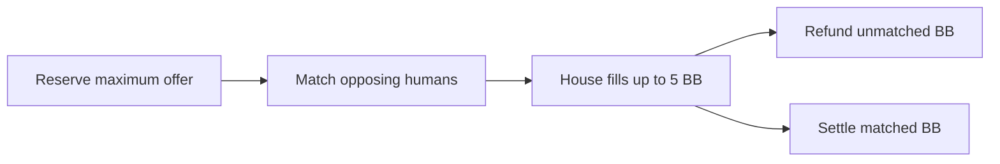

Bryan Bucks treats a bet as an offer to risk **up to** an amount, not as a
promise that the entire amount will be at risk. Scout reserves the offer when
it is placed, then decides the actual stake only after the market closes. This
keeps a player from losing Bucks that nobody was willing to put against them
while still allowing larger offers to earn proportionally larger rewards when
liquidity exists
([place-bet.ts](https://github.com/shepherdjerred/monorepo/blob/main/packages/scout-for-lol/packages/backend/src/betting/place-bet.ts)).

## Human demand determines the market

At close, Scout first matches the same total on both teams at even money. If
one side is oversubscribed, it allocates the available opposing stake
proportionally. Because Bucks are whole numbers, fractional remainders go to
the largest remainders, with the bet ID as a stable final tie-breaker. The same
set of offers therefore always produces the same allocations
([sweep.ts](https://github.com/shepherdjerred/monorepo/blob/main/packages/scout-for-lol/packages/backend/src/betting/sweep.ts)).

This makes offer size meaningful without making an oversized offer a trap. A
larger offer receives a larger share of scarce opposing stake, but anything
that cannot be matched is returned. Players on both sides supply all liquidity
when their totals balance; the house does not join a market that already
clears.

## The house supplies fun, not unlimited liquidity

After human matching, the house can take the other side of the remaining gap,
up to **5 BB total for the game** and no more than its available balance. This
lets a one-sided market produce a small real bet, but prevents the house from
making every offer fully liquid or carrying unbounded exposure. The house fill
is allocated proportionally across the still-unmatched offers on the larger
side and is recorded as its own position
([sweep.ts](https://github.com/shepherdjerred/monorepo/blob/main/packages/scout-for-lol/packages/backend/src/betting/sweep.ts)).

For example, if one player offers 5 BB on Blue and another offers 1 BB on Red,
the humans match 1 BB and the house supplies 4 BB on Red. The first player
risks 5 BB, the second risks 1 BB, and the house risks 4 BB. If the first offer
were 10 BB instead, the first player would risk 6 BB and receive 4 BB back.

The cap is deliberately aggregate, not per player. A per-player cap would let
one-sided demand multiply the house's exposure simply by splitting across
accounts or offers.

## Settlement follows the matched stake

Only the matched amount participates in the result. A winning position has a
gross payout of twice its matched stake; a losing position forfeits its matched
stake. A voided game returns the matched stake with no fee
([settle.ts](https://github.com/shepherdjerred/monorepo/blob/main/packages/scout-for-lol/packages/backend/src/betting/settle.ts)).

There is no placement fee and no fee on an automatic unmatched refund. A human
winner pays 20% of matched profit, rounded down. Cancelling before close uses a
different rule: 20% of the submitted offer, rounded to the nearest Buck. These
rules charge completed wins and voluntary reversals without penalizing a
player for liquidity the market could not provide
([house-cut.ts](https://github.com/shepherdjerred/monorepo/blob/main/packages/scout-for-lol/packages/backend/src/betting/house-cut.ts),
[cancel-bet.ts](https://github.com/shepherdjerred/monorepo/blob/main/packages/scout-for-lol/packages/backend/src/betting/cancel-bet.ts)).

## The ledger is the explanation

The stored position separates submitted, human-matched, house-matched,
total-matched, and unmatched amounts. The pool also stores a versioned matching
summary with every allocation and the aggregate house position. Cancelling an
offer removes only its active-position slot: the cancelled bet and all linked
ledger entries remain available for audit
([schema.prisma](https://github.com/shepherdjerred/monorepo/blob/main/packages/scout-for-lol/packages/backend/prisma/schema.prisma)).

Every balance change has an explicit ledger reason, including stake
reservation, unmatched refund, house matching, cancellation refund, void
refund, winner fee, and settlement payout. Matching and settlement use guarded
pool transitions in the same database transactions as their balance changes,
so retries cannot allocate, refund, or pay the same pool twice.

Scout reconciles the economy at startup and daily from one consistent database
snapshot. It re-derives wallet balances and running ledger balances, then
checks active positions, matching allocations, refunds, house debits, fees,
terminal outcomes, equal stake on both teams, the 5 BB house cap, and payout
conservation. Discrepancies are reported through structured logs and error
tracking; reconciliation never rewrites the evidence it is inspecting
([reconcile.ts](https://github.com/shepherdjerred/monorepo/blob/main/packages/scout-for-lol/packages/backend/src/betting/reconcile.ts)).
