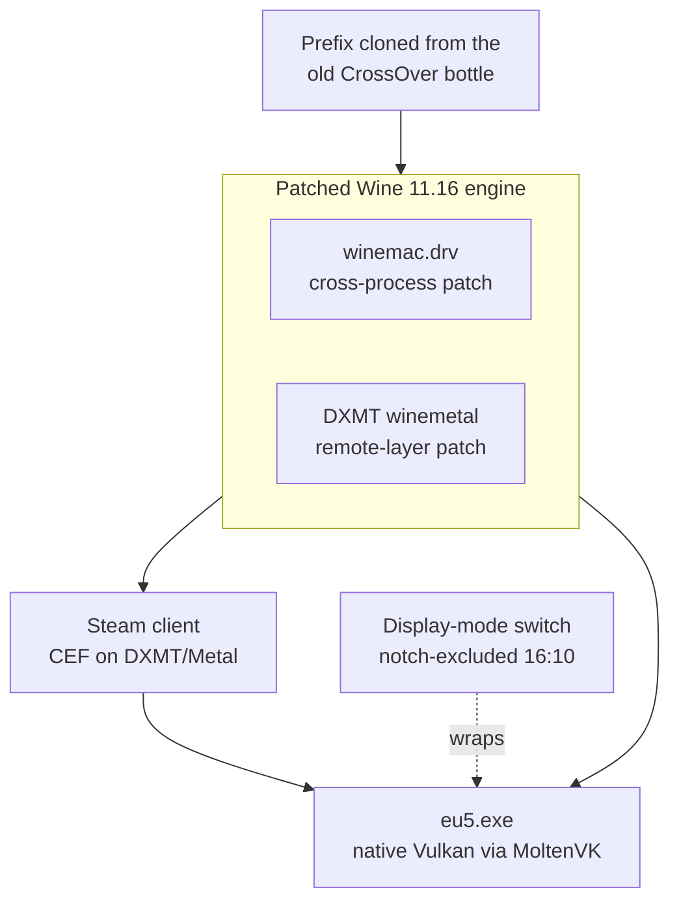

Europa Universalis V is a Windows-only Paradox title. It runs on a notched
Apple-silicon MacBook through a self-built Wine 11.16 engine rather than
CrossOver, because three separate problems each had to be solved and only a
patched, from-source engine solves all of them at once. This page explains why
the obvious approaches fail and what the working architecture actually is. The
commands to operate it live in [Play EU5 on macOS](/how-to/play-eu5-on-macos/);
the exact versions, paths, and flags live in
[the EU5 Wine stack reference](/reference/eu5-wine-stack/).

## Why not CrossOver

CrossOver is the usual way to run a Windows game on macOS, and its Steam client
renders perfectly. But EU5 1.3 ("Pavia") deadlocks under it: every game thread
parks forever with no window. The cause is a lost-wakeup race in Wine's
`NtWaitForAlertByThreadId` — a waiter and its waker can index different
alert-table slots, so the wakeup is dropped and the thread sleeps permanently.
EU5 1.3 leans on that path heavily during startup.

The race was fixed upstream in Wine 11.8. CrossOver 26's engine is built on a
Wine 11.0 base and has not been rebased since, so no CrossOver setting can avoid
the hang. That single fact forces the whole approach: the game needs a Wine
newer than 11.8, which means going outside CrossOver.

## Three problems, one engine

Moving to a stock newer Wine fixes the deadlock but surfaces two more problems
that CrossOver had quietly handled. The working setup is the smallest stack that
solves all three.

### The game itself

EU5 renders through Vulkan, which Wine maps to Metal via MoltenVK. This was the
easy part once the engine was new enough: the game reaches its menu and runs a
campaign without any graphics translation layer of its own. It never touches
Direct3D, which matters for keeping it isolated from the Steam-client fix below.

### The Steam client rendered black

Under stock Wine the Steam client window is entirely black. Steam's UI is
Chromium (CEF), and Chromium's GPU process asks the driver for a Metal view
belonging to a window owned by _another_ process. Stock `winemac.drv` keeps its
window records per-process, so the lookup fails, the GPU process crashes six
times, and Chromium gives up — a black window. CrossOver carries a private fix
for exactly this; stock Wine does not.

The open-source cure is a two-sided patch — one half in `winemac.drv`, one half
in DXMT's Metal layer — that lets the driver hand a remote layer across the
process boundary. It comes from the
[macgameport Cities: Skylines II project](https://github.com/macgameport/cities-skylines-2-macos),
which traced the same bug (WineHQ bug 60263). Applying it requires building both
Wine and DXMT from source.

That fix alone was still not enough. Even with the crash gone, Chromium refused
to use the GPU: its driver blocklist saw no usable Direct3D or Vulkan device and
fell back to software rendering, which cannot present the cross-process window —
still black. The breakthrough was routing Chromium's ANGLE layer through its
**Vulkan** backend, which reaches Metal via MoltenVK. ANGLE's Direct3D path fails
on the adapter query and its GL path caps below what Chromium needs; only the
Vulkan backend gives a working GPU context. Once ANGLE is on Vulkan and the GPU
blocklist is overridden, compositing turns on and the client renders fully, with
text.

Those switches cannot be passed normally, because Steam strips them from its own
web-helper's command line. They are injected by a tiny shim that stands in for
the web-helper. EU5 keeps rendering through plain Vulkan and never loads the DXMT
Direct3D layer, so the client fix and the game path stay independent.

### The camera notch

In fullscreen the game covered the whole display, so its top bar sat under the
camera notch. macOS has a per-app "scale below built-in camera" mode for this,
but it does not attach to Wine — the driver reads the raw display bounds and
covers the notch regardless of the setting.

The fix works one level down, at the display itself. A notched MacBook exposes
two families of resolution: notch-inclusive modes that use the full panel height,
and 16:10 notch-excluded modes that render everything below the notch with the
notch row left black. Switching the built-in display to its notch-excluded twin
for the duration of a play session — same sharpness, a few points shorter — puts
the game, and everything else, below the notch. The launcher makes the switch on
start and restores the normal mode on exit. On an external monitor there is no
notch, so the switch is skipped.

## The prefix and the Steam session

The Wine prefix is a clone of the working CrossOver bottle, which mattered for
one non-obvious reason: Steam's saved login. The refresh token lives in a file
encrypted with Wine's implementation of Windows DPAPI, and under Wine that
encryption is keyed only to the Windows user name, not the machine. Cloning the
bottle and running the engine as the same Windows user (`crossover`) lets the
existing token decrypt, so Steam logs in without a fresh sign-in. Copying
individual config files did not work, because the token is not in them.

One rule follows from sharing an account across two installs: the old CrossOver
Steam must never be launched again. Each login rotates the refresh token and
invalidates the other install's copy, so the two clients would knock each other
out. The clone is now the only Steam that should run.

## What this buys

The game runs at full speed on Vulkan; the Steam client renders completely, so
the store, library, Workshop, and cloud saves all work; and fullscreen clears the
notch. Everything is one Wine 11.16 engine and one prefix, with CrossOver no
longer in the path.

## Related

- [Play EU5 on macOS](/how-to/play-eu5-on-macos/) — launch, recover, rebuild
- [EU5 Wine stack reference](/reference/eu5-wine-stack/) — versions, paths, flags
