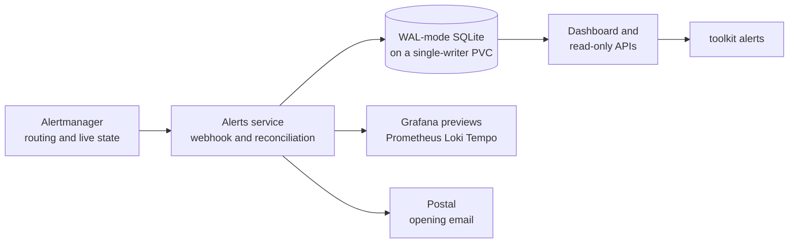

Alerts is the human-facing ledger for the homelab's Alertmanager data.
It adds history and browsing without becoming an on-call system or taking over
routing, grouping, inhibition, silences, or current-state authority.

## System map



## Current deployment boundary

The application, image, ledger volume, network policy, observability rules,
Argo CD application, and cutover receiver exist in the repository. The cluster
continues its existing notification path until the two GitOps changes pass
Buildkite and Argo CD syncs them; after that, Alerts and Postal are the active
destinations.

Activation is a separate operational step: publish and make the image public,
pin its real digest, bootstrap reconciliation with email disabled, then verify a
synthetic fire/resolve before changing Alertmanager. This avoids deploying a
zero-digest image or silently replacing the working notification path.

## Database transport trust

Alerts verifies PostgreSQL transport rather than treating encryption alone as
identity. A namespace-local self-signed issuer creates a long-lived CA, and a
CA issuer signs the PostgreSQL server certificate for the operator service's
cluster DNS names. The application and its migration container connect with
`verify-full`, so the presented certificate must chain to that CA and match the
service hostname.

Only the public `ca.crt` entry is projected into the application pod. The CA
private key remains in its issuer secret, and the PostgreSQL leaf private key
remains in the server secret consumed by the operator. The leaf certificate is
short-lived and rotates automatically. The CA is deliberately stable and does
not auto-rotate: replacing a trust root safely needs an overlap period in which
both the old and new roots are trusted, so unattended single-secret replacement
would turn routine renewal into an outage risk.

The predecessor PostgreSQL database contained no application tables at the
migration audit, so the SQLite ledger began empty. Its retained PVC is outside
this persistence boundary and requires a separate teardown decision.

## Operator workflow after activation

The UI provides active, suppressed, and historical occurrence views. The CLI
uses the same read-only API for focused checks:

```bash
toolkit alerts list --state open
toolkit alerts list --opened-from 2026-08-03T00:00:00Z --json
toolkit alerts list --resolved-from 2026-08-03T00:00:00Z --json
toolkit alerts show <occurrence-id>
```

An occurrence can resolve through a webhook or reconciliation; neither means a
human acknowledged or manually closed it. Alert acknowledgement, assignment,
manual resolution, silence management, paging, and on-call schedules are not
part of this service.

## Where to look

- Service and UI: `packages/alert-dashboard/`.
- Deployment definitions: `packages/homelab/src/cdk8s/src/resources/alert-dashboard/`.
- Operator CLI: `packages/toolkit/src/handlers/alerts.ts`.
- Activation and retention boundary:
  `packages/docs/todos/pagerduty-migration.md`.
