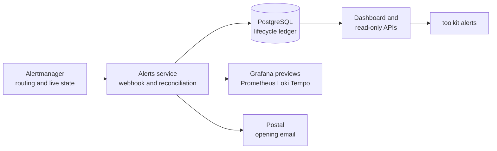

Alerts is the human-facing ledger for the homelab's Alertmanager data.
It adds history and browsing without becoming an on-call system or taking over
routing, grouping, inhibition, silences, or current-state authority.

## System map



## Current deployment boundary

The application, image, database chart, network policy, observability rules,
Argo CD application, and cutover receiver exist in the repository. The cluster
continues its existing notification path until the two GitOps changes pass
Buildkite and Argo CD syncs them; after that, Alerts and Postal are the active
destinations.

Activation is a separate operational step: publish and make the image public,
pin its real digest, bootstrap reconciliation with email disabled, then verify a
synthetic fire/resolve before changing Alertmanager. This avoids deploying a
zero-digest image or silently replacing the working notification path.

## Operator workflow after activation

The UI provides active, suppressed, and historical occurrence views. The CLI
uses the same read-only API for focused checks:

```bash
toolkit alerts list --state open
toolkit alerts list --opened-from 2026-08-03T00:00:00Z --json
toolkit alerts list --resolved-from 2026-08-03T00:00:00Z --json
toolkit alerts show <occurrence-id>
```

An occurrence can resolve through a webhook or reconciliation; neither means a
human acknowledged or manually closed it. Alert acknowledgement, assignment,
manual resolution, silence management, paging, and on-call schedules are not
part of this service.

## Where to look

- Service and UI: `packages/alert-dashboard/`.
- Deployment definitions: `packages/homelab/src/cdk8s/src/resources/alert-dashboard/`.
- Operator CLI: `packages/toolkit/src/handlers/alerts.ts`.
- Activation and retention boundary:
  `packages/docs/todos/pagerduty-migration.md`.
