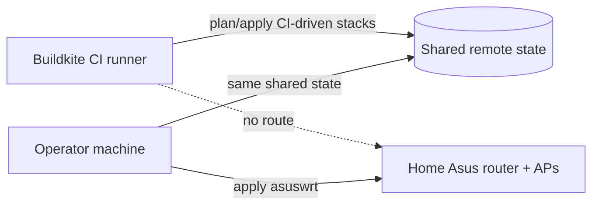

The `asuswrt` OpenTofu stack tracks the home Asus router and its access points
as real OpenTofu state, yet nothing in CI ever applies it.

That split — shared remote state, local-only apply — is the whole point of this
page. The state object is as durable and as shared as every CI-applied stack;
only the actor and the network path differ.

## Why CI cannot own it

Most stacks under `packages/homelab/src/tofu/` are planned on each pull request
and applied on merge, driven by the plan and apply allowlists in
[`.buildkite/pipeline.yml`](https://github.com/shepherdjerred/monorepo/blob/main/.buildkite/pipeline.yml).

`asuswrt` sits outside both loops deliberately. The CI runner reaches the shared
state backend, but it has no network route to the home LAN where the router
lives. An apply therefore has to run from a machine that can reach **both** the
LAN and the state backend.

The alternative — exposing the router's admin interface to the CI network —
trades a manual step for a permanent attack surface on the device that fronts
the house. The manual step is the cheaper cost.

## Why the wireless write path is not trusted

Reads and imports are reliable across these devices' firmwares, and `plan`
converges to no changes after import. Writes are a different question.

Firmware-specific `wl_bw` codes, chanspec sideband forms, and SAE `wl_mfp`
handling are not fully modeled by
[`terraform-provider-asuswrt`](https://github.com/shepherdjerred/monorepo/tree/main/packages/terraform-provider-asuswrt).
A wireless apply could therefore reformat a working radio into a configuration
the firmware accepts but nobody intended.

So the wireless surface is treated as track-only until an apply has been
verified against real hardware. Import and plan are safe today; that is a
smaller promise than "managed", and it is the honest one.

## Why the WiFi password is deliberately unmanaged

`wpa_passphrase` is write-only — the router never reads it back. Tracking it
would rewrite the PSK on every apply and could never show honest drift, because
there is no observed value to compare against.

A resource that always claims a change it cannot verify is worse than no
resource. The WiFi password is managed out of band instead.

## What that leaves tracked

System settings, DHCP static leases, and port forwards (router only — AP mode
disables the latter two), plus wireless SSID, auth, crypto, channel, bandwidth,
and hidden flags.

## Related

- [Apply the asuswrt stack](/how-to/apply-the-asuswrt-stack/)
- [About the homelab](/explanation/homelab/overview/)
