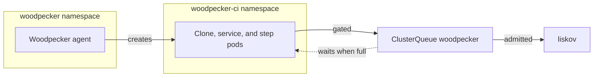

CI runs on the dedicated `liskov` worker. Kueue holds every CI pod until its
resource requests fit a budget below the node's capacity. Woodpecker's
workflow cap is only a backstop.

## The problem with counting jobs

A count cannot tell a lint step from a cold Docker build. The July 2026
freezes proved it: nine concurrent jobs locked up a node. Lowering the cap did
not help, because the cap never bounded what each job consumed.

A count therefore either wastes the node or oversubscribes it. Oversubscription
surfaces as scheduling churn, then kubelet eviction. It looks like flaky CI
rather than a capacity problem.

## Admitting by resources instead

Kueue meters CPU, memory, and ephemeral storage against the `woodpecker`
ClusterQueue. The budget sits below liskov's 29 CPU and roughly 91.5Gi of
allocatable memory. It is a guard, not permission to consume the node to zero.
The numbers live in one file, `misc/ci-admission-budget.json`.

A pod that does not fit is held behind a scheduling gate. It exists, but the
scheduler and the kubelet ignore it. There is no churn, and nothing to evict.
It waits until other CI work finishes.

Ephemeral storage is in the budget deliberately. A build that fills the node's
disk makes the kubelet evict _other_ pods. Metering it makes disk a scheduling
constraint instead of an afterthought.

## Why CI has its own namespace

Woodpecker creates bare pods, not Jobs, so admission uses Kueue's pod
integration. That integration can only be scoped by namespace, and it gates
every pod in one. It also fails closed: while Kueue is down, pod creation
there fails.

That is right for CI and wrong for anything that must restart unattended. So
the control plane (server, agent, configuration extension, database) lives in
`woodpecker`, which Kueue never manages. CI pods, their caches, and their
credentials live in `woodpecker-ci`. A Kueue outage fails CI loudly and leaves
the control plane alone.

The maintenance worker shares `woodpecker-ci` because it mounts the caches.
It has its own small queue, so it never holds CI quota.

## Every pod is its own workload

Woodpecker runs a workflow as separate pods: a clone, then its services and
step together. Kueue admits each one alone. That creates one hazard: services
are admitted before their step and hold quota while it waits. Enough waiting
workflows could hold everything, with no step able to start.

A root check, `check-ci-admission-budget.ts`, rules that out. It proves that
every in-flight workflow's services plus the largest step always fit the
budget. Keeping services on the small `SERVICE_TIER` is what makes it hold.

Kueue never preempts CI. It stops a plain pod by deleting it, and Woodpecker
reports a pod that vanishes mid-step as a success.

## Guards against a misplaced pod

Placement, priority, and requests come from three different layers: the
agent's pod defaults, the pipeline generator, and a namespace `LimitRange`.
Woodpecker gives its clone and service pods nothing a step declares. Without
the agent defaults, a clone would land on the production node. The workspace
claim would bind there with it.

An admission policy, `woodpecker-ci-pod-guard`, rejects any CI pod that is
not pinned to liskov, not at `batch-low` priority, or missing requests and
limits. A regression in any layer becomes a failed step, not CI on torvalds.

## Workspaces do not accumulate

Each workflow gets a workspace claim on the `ci-workspace` storage class. The
class deletes the volume with the claim and provisions only on liskov. A class
that retained volumes would grow the CI pool with every build. That is the
disk-full failure the July freezes began with.

A claim that outlives any possible workflow means Woodpecker failed to delete
it. The `WoodpeckerWorkspaceClaimLeaked` alert reports it.

## What is watched

Prometheus scrapes Kueue's controller through a ServiceMonitor in
`kueue-system`. Sustained pending workloads mean the budget is too small for
the work. Gated time counts against the workflow timeout, so the backlog alert
fires well before that. Separate memory alerts watch for liskov approaching
kubelet eviction, whatever the queue says.

## Where to look

- Kueue chart and controller config:
  `resources/argo-applications/platform/kueue.ts`
- Queues and quota: `resources/kueue-config.ts` and
  `misc/ci-admission-budget.json`
- CI namespace, `LimitRange`, and default service account:
  `resources/woodpecker/ci-namespace.ts`
- Pod guard: `resources/woodpecker/ci-pod-guard.ts`
- Agent pod defaults: `resources/woodpecker/agent.ts`
- Workspace class: `misc/storage/storage-classes.ts`
- Per-step resource tiers:
  `packages/woodpecker-config-extension/src/pipeline/tiers.ts`
- Budget proof: `scripts/checks/ci/check-ci-admission-budget.ts`
- Queue, workspace, and liskov memory alerts:
  `resources/monitoring/monitoring/rules/woodpecker.ts` and
  `resources/monitoring/monitoring/rules/platform/resource-monitoring-liskov.ts`

## Related

- [About the homelab](/explanation/homelab/overview/) — why liskov is CI-only
