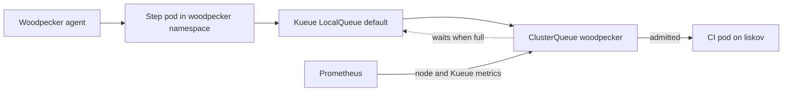

CI runs on the dedicated `liskov` worker. Woodpecker caps in-flight workflows
at 24, and Kueue decides whether each step's resource requests fit the shared
CI budget **before** Kubernetes creates its pods.

## The problem with counting jobs

Woodpecker's cap is a count: at most 24 workflows in flight. But CI steps are
not interchangeable. Twenty lightweight lint steps and twenty Docker builds are
very different loads on one machine.

A count-based limit therefore either wastes the node or oversubscribes it. When
it oversubscribes, Kubernetes keeps trying to schedule pods that cannot fit,
and the failure surfaces as scheduling churn and eventually kubelet eviction —
which looks like flaky CI rather than a capacity problem.

## Admitting by resources instead

The `woodpecker` namespace is managed by Kueue. The `woodpecker`
ClusterQueue's nominal quota is:

| Resource          | Quota |
| ----------------- | ----- |
| CPU               | 24    |
| Memory            | 80Gi  |
| Pods              | 24    |
| Ephemeral storage | 100Gi |

Steps that do not fit stay **suspended** until resources are released. No pods
are created, so there is no churn to observe and nothing to evict.

This keeps resource pressure quiet at admission time. The workflow count cap
remains an independent backstop rather than the primary control.

Liskov currently exposes approximately 83.5Gi of Kubernetes allocatable
memory. The 80Gi queue quota is therefore a scheduling guard, not permission to
consume the node to zero: the node and queue dashboards correlate admission
with MemAvailable, AMD Tctl, and disk-I/O pressure.

The complete pod reservation includes Woodpecker's own clone and workspace
containers. The audited heavy profiles are 1.1 CPU / 15.06Gi for `verify`, 1.1
CPU / 5.06Gi for Playwright, and 1.1 CPU / 2.06Gi for image/remote-BuildKit
clients. Light deploy and scanner profiles reserve 350m CPU and roughly
1.56-1.81Gi. CPU, memory, and ephemeral-storage quotas continue to stop an
unsafe all-heavy mix before the 24-workflow count cap does.

## Why ephemeral storage is in the quota

It is the one people forget. A build that fills the node's ephemeral storage
triggers kubelet eviction of _other_ pods, so an unbounded disk-hungry step can
take down unrelated work on the same node.

Including it in the admission budget makes disk a first-class scheduling
constraint rather than an afterthought.

## What is watched

Prometheus scrapes Kueue's controller through the selected ServiceMonitor in
`kueue-system`. The monitoring rules alert on sustained queue backlog and on the
memory conditions that precede liskov's kubelet eviction behaviour.

Backlog is the signal that the quota is too small for the workload; the memory
alert is the signal that something is about to go wrong regardless.

## Where to look

- Kueue chart and ServiceMonitor: `resources/argo-applications/platform/kueue.ts`
- Queue resources and pod quota: `resources/kueue-config.ts`
- Namespace and count cap: `resources/woodpecker/agent.ts` and
  `misc/woodpecker.ts`
- Per-step resource tiers: `packages/woodpecker-config-extension/src/pipeline/tiers.ts`
- Node and admission alerts:
  `resources/monitoring/monitoring/rules/resource-monitoring-liskov.ts`

## Related

- [About the homelab](/explanation/homelab/overview/) — why liskov is CI-only
