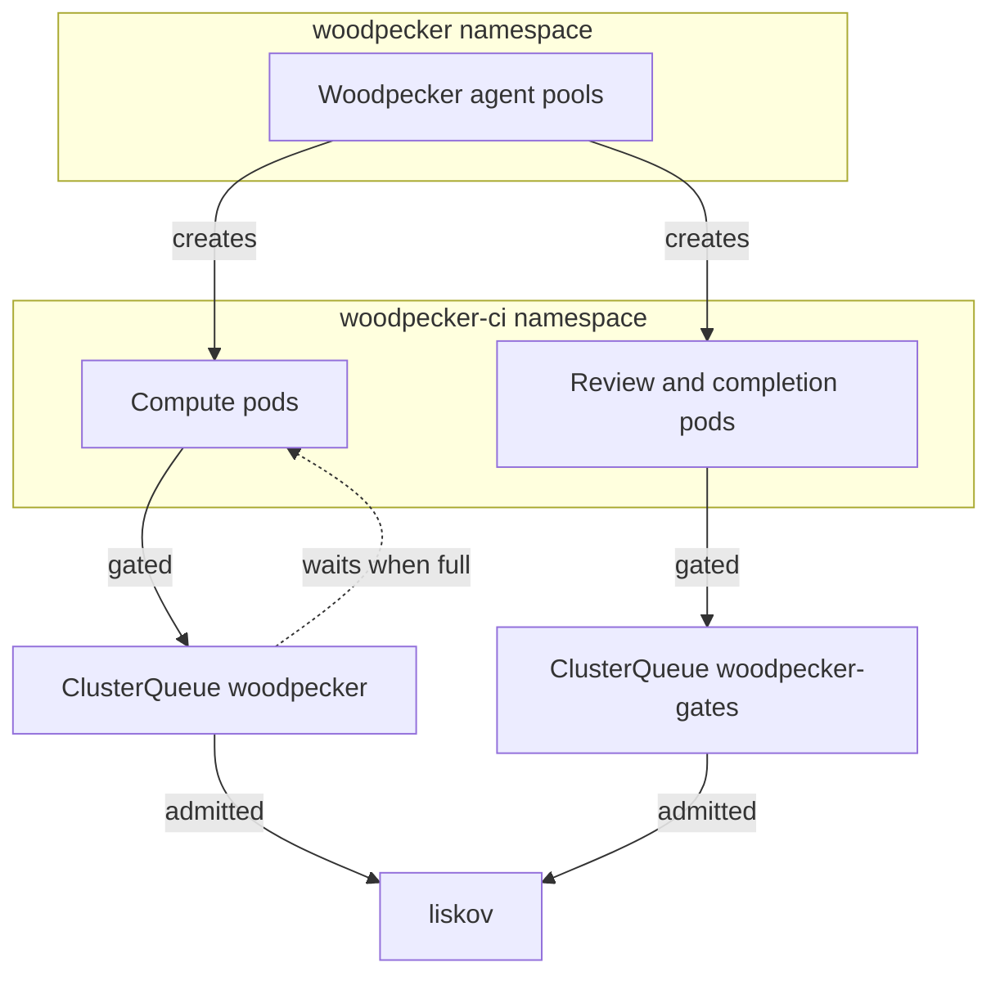

Kueue holds CI pods until their requests fit liskov's budget, with a separate
reserve for review and completion gates.

The [admission budget](https://raw.githubusercontent.com/shepherdjerred/monorepo/refs/heads/main/packages/homelab/src/cdk8s/src/misc/ci-admission-budget.json)
divides the existing capacity between computation and gates. Woodpecker's
workflow caps limit concurrency within each pool.

```mermaid
flowchart TB
  accTitle: CI resource admission
  accDescr: Woodpecker agents create pods in the woodpecker-ci namespace. Compute pods use the default queue, while review and completion pools use a separate gate reserve. Both queues admit pods onto liskov. The control plane lives in a namespace Kueue never touches.

  subgraph CP[woodpecker namespace]
    WP[Woodpecker agent pools]
  end
  subgraph CI[woodpecker-ci namespace]
    POD[Compute pods]
    GATE[Review and completion pods]
  end
  WP -->|creates| POD
  WP -->|creates| GATE
  POD -->|gated| CQ[ClusterQueue woodpecker]
  GATE -->|gated| GQ[ClusterQueue woodpecker-gates]
  CQ -->|admitted| NODE[liskov]
  GQ -->|admitted| NODE
  CQ -.->|waits when full| POD
```

## The problem with counting jobs

A count cannot tell a lint step from a cold Docker build. The July 2026
freezes proved it: nine concurrent jobs locked up a node. Lowering the cap did
not help, because the cap never bounded what each job consumed.

A count therefore either wastes the node or oversubscribes it. Oversubscription
surfaces as scheduling churn, then kubelet eviction. It looks like flaky CI
rather than a capacity problem.

## Admitting by resources instead

Kueue meters CPU, memory, and ephemeral storage across two CI queues.
Their combined budget stays below liskov's allocatable capacity.
The [queue definitions](https://raw.githubusercontent.com/shepherdjerred/monorepo/refs/heads/main/packages/homelab/src/cdk8s/src/resources/kueue-config.ts)
derive both reserves from the admission budget.

A pod that does not fit is held behind a scheduling gate. It exists, but the
scheduler and the kubelet ignore it. There is no churn, and nothing to evict.
It waits until other CI work finishes.

Ephemeral storage is in the budget deliberately. A build that fills the node's
disk makes the kubelet evict _other_ pods. Metering it makes disk a scheduling
constraint instead of an afterthought.

## Why gates have reserved capacity

A review poller can occupy a workflow slot while waiting for an external
provider. A completion check can then queue behind work from newer PRs.
The developer waits even after the expensive checks have finished.

The [agent pools](https://github.com/shepherdjerred/monorepo/blob/main/packages/homelab/src/cdk8s/src/resources/woodpecker/agent.ts)
give PR execution, main releases, reviews, and completion separate workflow
caps. Review and completion share a small resource reserve but have separate
agents. A backlog of review polls therefore cannot consume the completion slot.

Mandatory agent labels keep a pool from taking unrelated workflows.
All generated workflows use their assigned pool. The admission proof covers
eight compute slots and four gate slots. Its pod backstop also includes
compute services, so partially started workflows cannot fill every slot before
a step can run. The legacy pool has zero slots and no agent Deployment.

The reserve slightly reduces compute capacity. It buys predictable access for
short verdict checks without increasing the total CPU, memory, or ephemeral
storage budget. Gate workflows need no checkout or services, so their workspace
claims are smaller too.

## Admission priority does not preempt production

The queues define workload priorities for main releases, ready PRs, and drafts,
in that order. These priorities order waiting work inside Kueue.
They leave every CI pod at the existing Kubernetes `batch-low` priority.
Preemption remains disabled, so priority never cancels an admitted CI pod.

## Why CI has its own namespace

Woodpecker creates bare pods, not Jobs, so admission uses Kueue's pod
integration. That integration can only be scoped by namespace, and it gates
every pod in one. It also fails closed: while Kueue is down, pod creation
there fails.

That is right for CI and wrong for anything that must restart unattended. So
the control plane (server, agent, configuration extension, database) lives in
`woodpecker`, which Kueue never manages. CI pods, their caches, and their
credentials live in `woodpecker-ci`. A Kueue outage fails CI loudly and leaves
the control plane alone.

The maintenance worker shares `woodpecker-ci` because it mounts the caches.
It has its own small queue, so it never holds CI quota.

## Every pod is its own workload

Woodpecker runs a workflow as separate pods: a clone, then its services and
step together. Kueue admits each one alone. That creates one hazard: services
are admitted before their step and hold quota while it waits. Enough waiting
workflows could hold everything, with no step able to start.

A root check, `check-ci-admission-budget.ts`, rules that out. It proves that
every in-flight workflow's services plus the largest step always fit the
budget. Most services use the small `SERVICE_TIER`. Paper needs a larger
reservation, so its workflow has a shared concurrency cap across agents and
PRs. The proof accounts for that cap without reducing the smoke checks.

Kueue never preempts CI. It stops a plain pod by deleting it, and Woodpecker
reports a pod that vanishes mid-step as a success.

## Guards against a misplaced pod

Placement, priority, and requests come from three different layers: the
agent's pod defaults, the pipeline generator, and a namespace `LimitRange`.
Woodpecker gives its clone and service pods nothing a step declares. Without
the agent defaults, a clone would land on the production node. The workspace
claim would bind there with it.

An admission policy, `woodpecker-ci-pod-guard`, rejects any CI pod that is
not pinned to liskov, not at `batch-low` priority, or missing requests and
limits. A regression in any layer becomes a failed step, not CI on torvalds.

## Workspaces do not accumulate

Each workflow gets a workspace claim on the `ci-workspace` storage class. The
class deletes the volume with the claim and provisions only on liskov. A class
that retained volumes would grow the CI pool with every build. That is the
disk-full failure the July freezes began with.

A claim that outlives any possible workflow means Woodpecker failed to delete
it. The `WoodpeckerWorkspaceClaimLeaked` alert reports it.

## What is watched

Prometheus scrapes Kueue's controller through a ServiceMonitor in
`kueue-system`. Sustained pending workloads mean the budget is too small for
the work. Gated time counts against the workflow timeout, so the backlog alert
fires well before that. Separate memory alerts watch for liskov approaching
kubelet eviction, whatever the queue says.

## Where to look

- Kueue chart and controller config:
  `resources/argo-applications/platform/kueue.ts`
- Queues and quota: `resources/kueue-config.ts` and
  `misc/ci-admission-budget.json`
- CI namespace, `LimitRange`, and default service account:
  `resources/woodpecker/ci-namespace.ts`
- Pod guard: `resources/woodpecker/ci-pod-guard.ts`
- Agent pod defaults: `resources/woodpecker/agent.ts`
- Workspace class: `misc/storage/storage-classes.ts`
- Per-step resource tiers:
  `packages/woodpecker-config-extension/src/pipeline/tiers.ts`
- Budget proof: `scripts/checks/ci/check-ci-admission-budget.ts`
- Queue, workspace, and liskov memory alerts:
  `resources/monitoring/monitoring/rules/woodpecker.ts` and
  `resources/monitoring/monitoring/rules/platform/resource-monitoring-liskov.ts`

## Related

- [About the homelab](/explanation/homelab/overview/) — why liskov is CI-only
