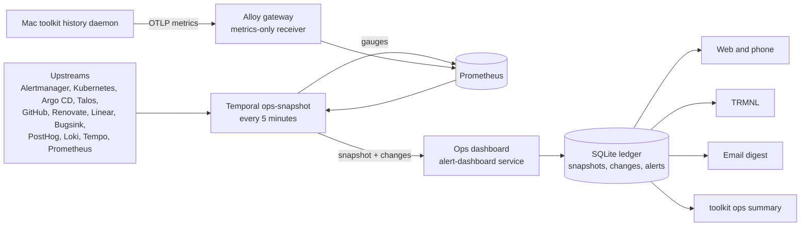

The operations overview gives one answer to "is anything wrong, and what is
waiting on me?". Every surface reads the same stored snapshot. The web
dashboard, the TRMNL screen, the email digest, and `toolkit ops summary` never
query upstreams themselves.

## The questions it answers

The design starts from seven recurring questions, not from the data sources:

| Question                                             | Where it is answered                                         |
| ---------------------------------------------------- | ------------------------------------------------------------ |
| Is anything wrong right now?                         | Overall status, section cards, attention list                |
| Something broke — what changed, and where?           | Service detail with its change timeline and drill-down links |
| What is in flight, and what is waiting on me?        | Delivery section and the "waiting on you" list               |
| Which subscription should I use, and am I on budget? | AI section: quota windows, spend, projection                 |
| What is rotting?                                     | Maintenance section                                          |
| Are my sites up and used?                            | Sites & product section                                      |
| How did the week go?                                 | Review page and the weekly digest                            |

Grafana remains the place to drill in. The overview links into Explore and the
existing dashboards rather than embedding panels.

## System map

## One model, many renderers

Five consumers ask the same questions. Building a web page first and scraping
it later would give each surface its own interpretation of "healthy". Instead,
the contract lives in `packages/ops-model`.

Every upstream fact becomes a **signal**. A signal has a severity, a source, an
optional service, a `needsMe` flag, a start time, and links. Signals group into
fixed **sections**. Each section rolls up to its worst severity. The snapshot
rolls up its sections the same way.

The severity scale is `ok < info < unknown < warning < error`. `unknown` sits
above `info` on purpose. A source that failed to answer must never look
healthy, but a known problem still sorts ahead of a blind spot.

## Why a scheduled snapshot, not live queries

A Temporal schedule collects every five minutes and stores the result. This
choice has three consequences.

- Every surface agrees, because they all read the same document.
- History comes for free. The collector sets Prometheus gauges for PR counts,
  the Renovate backlog, Linear, Bugsink, and Talos. The dashboard keeps hourly
  snapshots for trends.
- The dashboard needs no upstream credentials. Linear, PostHog, and GitHub
  access lives only in the Temporal infra worker, which already held the
  Talos, GitHub App, and Bugsink credentials.

The cost is up to five minutes of lag. Alerts are the exception, because
Alertmanager already pushes them to the dashboard's ledger in real time.

Each source is isolated. A failed source becomes a failed `SourceStatus`, and
its section renders `unknown`. The rest of the snapshot still publishes. At
read time the dashboard applies a staleness budget of three intervals. An old
snapshot degrades to `unknown` instead of staying green. A Prometheus rule
alerts when publishing stops.

Adding a source spans two deploys. Collector activities update with every
release, but the snapshot workflow is pinned to the central Worker
Deployment version. Until that version advances, a newly declared source is
reported as failed ("not collected by this workflow build") rather than
blocking the whole snapshot. Traces arrived this way: error and slow root
traces come from Tempo's TraceQL search, grouped by root service.

## The service catalog is the join key

Triage and product questions only work if names from different systems meet.
`packages/ops-model/services.json` maps each service to its namespaces, Argo CD
applications, Bugsink projects, analytics sites, Grafana dashboards, and
deploy variants.

Namespaces do most of the joining. Probes, pods, Argo CD destinations, and Loki
streams already carry them. The catalog only needs explicit entries for names
with no namespace, such as Bugsink project slugs and PostHog site keys.

Tests keep the catalog honest. Every Argo CD application and every analytics
site must belong to exactly one service. `toolkit deployed` derives its service
table from the same file.

## Mac usage stays push-only

Personal Claude Code, Codex, and subscription quota data exist only on the
Mac. The `toolkit history` daemon pushes them as OTLP metrics. The cluster
never reaches into the laptop, and a sleeping Mac simply stops reporting.

Two details make the counters trustworthy.

- Transcripts get pruned, and the history index can be rebuilt. A separate
  export ledger only ever adds events it has not seen, so totals never
  decrease.
- The first run seeds the ledger without exporting. History starts at rollout;
  it is not backfilled.

The Alloy gateway exposes a separate metrics-only receiver on the tailnet. It
forwards only `ai_usage_*` and `ai_subscription_*` series to Prometheus. The
trace receiver stays cluster-internal. See
[Enable Mac usage metrics](/how-to/enable-mac-usage-metrics/).

## Read-only by design

The overview links to native tools and never acts on them. It cannot approve a
Renovate update, silence an alert, or merge a PR. That keeps every token
read-scoped. It also leaves the tailnet boundary as the only access control a
read-only page needs.

The dashboard writes only two things. It stores ingested snapshots, and it
records which signals a viewer has already seen.

The email digest follows the same rule. A daily glance and a weekly review
summarize the stored snapshots. Alertmanager remains the only paging path.
Sending is gated by the `ops-digest-email-enabled` flag.

## Why it lives in the alert dashboard

The alert dashboard already had the durable SQLite ledger, the Postal outbox,
Grafana deep links, and a tailnet UI. The overview extends that service in
place rather than adding a sibling. The deployed identity stays
`alert-dashboard`, so the ledger volume and webhook URL do not move. The same
service answers on both the `alerts` and `ops` tailnet hosts. See
[Alerts and incident history](/explanation/homelab/alerts/) for the ledger
itself.

## Where to look

- Contract, policy, and catalog: `packages/ops-model/`.
- Upstream clients: `packages/ops-clients/`.
- Collector workflow and schedules: `packages/temporal/src/workflows/ops-snapshot.ts`
  and `packages/temporal/src/activities/ops/`.
- Dashboard, digest, and API: `packages/alert-dashboard/`.
- Mac export: `packages/toolkit/src/lib/history/`.
- Alloy receiver: `packages/homelab/src/cdk8s/src/resources/argo-applications/observability/alloy-gateway.ts`.
