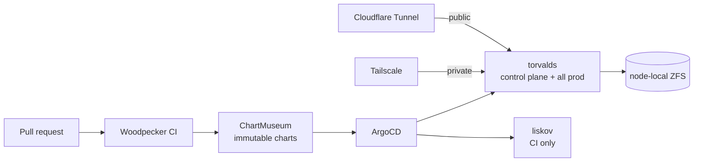

The homelab is a two-node Talos Linux cluster. Everything on it is defined as
typed TypeScript — cdk8s for Kubernetes manifests, OpenTofu for the external
services around them — and delivered by ArgoCD.

## Two nodes, deliberately unequal

**torvalds** is the control plane and the only node running production — media,
home automation, monitoring, and the storage for every prod PVC. Its ZFS volumes
are node-local, so prod stateful workloads cannot move.

**liskov** is a CI-only worker (Ryzen 9950X), tainted `ci=only:NoSchedule` in its
Talos machine config. Only CI step pods, which also nodeSelector onto it,
and per-node system DaemonSets with tolerations run there.

This is not a high-availability cluster and is not pretending to be. For prod
workloads torvalds is effectively a single node: a replacement pod _is_ prod, and
there is no second node it could use.

## Why the split is worth having anyway

The value is not redundancy — it is **separating failure domains**.

If liskov is down, CI pods go Pending and nothing else notices. CI deliberately
never falls back onto torvalds, because a runaway build competing with the media
stack and home automation for CPU is worse than CI simply waiting.

If torvalds is down, everything is down, including the control plane. That is
the accepted single point of failure, and knowing it is single is more useful
than pretending otherwise.

GPU work (Intel i915 hardware acceleration) exists only on torvalds. liskov has
no GPU workloads.

## Memory is shared, not reserved for every possible peak

Production workloads reserve their baseline memory and share spare RAM for bursts.
Adding every application's independent peak would reserve memory that normally sits unused.
Container limits bound selected bursty apps so one outlier cannot consume the whole pool.
The [workload resource definitions](https://github.com/shepherdjerred/monorepo/blob/main/packages/homelab/src/cdk8s/src/misc/container-resources.test.ts) preserve these explicit decisions.

Interactive games and Plex can reclaim reservations from the two background Glitter workers.
They cannot preempt equal-priority normal services, including databases.
The existing global service default remains non-preempting.
The [priority classes](https://github.com/shepherdjerred/monorepo/blob/main/packages/homelab/src/cdk8s/src/misc/priority-classes.ts) define that boundary.

Background work may wait, restart, or exhaust its existing finite retries during repeated pressure.
That tradeoff favors a usable homelab over protecting every background occurrence.
Priority influences node-pressure eviction; it does not guarantee protection from every OOM.
The [Glitter deployments](https://github.com/shepherdjerred/monorepo/blob/main/packages/homelab/src/cdk8s/src/resources/temporal/workers/glitter-worker.ts) keep the existing shutdown and retry contracts.

Host reservations and eviction floors still protect Talos, Kubernetes daemons, and ZFS memory.
Available-memory alerts warn before pressure reaches those floors.
Their sources are the [kubelet budget](https://github.com/shepherdjerred/monorepo/blob/main/packages/homelab/src/talos/torvalds/patches/kubelet.yaml) and [production memory alerts](https://github.com/shepherdjerred/monorepo/blob/main/packages/homelab/src/cdk8s/src/resources/monitoring/monitoring/rules/platform/resource-monitoring-production.ts).

## Typed infrastructure, not YAML

Manifests come from cdk8s in strict TypeScript, and Helm values are typed
against generated chart types. The committed types in
`packages/homelab/src/cdk8s/generated/helm` are the source of truth; a chart bump
that changes them without regenerating fails CI on a dedicated drift check.

The reason is that a Kubernetes manifest error usually surfaces as a workload
that quietly does not do what you meant. Pushing that into a type error moves the
discovery from "weeks later" to "before merge".

OpenTofu covers what is not in the cluster: ArgoCD bootstrap, Cloudflare,
GitHub, SeaweedFS, Tailscale, and the media stack's external config.

## Delivery is GitOps, with an unusual amount of care

Charts are published immutably and synced by exact revision, not by a floating
tag. The release sequence suspends auto-sync, publishes, applies child specs
while still suspended, reconciles, and only then restores the root tree — see
[release safety](/explanation/homelab/release-safety/) for why each of those
steps exists.

Nothing is applied to the cluster by hand. A change that is not in Git does not
survive the next sync.

## Two ingress paths

Private services use a **Tailscale ingress** and are reachable only from the
tailnet. Public services go through a **Cloudflare Tunnel**.

Choosing tailnet-only is the default, and the tailnet can serve as a service's
authorization boundary.

Funnel, which would publish a tailnet service to the public internet, is
deliberately never configured.

## Where state lives

Persistent volumes are ZFS on OpenEBS, across an NVMe pool and an HDD pool. They
are scrubbed weekly and covered by an explicit Velero backup inventory.

Object storage is SeaweedFS, which backs S3 buckets for Scout images, Glitter's
corpus, LLM observability archives, and public PR artifacts. Protected objects
are copied incrementally to immutable recovery points in Cloudflare R2; derived
and ephemeral buckets remain explicitly excluded. See the
[SeaweedFS backup reference](/reference/seaweedfs-backups/).

Secrets come from 1Password. Backup coverage is an explicit list, not an
inference — a volume nobody added is a volume nobody is backing up, and the
orphan audit exists to make that visible.

## CI runs here, so the homelab is in the merge path

CI runs on liskov under [Kueue admission](/explanation/homelab/ci-admission/).
The Temporal worker also posts the required `ci/merge-conflict` status.

That means the homelab being down blocks merging. It is a real coupling, and an
accepted one.

## Related

- [Release safety](/explanation/homelab/release-safety/)
- [CI admission](/explanation/homelab/ci-admission/)
- [Cut a homelab release](/how-to/cut-a-homelab-release/)
