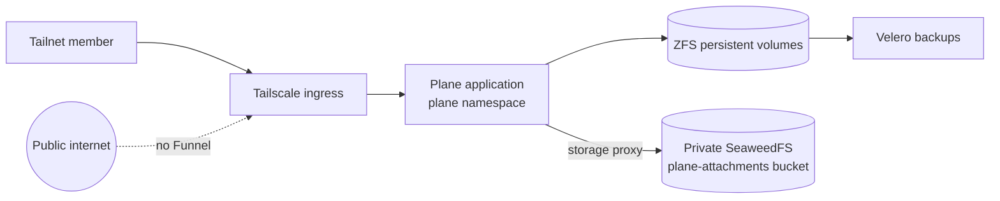

Plane is the homelab's private issue tracker, reachable only through the
Tailscale ingress at the tailnet's `plane` MagicDNS name. Funnel is not
configured, so the public internet has no route to it.

## Wrapping a vendor chart instead of forking it

The vendor chart's own ingress stays disabled, because the cluster's Tailscale
ingress supplies the private access boundary.

The vendor services are headless, which the Tailscale operator cannot route
to directly. Rather than patching the vendor chart, a local chart provides
narrow ClusterIP adapters in front of them.

That keeps the vendor chart pinned and upgradable. A fork would drift, and every
Plane upgrade would become a merge.

## Two kinds of state, two recovery paths

This is the part worth remembering, because restoring one without the other
gives you a tracker full of broken attachment links.

**Structured state** — PostgreSQL, Redis, RabbitMQ, monitor state — lives on ZFS
persistent volumes and is explicitly included in the Velero inventory.

**Attachments** live in the private `plane-attachments` SeaweedFS bucket,
protected from accidental destruction by its OpenTofu lifecycle policy rather
than by Velero.

They are separate because they fail differently. Volume snapshots are the right
tool for a database; object-store lifecycle protection is the right tool for a
large, append-mostly blob store.

## Browsers never touch the object store

Plane uploads attachments through its storage proxy and the in-cluster S3
endpoint. The bucket stays private and clients never need S3 credentials or
direct access.

The alternative — presigned URLs straight to the bucket — would mean the
object store's exposure is only as good as every URL that has ever been issued.

## GitOps owns deployment

A local chart creates the namespace, secrets integration, and private ingress. A
separate ArgoCD application installs the pinned vendor chart.

Changes flow through Git and ArgoCD, never direct Kubernetes mutation.

## Where to look

- Private ingress and 1Password integration: `src/cdk8s/src/cdk8s-charts/plane.ts`
- Vendor chart settings and storage proxy: `resources/argo-applications/plane.ts`
- Attachment bucket lifecycle: `src/tofu/seaweedfs/buckets.tf`
- Backup inventory: `src/cdk8s/src/backup-policy/pvc-backup-policy.json`
