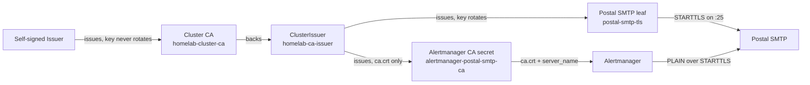

Alertmanager's independent Postal fallback authenticates with PLAIN over
STARTTLS. Go's SMTP client refuses PLAIN on a plaintext connection, so a
Postal listener that never advertises STARTTLS cannot receive that mail even
when the HTTP API is healthy.

The dashboard's opening notifications use Postal's HTTP API. They are a
different path. Enabling SMTP TLS does not send those queued messages. It
makes the Alertmanager fallback able to authenticate.

## Why a cluster CA, not a self-signed leaf

Postal SMTP and Alertmanager live in different namespaces. A certificate that
is its own trust anchor breaks the first time the leaf rotates. cert-manager's
`rotationPolicy: Always` mints a new key, the secret's `tls.crt` changes, and
Alertmanager has no coordinated reload against Postal.

The two-tier pattern avoids that. A long-lived CA with `rotationPolicy: Never`
is the trust anchor. A ClusterIssuer signs rotating leaves from it. Clients
trust `ca.crt` copied into each leaf secret, never `tls.crt`.

[`cert-manager.ts`](https://github.com/shepherdjerred/monorepo/blob/main/packages/homelab/src/cdk8s/src/resources/argo-applications/cert-manager.ts)
owns the CA and ClusterIssuer.
[`postal.ts`](https://github.com/shepherdjerred/monorepo/blob/main/packages/homelab/src/cdk8s/src/resources/mail/postal.ts)
presents the rotating SMTP leaf.
[`prometheus.ts`](https://github.com/shepherdjerred/monorepo/blob/main/packages/homelab/src/cdk8s/src/resources/argo-applications/prometheus.ts)
points Alertmanager at `ca.crt` and sets `smtp_require_tls: true`.

This CA is cluster-scoped on purpose. Temporal's PostgreSQL CA stays a
namespace-local Issuer because that identity is only for the database.
Mixing SMTP clients into that chain would couple their rotation. The first
cross-namespace consumer is Postal SMTP. Later in-cluster TLS clients can
reuse the ClusterIssuer without minting another root.

The leaf and CA split matches
[Temporal PostgreSQL's TLS identity](/explanation/temporal/postgresql-tls-identity/).
The issuer here is a ClusterIssuer instead of a namespaced Issuer.

## Why Prometheus syncs after the cluster CA

Alertmanager requires the CA secret. If that mount is optional, a missing or
unissued certificate lets the pod start and hides the failure until fallback
mail tries to validate Postal.

Prometheus therefore syncs at wave `-1`, after the cluster CA and the
prometheus-namespace trust certificate at waves `-4` through `-2` in
[`application-release-policy.ts`](https://github.com/shepherdjerred/monorepo/blob/main/packages/homelab/src/cdk8s/src/application-release-policy.ts).
Temporal follows at wave `0` so its ServiceMonitors still see Prometheus CRDs.

## Recovery

Postal reads the SMTP certificate when the process starts. Kubernetes updates
the mounted secret on renewal, but the cluster has no secret-reloader, so the
running Postal SMTP pod keeps the previous leaf until it is rolled.

The leaf lasts one year and renews 30 days before expiry. A rollout in that
window picks up the new leaf while the old one is still valid. Alertmanager
trusts `ca.crt`, which does not change when the leaf rotates. Regenerating the
cluster CA is a rare, deliberate event and requires rolling every client that
mounted `ca.crt`.

## Related

- [Alerts and incident history](/explanation/homelab/alerts/)
- [Temporal PostgreSQL's TLS identity](/explanation/temporal/postgresql-tls-identity/)
