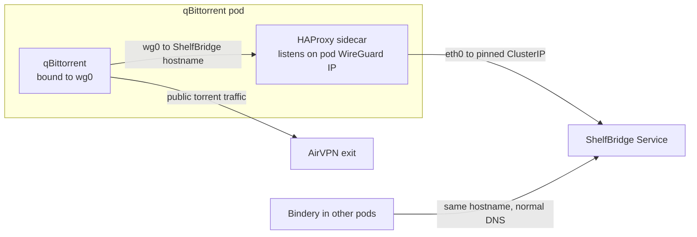

qBittorrent must send every packet through the AirVPN WireGuard device (`wg0`),
so no torrent traffic ever leaks onto the cluster network. Its book webseeds
come from ShelfBridge, an in-cluster service reachable only over the normal pod
route (`eth0`).

Those two facts conflict: a client pinned to `wg0` cannot dial a Kubernetes
ClusterIP.

## The obvious fix is the wrong one

The simple resolution is to relax the VPN binding, or add a cluster-network
exception to the client. Both work, and both convert a hard guarantee into a
configuration detail that a future change can quietly undo.

The relay exists specifically so `Session\Interface=wg0` and
`Session\InterfaceName=wg0` never have to be relaxed. Those settings are
committed and drift-enforced.

## Why a fixed-destination sidecar, not a proxy

The HAProxy backend is a single pinned ShelfBridge ClusterIP. The relay has no
Service and no Ingress, and it cannot forward anywhere else.

That constraint is the whole security argument. A general-purpose proxy inside
the VPN-bound pod would be an escape hatch out of the VPN boundary — exactly the
thing the binding exists to prevent. A relay that can only ever reach one
address is not.

Gluetun keeps its default-deny firewall with only the Kubernetes service CIDR
allowed outbound.

## The split-horizon hostname

`media-shelfbridge-service` resolves two ways. Inside the qBittorrent pod a
`hostAlias` maps it to the pod's own WireGuard address, where HAProxy listens.
Everywhere else it resolves normally to ShelfBridge's Service.

One name, two destinations. This means the webseed URLs ShelfBridge hands out
work unchanged from either side, so nothing has to know it is talking through a
relay.

## Two operational consequences

**Readiness tracks the local listener, not the remote backend.** The pod's
readiness probe watches HAProxy's local health port, so a ShelfBridge outage
degrades webseeds without pulling the qBittorrent WebUI or its metrics endpoint
out of service. HAProxy's `/health` still reports backend reachability for
diagnosis.

**Config changes roll the pod.** The HAProxy config is mounted via `subPath`, so
it is never hot-reloaded, and HAProxy has no in-place reload. A `config-hash`
pod-template annotation forces a rollout whenever the relay config changes —
otherwise the running pod would serve stale config behind a Synced ArgoCD
application, which is the worst kind of drift because everything looks correct.

## Where to look

- Relay, sidecar, split-horizon alias, and readiness wiring:
  [`qbittorrent.ts`](https://github.com/shepherdjerred/monorepo/blob/main/packages/homelab/src/cdk8s/src/resources/torrents/qbittorrent.ts)
- ShelfBridge service, pinned ClusterIP, and webseed base URL:
  [`shelfbridge.ts`](https://github.com/shepherdjerred/monorepo/blob/main/packages/homelab/src/cdk8s/src/resources/torrents/shelfbridge.ts)
