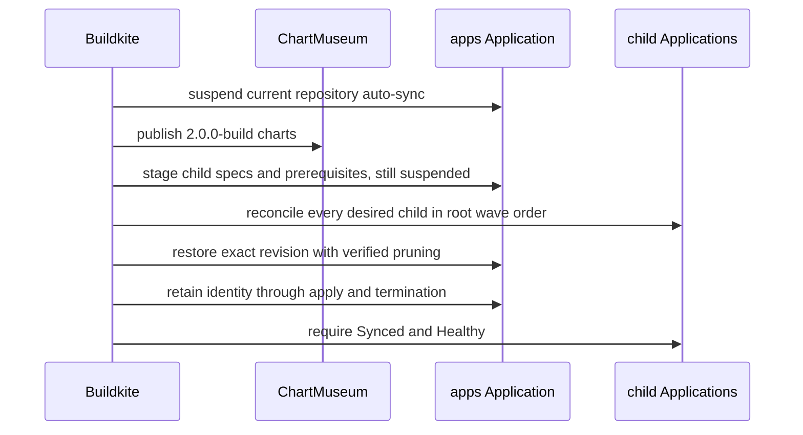

The homelab release pipeline does several things that look redundant until you
consider what each one prevents. Every step exists because of a specific way a
GitOps release can go wrong.

## Why the root is applied twice

The second suspended root apply is the part people delete when simplifying, and
it is the part that matters.

New child-level safety settings have to exist _before_ those children sync.
But enabling floating auto-sync before every chart is published would let a
child pick up a partially published release.

The staged root release applies unchanged resources with exact-revision,
source-selective syncs. Child Applications are the only resources changed:
local manifest overrides keep their auto-sync disabled regardless of whether
their source is internal or external. Child settings and root-owned
prerequisites such as admission policies therefore land before reconciliation
without starting an automatic child operation. Keeping unchanged resources on
the source path is significant: Argo applies the chart-owned object itself,
rather than treating a local manifest as an alternate desired tree whose result
may be reported as applied without updating a cluster-scoped prerequisite. The
[manifest-override batcher](https://github.com/shepherdjerred/monorepo/blob/main/packages/homelab/scripts/argocd-manifest-overrides.ts)
splits only the rewritten Application requests at 750 kB. ArgoCD v3.4.5's
[operation-state constructor](https://github.com/argoproj/argo-cd/blob/564b94973b284b8de98da7cee6eeade2cb941e46/controller/sync.go#L76-L81)
copies the original request into status. In this cluster, a request near the
observed 2 MiB controller message ceiling can therefore be accepted but never
acquire visible operation state, matching
[upstream reports of oversized operation-state patches](https://github.com/argoproj/argo-cd/issues/14224#issuecomment-1636337124).
The batcher also keeps each request within one numeric Argo sync wave and sends
waves in ascending order. Argo applies all targets in a wave before waiting for
their health; separating waves prevents a degraded child Application in an
earlier wave from leaving root-owned prerequisites in a later wave unapplied.
Once every selected resource in a staged wave is applied, the release command
terminates that exact operation instead of waiting for aggregate health. A
failed resource with an actual Argo hook type still blocks termination; health
for ordinary child Applications remains the final scoped release gate's job.
Argo omits `operation.sync.revision` from manifest-override operations, so the
release command also persists the exact revision in the operation info list
beside its request and operation UUIDs. Either representation can prove the
revision, but disagreement between them is a hard identity failure.

Disabling every child creates a second ordering obligation: Buildkite must
explicitly reconcile external children as well as charts published by this
repository. The release renders the exact root revision again, orders its
Application manifests by numeric sync wave, and combines two revision sources.
Repository charts use the immutable revision inventory produced by the publish
step; external charts and Git sources use their complete root-manifest source,
including Helm values. The staging parser preserves that nested source object;
dropping fields there can rewrite every external Application to chart defaults.
This lets a controller upgrade such as cert-manager finish before a later
repository workload depends on it. It also fences the inventories in both
directions so a published child cannot disappear from the root and a
repository child cannot silently fall back to its semver range.

ArgoCD's comparison status is not deployment proof during this transition. A
staged Application can report `Synced` at its new comparison revision while
its latest deployment history still names the old source. For an external
child, the complete history entry source must match the complete rendered root
source before reconciliation skips it. A Git tag may resolve to a commit SHA,
so comparing only the history revision to the root's tag would create a
permanent mismatch; comparing only the source target would miss changed Helm
values at the same chart version.

Once that exact source has been deployed, ordinary same-source drift remains
the external Application's responsibility after auto-sync is restored; it does
not broaden the release-scoped gate. Repository-published children keep the
stricter boundary: sync status, exact resolved revision, latest deployment
history, and terminal operation state must agree. This prevents the brief
post-stage comparison window from skipping a changed external prerequisite.

Certificate waves still use resource health as their ordering barrier. The
[cert-manager Certificate condition contract](https://github.com/cert-manager/cert-manager/blob/b8f325e36f49626ba72d7efbe138c01a5e661d96/pkg/apis/certmanager/v1/types_certificate.go#L717-L777)
allows separate `Ready` and `Issuing` conditions. A new Certificate briefly
reports `Ready=False` with reason `DoesNotExist` while it creates the referenced
Secret. The
[ArgoCD health customization](https://github.com/shepherdjerred/monorepo/blob/main/packages/homelab/src/cdk8s/src/resources/argo-applications/argocd.ts)
classifies only that normal issuance transition as `Progressing`, so the wave
waits instead of terminating. It checks the separate Issuing condition before
exempting a missing Secret because cert-manager
[records a failed request as `Issuing=False`](https://github.com/cert-manager/cert-manager/blob/b8f325e36f49626ba72d7efbe138c01a5e661d96/pkg/controller/certificates/issuing/issuing_controller.go#L408-L430)
while the missing-Secret Ready condition can remain unchanged. A different
false Ready reason or failed issuance stays `Degraded`. The
[five-minute release operation timeout](https://github.com/shepherdjerred/monorepo/blob/main/.buildkite/pipeline.yml#L1547-L1556)
still fails a Certificate that never becomes ready. Ignoring Certificate health
would let the
[later CA, database, and workload waves](https://github.com/shepherdjerred/monorepo/blob/main/packages/homelab/src/cdk8s/src/resources/postgres/alert-dashboard-tls.ts)
race a missing trust Secret, so the release does not use that shortcut.

Both request shapes remain isolated by numeric sync wave and exact resource
identity. After explicit child reconciliation completes, the
[root finalizer](https://github.com/shepherdjerred/monorepo/blob/main/packages/homelab/scripts/argocd.ts)
reapplies the exact desired tree in isolated wave batches. This restores every
child auto-sync policy without letting an unhealthy earlier wave hide a later
one. Unchanged resources again use the exact source, while the self-managed root
Application alone uses a local override to stay suspended so it cannot launch
an unowned full-source operation between batches. Only then does the owned
full-source operation restore the root policy and perform verified pruning.
That final operation must report the root Application and every prune candidate;
other desired-resource coverage comes from the completed batches. Aggregate
child health remains deferred to the scoped release gate.

This split proof is deliberate. The root chart contains its own Application,
and ordinary child Applications can be degraded. Argo waits for their health
before exposing later waves, even after the current wave and all prunes apply.
Weakening generic sync completeness would risk skipping a genuinely unapplied
later wave. Proving each desired wave first keeps that safety boundary intact.

Every desired automated policy includes an explicit `enabled` boolean. The
[release policy](https://github.com/shepherdjerred/monorepo/blob/main/packages/homelab/src/cdk8s/src/application-release-policy.ts)
stages repository charts with `enabled: false`. An empty object also means
enabled to Argo, but restoring that staged object to `{}` can produce an
`automated: null` patch that the Application CRD rejects. The
[artifact-level chart test](https://github.com/shepherdjerred/monorepo/blob/main/packages/homelab/src/cdk8s/src/helm-template.test.ts)
checks every synthesized Application so the release restores a concrete object.

## Why immutable chart revisions

Charts are published once, under an exact revision, and synced by that revision
rather than a floating tag.

A floating tag means "whatever is newest when the sync happens", which makes a
release non-reproducible and makes a partially published set indistinguishable
from a complete one.

## Why a Synced-and-Healthy child still gets retried

Repository-child reconciliation retries a failed operation recorded against
the current chart revision even when ArgoCD already reports Synced and Healthy.
External-child reconciliation runs when the complete rendered root source is
absent from the latest deployment history.

That reads like a bug and is not. A child-level safety setting can make the same
immutable chart revision safe to retry after a previous apply failed. Without
the retry, the failed operation would stay recorded and the child would sit in a
state nobody clears.

## The prune rule, and why it distrusts ArgoCD

This is the most dangerous part of the pipeline, because the failure mode is
deleting a retained application.

Root pruning does **not** trust ArgoCD's cached `OutOfSync` or
`requiresPruning` flags. The selective manifest-override sync temporarily marks
unselected retained children as requiring prune, so those flags describe the
override rather than the published tree.

Instead the release script renders the exact `apps` revision and treats only
live child Applications **absent from that rendered set** as prune candidates.
Each candidate must additionally carry the
`ci.sjer.red/application-lifecycle: cascade` annotation and the Argo resources
finalizer.

This is the same principle the repo applies elsewhere: do not validate a
replacement against the unreliable signal it replaces. The desired state is the
rendered revision, not ArgoCD's opinion about it.

## Why the final root sync ends after apply

The root app also tracks child Applications that may be deferred or
independently unhealthy. Waiting synchronously on the root would mean waiting on
every one of them, and a single permanently unhealthy child would hold the
release open forever.

So the [main release pipeline](https://github.com/shepherdjerred/monorepo/blob/main/.buildkite/pipeline.yml)
separates root application from release-scoped health. One
[atomic Argo command](https://github.com/shepherdjerred/monorepo/blob/main/packages/homelab/scripts/argocd.ts)
retains the exact Buildkite request identity while ArgoCD applies the root
revision. It sends every desired wave as bounded exact-source selections plus
local overrides only where policy is deliberately rewritten. It compares each
batch's reported group, kind, and name identities with its exact selection and
terminates that batch only after all selected resources apply. During
finalization, the self-managed root is the deliberate override: keeping its
auto-sync disabled prevents an unowned operation between batches. Only after
all desired batches complete does the finalizer start a full-source prune. That
operation must report the restored root and carries the independently validated
candidates into its completion boundary, requiring each candidate to appear as
`Pruned` before termination.
The generic atomic sync path remains stricter: without prior desired-batch
proof, it still requires every rendered desired identity in the same result.

The identity boundary matters because ArgoCD publishes operation state
asynchronously. A second process can read before the accepted operation appears.
Keeping submission and finalization together lets the command poll through that
gap and distinguish stale state from its own operation.

Buildkite retries reuse the build UUID. The
[operation identity implementation](https://github.com/shepherdjerred/monorepo/blob/main/packages/homelab/scripts/argocd.ts)
adopts only the same request ID and revision. It refuses any unrelated active
operation. For the root workflow, the active resource selection must also equal
one exact desired batch or the unselected final prune. Each owned operation
also persists a `batch` or `prune` phase marker. An unselected operation is
adoptable as the final prune only when that marker says `prune` and Argo's prune
flag is true, so an older full-source operation cannot borrow prior-batch proof.
A generated per-operation UUID binds the top-level live operation to its
completed status. This lets a retry accept a stable, fully applied result while
rejecting stale status from an earlier POST with the same Buildkite identity.
The standalone finalizer remains a recovery tool, not part of the normal
release path. It recognizes the retired client's pre-UUID operation only when
both live and completed state share the exact request ID and revision. Both
must omit an operation UUID. Atomic operations never use that compatibility
case.

After termination, the top-level live operation is authoritative. Its absence
means the health wait is gone even if `status.operationState` still says
`Running` or `Terminating`; a different operation UUID in live or completed
state still proves replacement and fails the release. Natural success uses the
[same boundary](https://github.com/shepherdjerred/monorepo/blob/main/packages/homelab/scripts/argocd.ts):
a `Succeeded` status does not finish the command until the live operation
clears.

Without this atomic boundary, a root operation stuck in `Running` blocks the
next ordered release indefinitely. Treating missing operation state as success
is therefore unsafe even when every manifest was applied.

## Why image selection looks complicated

The authenticated publisher is not proof that Kubernetes can pull an image.
GitHub Container Registry packages are private by default. The monorepo's
`org.opencontainers.image.source` label links each application package to its
source repository, but that link does not make the package public. GitHub
describes source links, inherited repository access, and package visibility as
separate controls in its
[package access guidance](https://docs.github.com/en/packages/learn-github-packages/configuring-a-packages-access-control-and-visibility).
That separation is why the release treats anonymous pullability as its own
gate. The operator procedure for bootstrapping or recovering package visibility
lives in [Cut a homelab release](/how-to/cut-a-homelab-release/#if-ghcr-rejects-a-workload-pull).

After the push, the
[image publication flow](https://github.com/shepherdjerred/monorepo/blob/6891646ef4bfbe67a3b5bea615c0e100e99c6145/.buildkite/scripts/bake-images.ts)
resolves the candidate tag to a digest. The
[anonymous GHCR probe](https://github.com/shepherdjerred/monorepo/blob/ecfd92e182858588dc98c9ed85fcefe768fb0680/.buildkite/scripts/ghcr-public-access.ts)
then requests a pull token and fetches that immutable digest. Visibility and
manifest propagation may lag briefly, so the probe polls a bounded number of
times. Buildx then reads the effective OCI configuration at that same digest
and requires its source label to name the monorepo. The image lane records no
pin candidate until both checks succeed. This keeps a publisher credential or
a misleading Dockerfile from hiding what the unauthenticated kubelet and the
published artifact would expose later.

Application image selection uses the newest `main` commit whose `images` and
`version-commit-back` jobs both passed as its comparison base.

The image publisher reads current comparison digests and commit-back keys from
the structured `version-catalog.json` source of truth. The generated
`versions.ts` module is a runtime projection, not a writable pin corpus. The
image tests resolve every real bake target against the structured catalog so a
representation migration cannot finish a production push and only then discover
that it has no pin to update.

The problem being solved: a version-pin commit can cancel the rest of the build
that produced the image it pins. Treating that as an invalidated build would
throw away a completed image build, smoke test, and durable pin-handoff
evidence.

So a later pin commit cancels the remaining build without invalidating that
evidence. Changes after the image-release commit still rebuild their affected
closures, and an unchanged pin-only successor does not rebuild and repin the
same application forever.

## Related

- [Cut a homelab release](/how-to/cut-a-homelab-release/) — reading a live release
- [About the homelab](/explanation/homelab/overview/)
