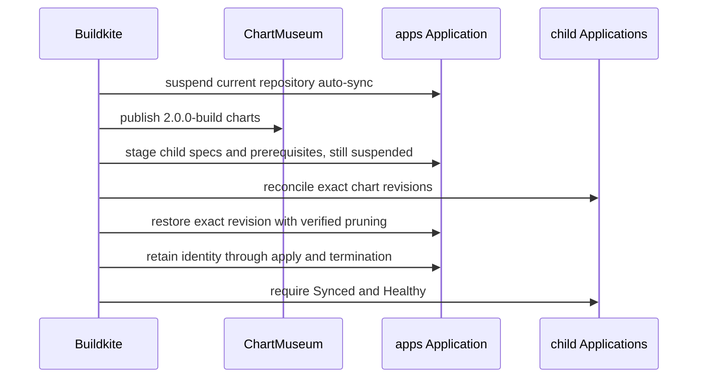

The homelab release pipeline does several things that look redundant until you
consider what each one prevents. Every step exists because of a specific way a
GitOps release can go wrong.

## Why the root is applied twice

The second suspended root apply is the part people delete when simplifying, and
it is the part that matters.

New child-level safety settings have to exist _before_ those children sync.
But enabling floating auto-sync before every chart is published would let a
child pick up a partially published release.

The staged root release applies every exact rendered resource through manifest
overrides. Child Applications are the only resources changed: their auto-sync
remains disabled regardless of whether their source is internal or external.
Child settings and root-owned prerequisites such as admission policies
therefore land before reconciliation without starting an automatic child
operation. The
[manifest-override batcher](https://github.com/shepherdjerred/monorepo/blob/main/packages/homelab/scripts/argocd-manifest-overrides.ts)
splits those requests at 750 kB. ArgoCD v3.4.5's
[operation-state constructor](https://github.com/argoproj/argo-cd/blob/564b94973b284b8de98da7cee6eeade2cb941e46/controller/sync.go#L76-L81)
copies the original request into status. In this cluster, a request near the
observed 2 MiB controller message ceiling can therefore be accepted but never
acquire visible operation state, matching
[upstream reports of oversized operation-state patches](https://github.com/argoproj/argo-cd/issues/14224#issuecomment-1636337124).
The batcher also keeps each request within one numeric Argo sync wave and sends
waves in ascending order. Argo applies all targets in a wave before waiting for
their health; separating waves prevents a degraded child Application in an
earlier wave from leaving root-owned prerequisites in a later wave unapplied.
Once every selected resource in a staged wave is applied, the release command
terminates that exact operation instead of waiting for aggregate health. A
failed resource with an actual Argo hook type still blocks termination; health
for ordinary child Applications remains the final scoped release gate's job.

After explicit child reconciliation completes, the full root apply restores
the exact auto-sync policies and performs verified pruning. Aggregate child
health is deferred until both the child and final root applies have completed.

## Why immutable chart revisions

Charts are published once, under an exact revision, and synced by that revision
rather than a floating tag.

A floating tag means "whatever is newest when the sync happens", which makes a
release non-reproducible and makes a partially published set indistinguishable
from a complete one.

## Why a Synced-and-Healthy child still gets retried

Child reconciliation retries a failed operation recorded against the current
chart revision even when ArgoCD already reports Synced and Healthy.

That reads like a bug and is not. A child-level safety setting can make the same
immutable chart revision safe to retry after a previous apply failed. Without
the retry, the failed operation would stay recorded and the child would sit in a
state nobody clears.

## The prune rule, and why it distrusts ArgoCD

This is the most dangerous part of the pipeline, because the failure mode is
deleting a retained application.

Root pruning does **not** trust ArgoCD's cached `OutOfSync` or
`requiresPruning` flags. The selective manifest-override sync temporarily marks
unselected retained children as requiring prune, so those flags describe the
override rather than the published tree.

Instead the release script renders the exact `apps` revision and treats only
live child Applications **absent from that rendered set** as prune candidates.
Each candidate must additionally carry the
`ci.sjer.red/application-lifecycle: cascade` annotation and the Argo resources
finalizer.

This is the same principle the repo applies elsewhere: do not validate a
replacement against the unreliable signal it replaces. The desired state is the
rendered revision, not ArgoCD's opinion about it.

## Why the final root sync ends after apply

The root app also tracks child Applications that may be deferred or
independently unhealthy. Waiting synchronously on the root would mean waiting on
every one of them, and a single permanently unhealthy child would hold the
release open forever.

So the [main release pipeline](https://github.com/shepherdjerred/monorepo/blob/main/.buildkite/pipeline.yml)
separates root application from release-scoped health. One
[atomic Argo command](https://github.com/shepherdjerred/monorepo/blob/main/packages/homelab/scripts/argocd.ts)
retains the exact Buildkite request identity while ArgoCD applies the root
revision. It terminates the aggregate health wait only after the complete sync
result is applied. The command compares reported group, kind, and name
identities with every resource rendered from the exact revision. An applied
early sync wave cannot hide later-wave work that ArgoCD has not reported yet.
It also carries the validated prune candidates into this boundary and requires
each candidate to appear as `Pruned` before termination.

The identity boundary matters because ArgoCD publishes operation state
asynchronously. A second process can read before the accepted operation appears.
Keeping submission and finalization together lets the command poll through that
gap and distinguish stale state from its own operation.

Buildkite retries reuse the build UUID. The
[operation identity implementation](https://github.com/shepherdjerred/monorepo/blob/main/packages/homelab/scripts/argocd.ts)
adopts only the same request ID and revision. It refuses any unrelated active
operation. A generated per-operation UUID binds the top-level live operation
to its completed status. This lets a retry accept a stable, fully applied
result while rejecting stale status from an earlier POST with the same
Buildkite identity. The standalone finalizer remains a recovery tool, not part
of the normal release path. It recognizes the retired client's pre-UUID
operation only when both live and completed state share the exact request ID
and revision. Both must omit an operation UUID. Atomic operations never use
that compatibility case.

After termination, the top-level live operation is authoritative. Its absence
means the health wait is gone even if `status.operationState` still says
`Running` or `Terminating`; a different operation UUID in live or completed
state still proves replacement and fails the release. Natural success uses the
[same boundary](https://github.com/shepherdjerred/monorepo/blob/main/packages/homelab/scripts/argocd.ts):
a `Succeeded` status does not finish the command until the live operation
clears.

Without this atomic boundary, a root operation stuck in `Running` blocks the
next ordered release indefinitely. Treating missing operation state as success
is therefore unsafe even when every manifest was applied.

## Why image selection looks complicated

Application image selection uses the newest `main` commit whose `images` and
`version-commit-back` jobs both passed as its comparison base.

The problem being solved: a version-pin commit can cancel the rest of the build
that produced the image it pins. Treating that as an invalidated build would
throw away a completed image build, smoke test, and durable pin-handoff
evidence.

So a later pin commit cancels the remaining build without invalidating that
evidence. Changes after the image-release commit still rebuild their affected
closures, and an unchanged pin-only successor does not rebuild and repin the
same application forever.

## Related

- [Cut a homelab release](/how-to/cut-a-homelab-release/) — reading a live release
- [About the homelab](/explanation/homelab/overview/)
