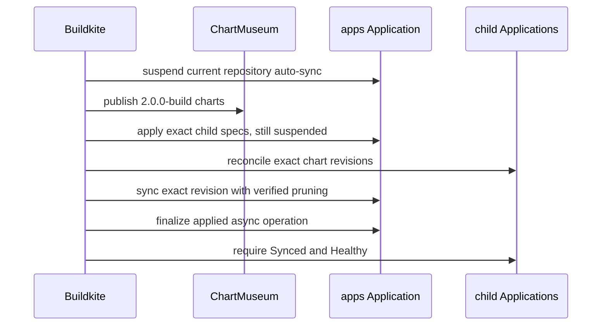

The homelab release pipeline does several things that look redundant until you
consider what each one prevents. Every step exists because of a specific way a
GitOps release can go wrong.

## Why the root is applied twice

The second suspended root apply is the part people delete when simplifying, and
it is the part that matters.

New child-level safety settings have to exist _before_ those children sync.
But enabling floating auto-sync before every chart is published would let a
child pick up a partially published release.

Applying the exact child specs while still suspended satisfies both: the
settings land, and nothing syncs on them until the chart set is complete.

## Why immutable chart revisions

Charts are published once, under an exact revision, and synced by that revision
rather than a floating tag.

A floating tag means "whatever is newest when the sync happens", which makes a
release non-reproducible and makes a partially published set indistinguishable
from a complete one.

## Why a Synced-and-Healthy child still gets retried

Child reconciliation retries a failed operation recorded against the current
chart revision even when ArgoCD already reports Synced and Healthy.

That reads like a bug and is not. A child-level safety setting can make the same
immutable chart revision safe to retry after a previous apply failed. Without
the retry, the failed operation would stay recorded and the child would sit in a
state nobody clears.

## The prune rule, and why it distrusts ArgoCD

This is the most dangerous part of the pipeline, because the failure mode is
deleting a retained application.

Root pruning does **not** trust ArgoCD's cached `OutOfSync` or
`requiresPruning` flags. The selective manifest-override sync temporarily marks
unselected retained children as requiring prune, so those flags describe the
override rather than the published tree.

Instead the release script renders the exact `apps` revision and treats only
live child Applications **absent from that rendered set** as prune candidates.
Each candidate must additionally carry the
`ci.sjer.red/application-lifecycle: cascade` annotation and the Argo resources
finalizer.

This is the same principle the repo applies elsewhere: do not validate a
replacement against the unreliable signal it replaces. The desired state is the
rendered revision, not ArgoCD's opinion about it.

## Why the final root sync is asynchronous

The root app also tracks child Applications that may be deferred or
independently unhealthy. Waiting synchronously on the root would mean waiting on
every one of them, and a single permanently unhealthy child would hold the
release open forever.

So the controller applies the exact revision and then waits on health
separately. `finalize-async-sync` verifies that the requested operation's sync
result is fully applied, refuses failed or mismatched operations, and terminates
the health wait.

Without that finalize step, a root operation stuck in `Running` would block the
next ordered release indefinitely — the asynchronous sync solves one problem and
would create another if nothing closed it out.

## Why image selection looks complicated

Application image selection uses the newest `main` commit whose `images` and
`version-commit-back` jobs both passed as its comparison base.

The problem being solved: a version-pin commit can cancel the rest of the build
that produced the image it pins. Treating that as an invalidated build would
throw away a completed image build, smoke test, and durable pin-handoff
evidence.

So a later pin commit cancels the remaining build without invalidating that
evidence. Changes after the image-release commit still rebuild their affected
closures, and an unchanged pin-only successor does not rebuild and repin the
same application forever.

## Related

- [Cut a homelab release](/how-to/cut-a-homelab-release/) — reading a live release
- [About the homelab](/explanation/homelab/overview/)
