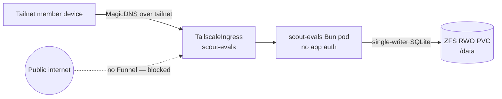

Scout review evals is a single Bun process serving a client and a tRPC API over
one SQLite file. It has **no application-level authentication at all**.

Its entire authorization boundary is the tailnet-only Tailscale ingress in front
of it. Tailnet membership _is_ the login. There is no second gate behind it.

## Why this is a reasonable trade

Building session handling, password storage, and account recovery for a
single-operator calibration tool is real work with real failure modes. The
tailnet already provides device-level identity that is stronger than a password
and that you are maintaining anyway.

Collapsing two auth layers into the one that is already trustworthy is a
legitimate choice — as long as everyone knows that is what happened.

## What it costs

The app binds `0.0.0.0` inside the cluster, which is only safe because nothing
but the tailnet ingress can route to it.

So two things become load-bearing that would otherwise be routine:

- **Never configure Funnel** on this ingress. Funnel publishes a service to the
  public internet, which would expose an unauthenticated admin surface. The call
  site and the app README both say so explicitly.
- **Tailnet membership is a credential.** Anyone you add with routing to this
  service can read and write every eval dataset. Adding a device is granting
  access.

There is no defence in depth here. That is the deliberate trade, and it means
the boundary has to be respected exactly.

## Containment, in case it is wrong

The container runs non-root with a read-only root filesystem and no privilege
escalation. Bun's runtime caches need a writable `$HOME`, so `HOME` points at a
small writable `emptyDir` at `/tmp`; durable data lives only on the `/data` PVC.

If this unauthenticated service is ever compromised, the attacker cannot rewrite
the container image contents.

## Why deploys take it down

Every dataset — raw artifacts, processed match context, prompts, model settings,
generations, human ratings — lives in one WAL-mode SQLite file on a
read-write-once ZFS volume.

Because it is single-writer, the Deployment uses the `Recreate` strategy so an
old and new pod never run concurrently and corrupt the WAL. A brief outage on
deploy is the correct behaviour, not a limitation to engineer around.

## Related

- [Operate Scout evals](/how-to/operate-scout-evals/)
- [About the homelab](/explanation/homelab/overview/) — the two ingress paths
