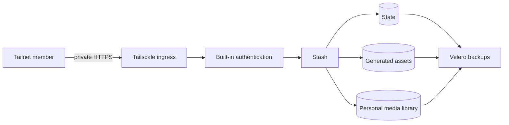

Stash is a private media organizer with two independent access barriers. The
tailnet controls who can reach it, while built-in credentials control who can
open the application.

## Why the barriers are separate

Tailscale limits network reachability to enrolled devices. It does not prove
that the person using an unlocked device should see this service.

Stash's credentials add an application session boundary. An
[init container](https://github.com/shepherdjerred/monorepo/blob/808643e192b14d4c9ec14b3c664f099407c07fd1/packages/homelab/src/cdk8s/src/resources/stash/index.ts#L36-L56)
writes the username and bcrypt hash into `/state/config.yml` before Stash
starts, so there is no first-run window without authentication.

The [Stash container](https://github.com/shepherdjerred/monorepo/blob/808643e192b14d4c9ec14b3c664f099407c07fd1/packages/homelab/src/cdk8s/src/resources/stash/index.ts#L193-L216)
mounts that same `/state` volume and points `STASH_CONFIG_FILE` at that file. It
therefore reads both credential fields; it must, to verify a login.

Neither container receives the plaintext password, but it is not confined to
1Password. The
[`OnePasswordItem`](https://github.com/shepherdjerred/monorepo/blob/808643e192b14d4c9ec14b3c664f099407c07fd1/packages/homelab/src/cdk8s/src/resources/stash/index.ts#L74-L83)
syncs the whole Login item into a Kubernetes Secret, so the plaintext lands in
cluster state and, by default, in etcd. The two
[`secretKeyRef`s](https://github.com/shepherdjerred/monorepo/blob/808643e192b14d4c9ec14b3c664f099407c07fd1/packages/homelab/src/cdk8s/src/resources/stash/index.ts#L138-L147)
only narrow what the init container reads: `username` and `password_hash`.

So the boundary is that no container reads the plaintext into its environment or
filesystem, not that the plaintext never left 1Password. Anything able to read
Secrets in the `stash` namespace can still recover it. A cost-10 bcrypt hash is
not a reusable credential, so the hash on the state volume stays a far weaker
exposure.

## Why storage is isolated

The service does not reuse the broad media namespace or its shared claims.
Configuration, generated assets, and the personal library have distinct volume
lifecycles and capacity profiles.

All three claims are listed explicitly in the
[backup inventory](https://github.com/shepherdjerred/monorepo/blob/808643e192b14d4c9ec14b3c664f099407c07fd1/packages/homelab/src/cdk8s/src/backup-policy/pvc-backup-policy.json#L356-L373).
The two ZFS volume constructs,
[NVMe](https://github.com/shepherdjerred/monorepo/blob/808643e192b14d4c9ec14b3c664f099407c07fd1/packages/homelab/src/cdk8s/src/misc/zfs-nvme-volume.ts#L33)
and
[SATA](https://github.com/shepherdjerred/monorepo/blob/808643e192b14d4c9ec14b3c664f099407c07fd1/packages/homelab/src/cdk8s/src/misc/zfs-sata-volume.ts#L33),
look their claim up as the chart is built. That lookup
[throws on an unlisted claim](https://github.com/shepherdjerred/monorepo/blob/808643e192b14d4c9ec14b3c664f099407c07fd1/packages/homelab/src/cdk8s/src/backup-policy/pvc-backup-policy.ts#L41-L54).
Missing coverage is therefore a synthesis failure, not an operational
assumption.

Phase one protects recoverability, not confidentiality at rest. The local ZFS
datasets and backup stream retain the homelab's existing unencrypted posture.
That risk is temporary and explicit; encryption needs a separate migration and
key-recovery design that preserves the initial recovery points.

## Where to look

- [Workload boundary](https://github.com/shepherdjerred/monorepo/tree/808643e192b14d4c9ec14b3c664f099407c07fd1/packages/homelab/src/cdk8s/src/resources/stash)
- [ArgoCD ownership](https://github.com/shepherdjerred/monorepo/blob/808643e192b14d4c9ec14b3c664f099407c07fd1/packages/homelab/src/cdk8s/src/resources/argo-applications/media/stash.ts)
- [Backup policy and its enforcement](https://github.com/shepherdjerred/monorepo/blob/808643e192b14d4c9ec14b3c664f099407c07fd1/packages/homelab/src/cdk8s/src/backup-policy/pvc-backup-policy.ts)
