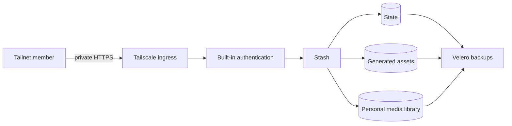

Stash is a private media organizer with two independent access barriers. The
tailnet controls who can reach it, while built-in credentials control who can
open the application.

## Why the barriers are separate

Tailscale limits network reachability to enrolled devices. It does not prove
that the person using an unlocked device should see this service.

Stash's credentials add an application session boundary. An
[init container](https://github.com/shepherdjerred/monorepo/blob/308f68a33ce0e6afe26606c5d2fb13c1b82ef1f2/packages/homelab/src/cdk8s/src/resources/stash/index.ts#L33-L45)
writes the username and bcrypt hash into `/state/config.yml` before Stash
starts, so there is no first-run window without authentication.

The [Stash container](https://github.com/shepherdjerred/monorepo/blob/308f68a33ce0e6afe26606c5d2fb13c1b82ef1f2/packages/homelab/src/cdk8s/src/resources/stash/index.ts#L182-L205)
mounts that same `/state` volume and points `STASH_CONFIG_FILE` at that file. It
therefore reads both credential fields; it must, to verify a login.

What it never receives is the plaintext password or the Kubernetes Secret. The
plaintext stays in 1Password for operator access and is never written to disk.
Only the init container reads the Secret, and only its `username` and
`password_hash` fields. A cost-10 bcrypt hash is not a reusable credential, so
its presence on the state volume is a far weaker exposure than the password.

## Why storage is isolated

The service does not reuse the broad media namespace or its shared claims.
Configuration, generated assets, and the personal library have distinct volume
lifecycles and capacity profiles.

All three claims are listed explicitly in the backup inventory. This makes
missing coverage a synthesis failure instead of an operational assumption.

Phase one protects recoverability, not confidentiality at rest. The local ZFS
datasets and backup stream retain the homelab's existing unencrypted posture.
That risk is temporary and explicit; encryption needs a separate migration and
key-recovery design that preserves the initial recovery points.

## Where to look

- Workload boundary: `src/cdk8s/src/resources/stash/`
- ArgoCD ownership: `src/cdk8s/src/resources/argo-applications/stash.ts`
- Backup inventory: `src/cdk8s/src/backup-policy/pvc-backup-policy.json`
- Deployment decisions: `packages/docs/plans/2026-08-10_stash-tailnet-deployment.md`
