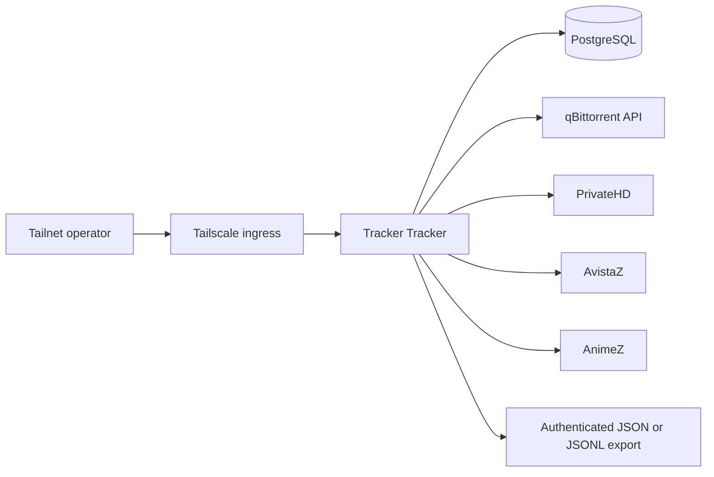

Tracker Tracker collects PrivateHD, AvistaZ, and AnimeZ account metrics
alongside qBittorrent torrent state, so ratio and buffer health live in one
place instead of three browser tabs.

## Credentials that are never in the pod

This is the interesting part of the design.

The Deployment receives only runtime and database values from the
`tracker-tracker-secrets` 1Password item. Tracker cookies, tracker login fields,
and qBittorrent credentials are **not** pod environment variables.

Instead an operator-only Bun command resolves them through `op://` references
and sends them to Tracker Tracker's authenticated API. Tracker Tracker persists
them in its encrypted database.

The reason: tracker session cookies are long-lived, high-value, and impossible
to rotate quickly. Putting them in a pod environment would spread them into
every process listing, crash dump, and debug endpoint the container ever
exposes. Treating them as bootstrap input to the application rather than
configuration of the container keeps that surface small.

TOTP is entered interactively when requested and never logged.

## Private by default

The service has a Tailscale-only hostname and no public Funnel route. Its
namespace policy permits only the required qBittorrent and PostgreSQL traffic.

Exports are authenticated JSON or JSONL, consumed by scripts. Nothing queries
the database directly, so the export shape is a real interface that can stay
stable while storage changes.

## Backed-up state

Tracker Tracker's `/data` volume and the managed PostgreSQL data claim are both
in the explicit Velero and ZFS backup inventory.

Explicit is the operative word: a volume nobody added is a volume nobody is
backing up.

## What it does not collect

Tracker-verified hit-and-run `Y/N` per torrent is deliberately outside the v1
boundary.

The adapter records account-level metrics — upload, download, ratio, buffer,
seeding, leeching, bonus, H&R, and reseed values — while qBittorrent supplies
per-torrent progress, status, client, transfer, ratio, timing, and history.
Reconciling those two into a verified per-torrent H&R judgement is a different
and much less reliable problem.

## Where to look

- Kubernetes resources: `src/cdk8s/src/resources/tracker-tracker/`
- Bootstrap and exporter: `scripts/tracker-tracker.ts`
- Operator reference template: `tracker-tracker.env.example`
- Backup inventory: `src/cdk8s/src/backup-policy/pvc-backup-policy.json`
