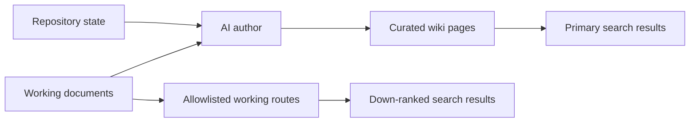

This wiki is written by AI agents and read by one person. It is the human-facing
layer over a much larger corpus of agent working documents.

## Four kinds of page

The wiki follows [Diátaxis](https://diataxis.fr/). Every page is exactly one of
four kinds, and never a blend:

| Kind        | Serves            | Answers      |
| ----------- | ----------------- | ------------ |
| Tutorial    | learning by doing | "teach me"   |
| How-to      | a goal, at work   | "how do I…?" |
| Reference   | a lookup, at work | "what is…?"  |
| Explanation | understanding     | "why…?"      |

The reason for the discipline is that the previous version of this wiki did not
have it. Pages mixed a system map, a list of flags, a set of commands, and a
design rationale, and consequently answered none of those questions well. If you
are reading a page and it stops to list flags, that is a bug.

**Tutorials are rare here on purpose.** A tutorial serves someone acquiring
basic competence, and the reader of this wiki owns these systems. Manufacturing
tutorials to fill the quadrant would be worse than leaving it nearly empty.

## Curated pages versus working material

Curated pages are the reading experience. Working material under `/working/` is
provenance — plans, research, and evidence trails you drop into when you need to
know how a conclusion was reached.

Working material sits outside the four kinds deliberately. It is not
documentation; it is the record behind it.

## The allowlist

Only exact paths listed in `src/lib/wiki-publication.ts` render under
`/working/`. Publication is file-by-file, never by directory discovery.

That is a privacy boundary, not a tidiness one. The parent corpus contains
operational notes and infrastructure context that should not be public, and
broad discovery would eventually publish one by accident.

Approved working pages carry a banner, stay out of the sidebar and sitemap,
are `noindex,follow`, and are down-ranked in search relative to curated pages.

## What does not belong here

No secrets, private host details, personal data, or sensitive incident
material — this site is public.

No workflow state either. Plan status, superseded designs, and open TODOs belong
in `packages/docs/`. A reader here wants to know how the system is, not what an
agent was planning to do about it.

## Related

- [About the monorepo](/explanation/monorepo/)
