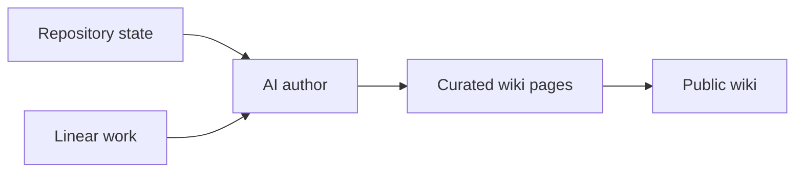

This wiki is written by AI agents and read by one person. It explains the
current systems without doubling as a project tracker.

## Four kinds of page

The wiki follows [Diátaxis](https://diataxis.fr/). Every page is exactly one of
four kinds, and never a blend:

| Kind        | Serves            | Answers      |
| ----------- | ----------------- | ------------ |
| Tutorial    | learning by doing | "teach me"   |
| How-to      | a goal, at work   | "how do I…?" |
| Reference   | a lookup, at work | "what is…?"  |
| Explanation | understanding     | "why…?"      |

The reason for the discipline is that the previous version of this wiki did not
have it. Pages mixed a system map, a list of flags, a set of commands, and a
design rationale, and consequently answered none of those questions well. If you
are reading a page and it stops to list flags, that is a bug.

**Tutorials are rare here on purpose.** A tutorial serves someone acquiring
basic competence, and the reader of this wiki owns these systems. Manufacturing
tutorials to fill the quadrant would be worse than leaving it nearly empty.

## Curated pages versus work tracking

Curated pages are the reading experience. Plans, reviews, and implementation
tasks live in Linear; code and pull requests provide implementation history.
The wiki publishes neither tracker state nor a mirror of it.

## What does not belong here

No secrets, private host details, personal data, or sensitive incident
material — this site is public.

No workflow state either. Plan status, superseded designs, and open tasks belong
in Linear. A reader here wants to know how the system is, not what an agent was
planning to do about it.

## Related

- [About the monorepo](/explanation/monorepo/)
