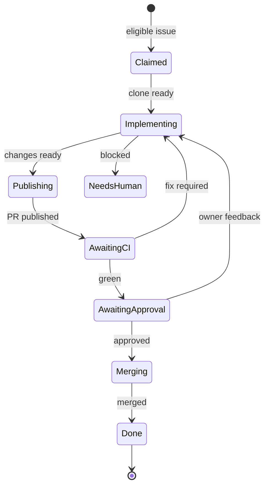

The local Linear agent queue automates implementation while preserving Jerred's
approval as the final merge authority.

Linear is only the intake queue. The MacBook owns durable task state, Docker
owns each bounded coding turn, and GitHub owns review and approval.

## Quiet periods are absence, not sleep

[The launchd reconciler](https://github.com/shepherdjerred/monorepo/blob/main/packages/justin-principal-engineer/src/host/launchd.ts)
starts one reconcile process every 60 seconds. [The reconciler state
machine](https://github.com/shepherdjerred/monorepo/blob/main/packages/justin-principal-engineer/src/reconcile.ts)
claims the local lock, advances one transition, writes state, and exits.

No model process or container remains alive while CI runs or approval is
pending. A fresh SDK turn starts only for initial implementation, owner
feedback, or a failing delivery gate.

This makes a Mac restart ordinary recovery. The next invocation reads the task
state and continues. The operating system owns the advisory lock, so it is
released atomically when the reconcile process exits or crashes.

## Authority is split at the container boundary

The [Docker runner](https://github.com/shepherdjerred/monorepo/blob/main/packages/justin-principal-engineer/src/host/docker.ts)
mounts one writable task clone, overlays its `.git` directory read-only, and
supplies one provider credential. The coding agent has shell and network access
because useful repository work needs both.

The container does not receive the host home directory, Docker socket, GitHub
App identity, Linear identity, or CI credential. It cannot publish its
own changes.

The host computes changed paths, stages them explicitly, and uses Git-Spice in
the [workspace publisher](https://github.com/shepherdjerred/monorepo/blob/main/packages/justin-principal-engineer/src/host/git-workspace.ts)
to publish. It also gathers Codex findings and CI logs before asking
for a repair turn.

## Approval is bound to the current commit

Green CI includes the repository's automated Codex review gate. The
[GitHub integration](https://github.com/shepherdjerred/monorepo/blob/main/packages/justin-principal-engineer/src/integrations/github.ts)
then waits for an `APPROVED` review from Jerred's pinned account ID and login
whose `commit_id` equals the current PR head.

A push invalidates that authorization in the reconciler even if GitHub still
displays an older approval. Merge performs the same gate and approval checks
again, closing the race between observation and mutation.

## Failure parks one task, not the queue

An implementation, checkout, or publishing failure gets one automatic retry.
Repeated failure adds `agent:needs-human` and parks the task. Observation
failures get five attempts to tolerate transient GitHub or CI outages;
the [reconciler](https://github.com/shepherdjerred/monorepo/blob/main/packages/justin-principal-engineer/src/reconcile.ts)
owns those transitions.

Base drift is restacked with Git-Spice. If that stops on conflicts, a fresh
agent turn resolves them and the host explicitly continues the interrupted
rebase before it republishes the branch.

Parked state does not hold the single active slot. A later eligible issue can
run. Requeuing the parked Linear issue restores its recorded phase and reuses
the existing checkout.

## Related

- [Run the Linear agent queue](/how-to/run-the-linear-agent-queue/)
- [The agent task security boundary](/explanation/temporal/agent-task-boundary/)
- [Run the PR fleet](/how-to/run-the-pr-fleet/)
