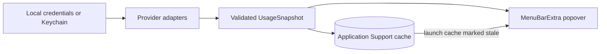

Brim keeps subscription usage visible without turning provider-specific web
usage pages into a dashboard. It polls Claude Code, Codex, Kimi Code, and Grok
through [typed credential discovery](https://github.com/shepherdjerred/monorepo/blob/231bac375d228b685e12308a1d02d243cb3d1481/packages/macos-ai-subscription-tracker/Sources/QuotaBarCore/Credentials.swift).
Its [provider-independent model](https://github.com/shepherdjerred/monorepo/blob/231bac375d228b685e12308a1d02d243cb3d1481/packages/macos-ai-subscription-tracker/Sources/QuotaBarCore/Domain.swift)
marks cached or failed data stale instead of current.

## Boundaries

The app tracks subscription usage only. It does not show developer API billing,
API rate cards, history charts, notifications, or a full usage dashboard.
The popover includes a personal subscription-spend reminder: $200/month for
Claude Code, $200/month for Codex, $40/month for Kimi Code, and $30/month for
Grok ($470/month total); this is not provider billing data.
The reminder values live in the
[subscription plan model](https://github.com/shepherdjerred/monorepo/blob/231bac375d228b685e12308a1d02d243cb3d1481/packages/macos-ai-subscription-tracker/Sources/QuotaBarCore/Domain.swift).

The subscription view surfaces the tightest actionable quota first and sorts
provider sections by current remaining usage. Quota windows and Codex reset
expirations use compact rows; healthy values stay neutral while orange and red
are reserved for pressure. Policy-only Fable data, stale snapshots, unknown
percentages, and provider errors remain explicit without invented progress.
The `API & routers` segment is deliberately disabled until developer API and
router data are actually supported.
These choices are derived by the
[quota overview model](https://github.com/shepherdjerred/monorepo/blob/231bac375d228b685e12308a1d02d243cb3d1481/packages/macos-ai-subscription-tracker/Sources/QuotaBarCore/QuotaOverview.swift)
and rendered by the
[menu-bar view](https://github.com/shepherdjerred/monorepo/blob/231bac375d228b685e12308a1d02d243cb3d1481/packages/macos-ai-subscription-tracker/Sources/QuotaBar/MenuBarView.swift).

Claude and Codex use private authenticated subscription usage surfaces. Claude
preserves additive model-scoped windows when the account returns them; Fable is
shown as a policy-only row when no independent counter is exposed. Codex labels
windows from returned duration and reset metadata, so a missing five-hour
window is not invented. It also reads the reset-credit surface read-only and
shows each available banked reset with its expiration; Brim never redeems a
reset.
The provider-specific behavior is isolated in the
[Claude adapter](https://github.com/shepherdjerred/monorepo/blob/231bac375d228b685e12308a1d02d243cb3d1481/packages/macos-ai-subscription-tracker/Sources/QuotaBarCore/ClaudeCodeProvider.swift)
and [Codex adapter](https://github.com/shepherdjerred/monorepo/blob/231bac375d228b685e12308a1d02d243cb3d1481/packages/macos-ai-subscription-tracker/Sources/QuotaBarCore/CodexProvider.swift).

Kimi Code reads its local OAuth credential directory, including a relocated
`KIMI_CODE_HOME`, and keeps Kimi Code separate from Moonshot Open Platform API
keys. Kimi and Grok may also read typed OAuth entries owned by OpenCode.
Brim never refreshes or rewrites OpenCode's credential chain; expired
credentials must be refreshed through OpenCode. Grok reads subscription usage
and credit surfaces, not xAI developer API limits. Kimi and Grok responses are
private contracts: malformed or changed responses become unavailable/stale
states and are covered by local fixtures.
Those boundaries are implemented by the
[Kimi adapter](https://github.com/shepherdjerred/monorepo/blob/231bac375d228b685e12308a1d02d243cb3d1481/packages/macos-ai-subscription-tracker/Sources/QuotaBarCore/KimiProvider.swift),
[Grok adapter](https://github.com/shepherdjerred/monorepo/blob/231bac375d228b685e12308a1d02d243cb3d1481/packages/macos-ai-subscription-tracker/Sources/QuotaBarCore/GrokProvider.swift),
and read-only [credential store](https://github.com/shepherdjerred/monorepo/blob/231bac375d228b685e12308a1d02d243cb3d1481/packages/macos-ai-subscription-tracker/Sources/QuotaBarCore/Credentials.swift).

## Runtime behavior

All enabled providers refresh in parallel every five minutes by default, with
bounded request and provider timeouts. A 401 reloads local credentials once. A
429 or network error retains the last successful windows and marks them stale.
Independent Codex/Grok surfaces may preserve valid partial data with a warning.
Successful snapshots are stored as JSON under the user's Brim Application
Support directory; corrupt and failed writes are visible, and loading the cache
always marks it stale until a fresh response arrives.
See the [polling coordinator](https://github.com/shepherdjerred/monorepo/blob/231bac375d228b685e12308a1d02d243cb3d1481/packages/macos-ai-subscription-tracker/Sources/QuotaBarCore/QuotaBarModel.swift),
[HTTP client](https://github.com/shepherdjerred/monorepo/blob/231bac375d228b685e12308a1d02d243cb3d1481/packages/macos-ai-subscription-tracker/Sources/QuotaBarCore/Networking.swift),
and [snapshot store](https://github.com/shepherdjerred/monorepo/blob/231bac375d228b685e12308a1d02d243cb3d1481/packages/macos-ai-subscription-tracker/Sources/QuotaBarCore/Persistence.swift).

The menu-bar symbol and text status use the lowest remaining quota: healthy
above 20%, warning from 5% through 20%, critical below 5%, and unavailable for
stale or unauthenticated data. Settings controls provider enablement, polling,
launch at login, optional per-provider credentials, and links to the provider
usage pages. Optional overrides are stored in the macOS Keychain and are not
included in the snapshot cache; Kimi Code and Grok fields are for subscription
credentials, not their developer API keys. Launch at login reflects the
installed app's real `SMAppService` state and reports approval or registration
failures instead of storing a hopeful boolean.
The controls are defined by [SettingsView](https://github.com/shepherdjerred/monorepo/blob/231bac375d228b685e12308a1d02d243cb3d1481/packages/macos-ai-subscription-tracker/Sources/QuotaBar/SettingsView.swift)
and the [launch-at-login controller](https://github.com/shepherdjerred/monorepo/blob/231bac375d228b685e12308a1d02d243cb3d1481/packages/macos-ai-subscription-tracker/Sources/QuotaBarCore/LaunchAtLogin.swift).

Brim's app icon is a committed Icon Composer document with separate background,
ring, and quota-wave layers. Xcode uses the document for native macOS icon
rendering across appearance modes; the manual SwiftPM bundle renders its
Default appearance into `Brim.icns` with Icon Composer's `ictool` for older
macOS compatibility. The menu-bar status glyphs remain separate template
assets because they communicate live quota state rather than app identity.

## Release boundary

The root Linux verification graph runs strict SwiftLint. Native build, test,
80% core coverage, Xcode-project compilation, app bundling, signing, and smoke
checks run locally through
`cd packages/macos-ai-subscription-tracker && bun run verify:macos`; no macOS
CI lane exists yet.
The ordinary local bundle is ad-hoc signed. A generated Xcode application
target links the same core package and enables automatic signing plus hardened
runtime; direct distribution goes through Xcode Organizer's Developer ID and
notarization workflow or equivalent explicit package commands. A release is
installable only after its Developer ID authority, secure timestamp, stapled
ticket, strict signature, and Gatekeeper acceptance all pass. Apple credentials
and private signing keys remain outside the repository. Passing fixtures
validates known response shapes but does not replace comparing all four
providers with their live Usage pages before release.
The native release gate is defined by the
[package scripts](https://github.com/shepherdjerred/monorepo/blob/231bac375d228b685e12308a1d02d243cb3d1481/packages/macos-ai-subscription-tracker/package.json)
and [Xcode project specification](https://github.com/shepherdjerred/monorepo/blob/231bac375d228b685e12308a1d02d243cb3d1481/packages/macos-ai-subscription-tracker/project.yml).

## Related

- [Monorepo source](https://github.com/shepherdjerred/monorepo) —
  `packages/macos-ai-subscription-tracker`
