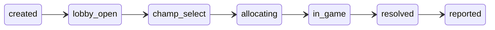

Scout reports on League matches by watching two Riot endpoints: Spectator, for
a game in progress, and Match-V5, for the finished result. Neither of them
reliably answers for a **custom game**.

Riot removed custom-game data from the public API for privacy reasons. Match-V5
does not carry customs at all, and Spectator surfaces them only inconsistently.
The practical effect for Scout was lopsided: a custom lobby would sometimes
produce a prematch card, and then never produce a post-match report, because
the match simply was not there to fetch.

The one sanctioned exception is the **Tournament API**. A game created from a
_tournament code_ is recorded in Match-V5 like any other, with
`info.tournamentCode` populated. So Scout mints the code itself, with
`/lobby create`, and the game becomes visible to the pipeline that already
exists.

That single constraint explains almost every other decision in the feature.

## The team split has to come from the person, not from Riot

Opening a Bryan Bucks market or drawing a useful prematch card requires knowing
who is on blue and who is on red **before** the game starts. Riot will not tell
us:

- `lobby-events/by-code` reports that a player joined, and gives their PUUID —
  but never which side they joined.
- Spectator would give the full roster, and does carry it for a custom
  _sometimes_, but not dependably enough to build a feature on.

So `/lobby create` takes two lists, `blue:` and `red:`, rather than one
`players:` list. The prematch card and the betting market are built from what
the person who created the lobby told us. A successful spectator probe is
treated as an upgrade, never as a prerequisite.

Players can still swap sides in the lobby — Riot enforces the participant
allow-list in aggregate, not per team. That is tolerable because a bet is
placed on a _side_, and settlement reads the actual team IDs off the finished
match.

## Notifying exactly once, from an endpoint that repeats itself

`lobby-events/by-code` replays its **entire** event list on every call. A naive
poller that reacted to "there is a `ChampSelectStartedEvent`" would send the
prematch card every twenty seconds for the life of the lobby.

Scout does not track which events it has seen. Instead it recomputes the
highest lifecycle state the whole list implies, and acts only on the
difference:

A state is only ever _entered_ once, and entering `champ_select` is what sends
the card. A replay, a crash mid-tick, a restart, out-of-order delivery, or a
tie in Riot's string-typed millisecond timestamp all produce no transitions and
therefore no second notification. That property is the reason the state machine
is a pure function with no I/O: it can be proven in CI, which matters because
almost nothing else about the feature can be.

## The poller links; it never ingests

When the game starts, the poller resolves its Riot match ID and writes an
`ActiveGame` row — and stops there.

Ingest stays with the existing per-player match-history cursor, whose write to
S3 is what allows that cursor to advance. That gate is the strongest durability
property Scout has: a storage outage stalls the cursor instead of losing a
match. A second ingest path would have to re-establish exactly-once against it
and would gain nothing, since tournament games appear in the ordinary
by-PUUID matchlist anyway.

This is also why `/lobby create` insists every participant is already tracked
in the calling server. It is not gatekeeping — an untracked lobby would produce
a code, a game, and no report at all, because nothing would be polling for it.

## Betting requires a code Scout minted

Bryan Bucks pays real balance for participation, and a custom game is trivially
farmable: ten accounts, instant surrender, repeat. So `"custom"` is
deliberately **not** an earning queue. What qualifies a custom game is that its
`tournamentCode` matches a lobby Scout itself created, in a server an operator
opted in — which makes farming require asking Scout for lobbies, one at a time.

The market is further limited to 5v5, because the MVP calculation normalises
each player's contribution against a five-man team. In a 2v2 every share would
roughly double, producing grades and payouts that are wrong rather than merely
noisy. Smaller lobbies still get reports, stats, and AI review; they just get
no market.

## What the stub cannot tell us

Riot offers `tournament-stub-v5`, which any development key may call. Scout can
run its whole request and parsing layer against it today. But stub codes do not
create a real in-client lobby, its events are canned, and `games/by-code` does
not exist there at all.

So the stub proves the client is correct. It proves nothing about a lobby. The
first real tournament-enabled key is also the first evidence for how often
spectator enriches a custom card, how long champ select actually takes, and
whether `platformId + gameId` composes a valid Match-V5 ID — which is the
assumption the entire linkage rests on.
