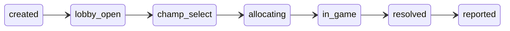

Scout reports on League matches by watching two Riot endpoints: Spectator, for
a game in progress, and Match-V5, for the finished result. Neither of them
reliably answers for a **custom game**.

Riot removed custom-game data from the public API for privacy reasons. Match-V5
does not carry customs at all, and Spectator surfaces them only inconsistently.
The practical effect for Scout was lopsided: a custom lobby would sometimes
produce a prematch card, and then never produce a post-match report, because
the match simply was not there to fetch.

The one sanctioned exception is the **Tournament API**. A game created from a
_tournament code_ is recorded in Match-V5 like any other, with
`info.tournamentCode` populated. So Scout mints the code itself, with
`/lobby create`, and the game becomes visible to the pipeline that already
exists.

Tournament-code custom games are a permanent **beta-only** Scout feature. The
production command surface hard-disables them before any beta flag or operator
override is evaluated.

The beta Customs Activity uses the same foundation. Its draft produces the
two locked teams, then calls the same retry-safe lobby service that backs
`/lobby create`. Tournament-V5 owns `PLAYING` and `RESULT_PENDING`; only the
ordinary Match-V5 ingest, after the canonical S3 write, can produce `VERIFIED`
and open intermission. The Activity has no manual winner path.

That single constraint explains almost every other decision in the feature.

## An open code is more useful than a predeclared roster

Riot will not reveal custom-game teams before the game starts. Its lobby events
say that a PUUID joined, but never which side they joined. Spectator can show a
roster sometimes, but not reliably enough to make it a dependency.

Scout used to ask the person creating a lobby for Blue and Red player lists.
That made the code an allow-list and turned a spontaneous custom into a setup
task. An open Tournament code better matches the way friends start a game: the
creator shares it, then decides teams in League.

The tradeoff is explicit. Scout can announce the map, pick type, intended team
size, and the Riot IDs of people Riot says joined. It cannot honestly draw Blue
and Red rosters, so an open lobby does not open a pregame Bryan Bucks market.

The identifying data is useful without being persistent tracking. Scout
reverse-resolves the event PUUIDs only for the lobby card. If Riot cannot
resolve everyone, Scout shows the exact joined-player count instead; it never
posts encrypted identifiers or a partial roster.

Once a tracked player in the server joins, Scout uses that actual participant to
link the game to its normal match-history ingest. Everyone else may be
untracked; the tracked participant is enough for the resulting match to reach
the report pipeline. A lobby with no tracked participant produces no Scout
report, rather than falsely promising one.

## Notifying exactly once, from an endpoint that repeats itself

`lobby-events/by-code` replays its **entire** event list on every call. A naive
poller that reacted to "there is a `ChampSelectStartedEvent`" would send the
prematch card every twenty seconds for the life of the lobby.

Scout does not track which events it has seen. Instead it recomputes the
highest lifecycle state the whole list implies, and acts only on the
difference:

A state is only ever _entered_ once, and entering `champ_select` is what sends
the card. A replay, a crash mid-tick, a restart, out-of-order delivery, or a
tie in Riot's string-typed millisecond timestamp all produce no transitions and
therefore no second notification. That property is the reason the state machine
is a pure function with no I/O: it can be proven in CI, which matters because
almost nothing else about the feature can be.

## The poller links; it never ingests

When the game starts, the poller resolves its Riot match ID and writes an
`ActiveGame` row — and stops there.

Ingest stays with the existing per-player match-history cursor, whose write to
S3 is what allows that cursor to advance. That gate is the strongest durability
property Scout has: a storage outage stalls the cursor instead of losing a
match. A second ingest path would have to re-establish exactly-once against it
and would gain nothing, since tournament games appear in the ordinary
by-PUUID matchlist anyway.

This is why an open lobby still needs one tracked participant before it becomes
a reportable Scout game. The requirement is discovered from who actually joins,
not imposed on the person creating the code.

## Betting requires a code Scout minted

Bryan Bucks pays real balance for participation, and a custom game is trivially
farmable: ten accounts, instant surrender, repeat. So `"custom"` is
deliberately **not** an earning queue. An open code also has no pregame market:
the Tournament API cannot tell Scout Blue and Red sides, and guessing would
make settlement unfair.

After the game, a recognised Scout-created tournament code can still establish
eligible 5v5 participation from the finished match. Smaller lobbies get
reports, stats, and AI review; they do not get a market because the MVP formula
normalises each player's contribution against a five-man team.

## What the stub cannot tell us

Riot offers `tournament-stub-v5`, which any development key may call. Scout can
run its whole request and parsing layer against it today. But stub codes do not
create a real in-client lobby, its events are canned, and `games/by-code` does
not exist there at all.

So the stub proves the client is correct. It proves nothing about a lobby. The
first real tournament-enabled key is also the first evidence for how often
spectator enriches a custom card, how long champ select actually takes, and
whether `platformId + gameId` composes a valid Match-V5 ID — which is the
assumption the entire linkage rests on.

The setup and recovery procedure is in [Operate Scout custom nights](/how-to/operate-scout-custom-nights/).
