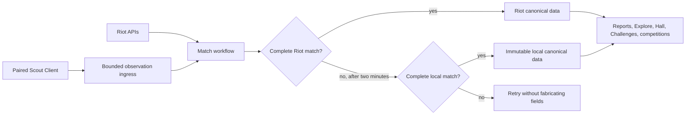

Scout uses a paired desktop client to observe League data that Riot's public
APIs omit or deliver inconsistently. The local evidence enters the same match
pipeline as Riot data without becoming an unrestricted proxy.

This reverses the old Tournament API workflow. Scout does not create a lobby
and tell players where to go. Players create or join an ordinary League lobby,
and Scout recognizes the game from what paired clients observe.

## Observation follows the players

Custom nights begin with teams assigned in Scout. Either duel participant can
create a lobby. Other customs can begin through the normal social flow in the
League client.

The backend binds an observed lobby only when its exact PUUID roster matches
one pending Custom or duel game. An ambiguous roster fails instead of being
guessed. This permits one client in a duel and several independent observers in
a ten-player lobby.

After binding, explicit League gameflow phases project the game to `PLAYING`
and `RESULT_PENDING`. These are lifecycle facts, not final results; only the
canonical postgame path can verify a winner.

The lobby-binding service in
`packages/scout-for-lol/packages/backend/src/scout-client/lobby-binding.ts`
owns that decision. Neither the desktop client nor a lobby creator assigns the
canonical Scout game.

## Riot remains the preferred match source

Local observations supplement Riot rather than replacing it. A client postgame
event starts the same durable Temporal match workflow used by Riot discovery.
The workflow asks Riot for Match-V5 first.

A complete local Match-V5-shaped payload can become canonical only after Riot
has been absent for two minutes. Scout validates the match ID, platform,
participant list, and observing player before selection. Conflicting complete
payloads fail rather than producing a blended match.

Legacy local match history can still reveal a missing match ID. Scout then
retries the ordinary Riot path without inventing fields that the local payload
does not contain. The canonical-source selector in
`packages/scout-for-lol/packages/backend/src/scout-client/canonical-match.ts`
keeps the chosen local source immutable.

## One ingress feeds the existing products

Once a match reaches the V2 workflow, it follows the established archive,
timeline, report-lake, report, notification, competition, duel, and challenge
stages. Bryan Bucks uses a separate anti-farming gate: a custom match must have
the exact roster of a scheduled Custom or duel game.

Mastery, season milestones, Clash, and challenge observations are latest-value
player snapshots. Clash snapshots include check-in eligibility, invitations,
registration state, rewards, and historical winners. Explore prefers a fresh
paired-client mastery snapshot and falls back to Riot. This preserves richer
local fields without changing the meaning of older Riot-backed data.

## The client is a narrow sensor

The Rust client accepts no caller-selected League URL. Its adapter exposes a
fixed read-only allowlist for account, lobby, champion select, gameflow,
postgame, Clash, mastery, challenges, recent matches, and replay settings. Live
game data uses Riot's fixed loopback endpoint through a separate adapter.

The League lockfile credential never leaves the machine. Device tokens live in
the operating-system credential store. Pairing requires an authenticated Scout
browser session, and a device can upload player observations only for Riot
accounts linked to its owner.

Ingress applies strict schemas, body and collection limits, depth limits,
prototype-pollution rejection, immutable observation IDs and sequence numbers,
and quarantine checks. These controls make local evidence useful without
pretending a player-controlled machine is Riot infrastructure.

The wire schemas in
`packages/scout-for-lol/packages/data/src/scout-client/protocol.schema.ts` and
ingress validation in
`packages/scout-for-lol/packages/backend/src/scout-client/ingress.ts` define
this trust boundary.

## Replays are attached evidence

The client discovers completed ROFL files from League's configured replay
directory and hashes each file before upload. The backend accepts a replay only
from a device that already supplied accepted postgame evidence for that game.

The backend streams the body through a bounded temporary file, checks its Riot
magic and declared digest, then stores it by content digest in SeaweedFS through
Scout's S3 boundary. A replay is evidence for review and future features; it
does not override the canonical structured match.

The replay relay in
`packages/scout-for-lol/packages/backend/src/scout-client/replay-upload.ts`
enforces those constraints.
