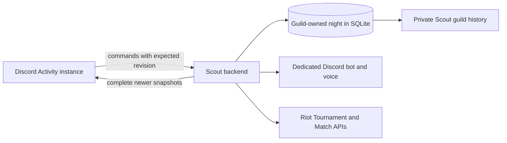

A Scout custom night is not a tournament bracket and it is not one League
match. It is the social session around several possible matches: finding ten
people, choosing captains, drafting teams, moving into voice, playing, and then
deciding what to preserve or mix up for the next game.

That distinction determines the architecture. The Discord Activity is a view
onto a guild-owned night, not the owner of it.

The [custom-night repository](https://github.com/shepherdjerred/monorepo/blob/c16cb65c4eb4bde0e3a5c04a05d8f18977a411de/packages/scout-for-lol/packages/backend/src/customs/repository.ts)
owns revisioned snapshots, while the [customs reconciler](https://github.com/shepherdjerred/monorepo/blob/c16cb65c4eb4bde0e3a5c04a05d8f18977a411de/packages/scout-for-lol/packages/backend/src/customs/reconciler.ts)
recovers work after process or Activity restarts.

## The Activity is deliberately disposable

Several friends can open or close the Activity during the same night. Discord's
participant list tells Scout who currently has that UI open, but it does not say
who intends to play. A person joins the night explicitly, accepts the custom
statistics disclosure, and then chooses Ready, Maybe, Sitting out, or Done.

The backend is the only state authority. Every command names the night and the
revision the client saw. Scout commits a validated XState snapshot, normalized
projections, and an audit event together. A stale command changes nothing and
returns the newest complete snapshot. WebSocket messages use the same complete
snapshots, so reconnecting never requires replaying an Activity's local history.
The [Activity router](https://github.com/shepherdjerred/monorepo/blob/c16cb65c4eb4bde0e3a5c04a05d8f18977a411de/packages/scout-for-lol/packages/backend/src/trpc/router/customs.router.ts)
and [snapshot socket](https://github.com/shepherdjerred/monorepo/blob/c16cb65c4eb4bde0e3a5c04a05d8f18977a411de/packages/scout-for-lol/packages/backend/src/customs/socket.ts)
expose that contract to clients.

## A night contains games, not the reverse

The night moves through recruiting, preparation, drafting, lobby, play, and
intermission. Each game has its own roster, captains, draft, Tournament code,
result, and imported Match-V5 details.

This nesting is what makes back-to-back choices coherent. Keeping teams,
rerolling a captain within each team, or redrafting with old or new captains all
start from the previous game's immutable participant snapshot. Sitting out one
game also breaks the consecutive-game champion comparison; Scout never compares
against a game the player did not play.
The [custom game service](https://github.com/shepherdjerred/monorepo/blob/c16cb65c4eb4bde0e3a5c04a05d8f18977a411de/packages/scout-for-lol/packages/backend/src/customs/game-service.ts)
creates and advances those game snapshots.

Availability stays outside both state machines. “Back in five” temporarily
removes someone from the ready count. Passing the deadline marks them overdue
rather than silently returning them. A host hold can reserve their place, while
team lock still waits for them to return.

## Discord and Riot have different jobs

Discord owns Activity embedding and invitations. Scout's dedicated Customs bot
owns the recruitment message and only the temporary voice channels recorded on
the night. The chosen lobby remains the safe boundary: Scout moves people only
from that lobby or from channels it created, and cleanup deletes only those
recorded channels.

Riot owns the actual lobby and result. Scout creates one short-lived tournament
per night and one allowlisted code per game. A callback is preferred, polling
recovers a missing callback, and a host can record a manual winner so another
game can begin. A later Riot result replaces that manual answer without erasing
the disagreement from the audit log.
The [voice service](https://github.com/shepherdjerred/monorepo/blob/c16cb65c4eb4bde0e3a5c04a05d8f18977a411de/packages/scout-for-lol/packages/backend/src/customs/voice.ts)
and [Riot result service](https://github.com/shepherdjerred/monorepo/blob/c16cb65c4eb4bde0e3a5c04a05d8f18977a411de/packages/scout-for-lol/packages/backend/src/customs/riot-results.ts)
implement these external boundaries.

## Private history is not a rating system

Custom history is available only through Scout OAuth to a current member of the
same allowlisted guild. It has no public navigation, profile, discovery,
competition, marketing, or product-analytics surface.

The stored facts are useful precisely as facts: who played, the teams and
captains, champion selections, and the verified or manual outcome. Scout does
not turn them into MMR, Elo, skill ratings, ranking leaderboards, or skill-based
balancing. Complete Match-V5 payloads remain on the guild-scoped custom game;
they never enter Scout's global report lake or Explore data. An operator-only
anonymization path removes a participant's consent and identity snapshots,
deletes the affected night's detailed Match-V5 payloads, and retains an audit
record that privacy work occurred.
The [custom history router](https://github.com/shepherdjerred/monorepo/blob/c16cb65c4eb4bde0e3a5c04a05d8f18977a411de/packages/scout-for-lol/packages/backend/src/trpc/router/customs-history.ts)
and [anonymization service](https://github.com/shepherdjerred/monorepo/blob/c16cb65c4eb4bde0e3a5c04a05d8f18977a411de/packages/scout-for-lol/packages/backend/src/customs/anonymize.ts)
enforce those privacy boundaries.
