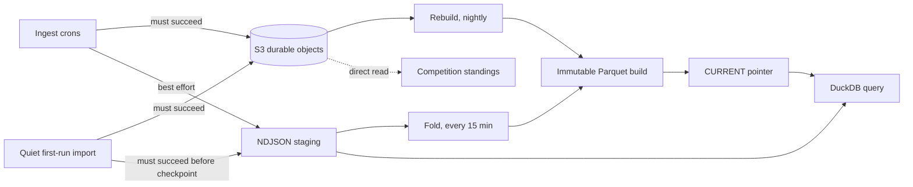
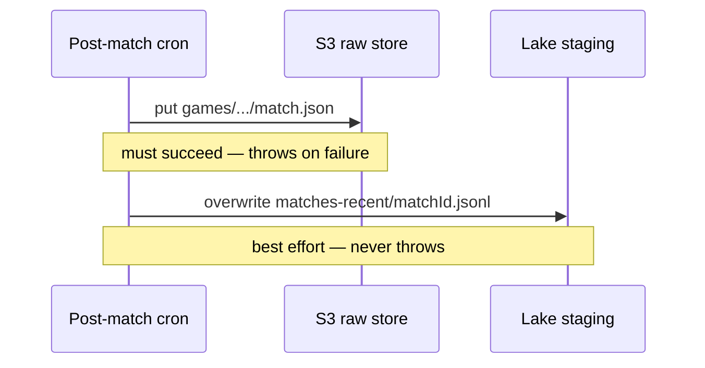
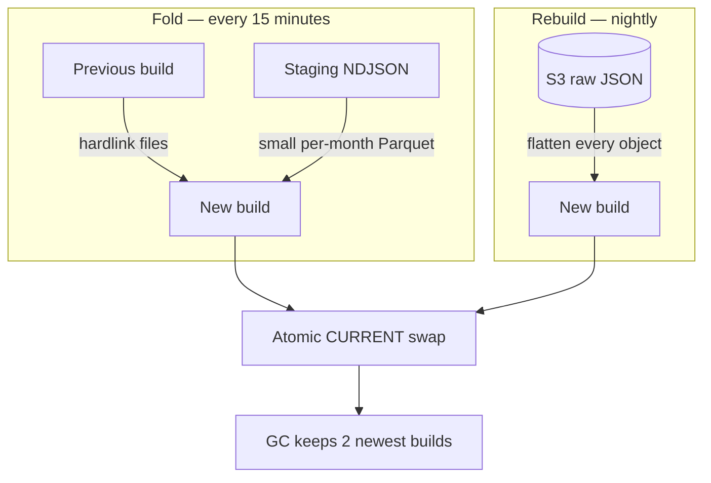
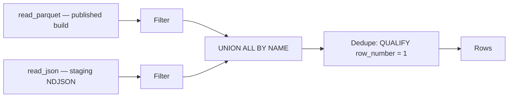

Scout has two stores with opposite guarantees: S3 holds the canonical raw
Riot JSON and must never lose a write, while the report lake is a local
Parquet directory that can be deleted and rebuilt from S3 at any time.

The lake is what the fact-style analytics surfaces query — ScoutQL's match,
prematch, and player-group sources, the Explore chat, the web data explorer —
through an embedded in-process DuckDB. Nothing on those paths reads S3, and
nothing treats the lake as durable.

Competition standings are the exception. ScoutQL's rank sources still delegate
to `calculateLeaderboard`, which pulls raw match JSON straight from S3 for the
match-counting criteria
([s3-query.ts](https://github.com/shepherdjerred/monorepo/blob/main/packages/scout-for-lol/packages/backend/src/storage/s3-query.ts));
pairing stats read the same way. Competition analysis additionally loads the
official leaderboard snapshots from S3
([s3-leaderboard.ts](https://github.com/shepherdjerred/monorepo/blob/main/packages/scout-for-lol/packages/backend/src/storage/s3-leaderboard.ts))
and merges them over the lake's rank history — a published standing is a
record, not something to re-derive. Either way those surfaces inherit S3's
latency and availability, so when competition analysis is slow or failing, the
lake is the wrong place to look.

## The record and the cache

Raw match, timeline, prematch, and leaderboard JSON lands in S3
(in-cluster SeaweedFS) under date-partitioned keys, defined in
[s3-raw-source.ts](https://github.com/shepherdjerred/monorepo/blob/main/packages/scout-for-lol/packages/backend/src/report-store/s3-raw-source.ts).
That store is append-only and authoritative.

The lake is a directory on the pod's own volume: Hive-partitioned Parquet
(`month=YYYY-MM/`) for match participants, match teams, team bans, prematch,
accounts, competition rank history, timeline events, timeline event
participants, timeline participant frames, and timeline coverage — laid out per
[paths.ts](https://github.com/shepherdjerred/monorepo/blob/main/packages/scout-for-lol/packages/backend/src/report-lake/paths.ts).
It is derived data. Losing the volume costs one nightly rebuild, not any
history.

This split is why schema changes are cheap. Adding a lake column needs no
migration and no backfill: the nightly rebuild re-derives every row from the
raw JSON, so the new column simply appears the next morning.

## Writes: live ingest can recover staging; initial import cannot

Ingest makes two writes with deliberately different contracts, spelled out in
[store.ts](https://github.com/shepherdjerred/monorepo/blob/main/packages/scout-for-lol/packages/backend/src/report-store/store.ts).
The S3 put throws on failure, because raw data is unrecoverable. Match and
timeline lake staging writes never throw, because a lost staging row is
re-derived from S3 that night anyway.

The quiet first-run import tightens that contract. It snapshots exactly 20
Match-V5 IDs once, imports newest first, and checkpoints a match only when the
S3 put and immediate staging write both succeed. A failed staging write retries
the same idempotent S3 key. This lets Explore and global ScoutQL read partial
history immediately without making guild reports claim readiness too early.
After match and current-rank enrichment, one coalesced fold refreshes
`accounts.parquet` and publishes all staged matches before the PUUID-level job
is complete. Guild-scoped lookbacks therefore see the new identity mapping and
facts together.

The import never enters the normal post-match processor. Historical matches do
not send Discord messages, generate reports or AI recaps, write ActiveGame
state, settle Bryan Bucks, award earnings, or fabricate per-match rank deltas.
The live poller resumes only after the fixed snapshot is stored and its newest
ID becomes the cursor, so a game completed during import is notified once.

Staging is one NDJSON file per match under `matches-recent/`, written as a
whole-file overwrite rather than an append
([staging.ts](https://github.com/shepherdjerred/monorepo/blob/main/packages/scout-for-lol/packages/backend/src/report-lake/staging.ts)).
Re-ingesting the same match rewrites the same file, so rows can never
interleave the way concurrent appends would, and a successful retry is
idempotent. The overwrite is not atomic, though: it targets the final path
rather than writing a temporary file and renaming it, so a crash or a storage
failure mid-write can leave a truncated file on disk. That is why compaction
validates every staged line and skips the whole file when one fails, and why
the nightly rebuild re-derives the row from S3 regardless.

Supported timelines are normalized into four relations. `timeline_events` gives
each event a stable ID; `timeline_event_participants` records semantic roles;
`timeline_participant_frames` records participant snapshots; and
`timeline_coverage` marks a retained, supported timeline as completely
normalized. Absence of that marker is missing evidence, while unsupported queue
choices are rejected before a timeline contract can be funded. That last
relation is essential for contracts: no event in a complete timeline is false
evidence, while a timeline Scout never retained must remain unknown.

Live ingest stages all four relations next to the match. Rebuild enumerates only
timeline objects already retained in S3; it does not call Riot or expand the raw
history solely to backfill a dare. Event and frame IDs are derived from match,
frame, event, participant, and role coordinates so replaying the same raw object
is idempotent.

All row shapes come from one place:
[flatten.ts](https://github.com/shepherdjerred/monorepo/blob/main/packages/scout-for-lol/packages/backend/src/report-lake/flatten.ts)
produces every lake row, and the Zod schemas plus DuckDB column types in
[schema.ts](https://github.com/shepherdjerred/monorepo/blob/main/packages/scout-for-lol/packages/backend/src/report-lake/schema.ts)
are imported by both the writer and the reader. The two sides cannot drift,
and DuckDB never infers types from a sparse first line.

The Dare SQL engine is deliberately a consumer of this lake boundary, not a
second statistics implementation. Its compiler validates one bounded,
read-only DuckDB `SELECT` against the generated relation catalog and stores the
canonical text, immutable AST, and hash. Preview and post-match settlement then
execute that same compiled contract over the historical or newly staged lake
relations. Evidence is immutable and carries the source matches and coverage
used for each result, so adding a lake column extends what SQL can express
without adding Dare-specific vocabulary or evaluator branches.

## Match relations and the Dare boundary

The match payload becomes several relations rather than one target-player row.
`match_participants` contains all ten participants. `matches` projects the
match-level columns once per match. `match_teams` contains one row for each team,
including its win state, objective counts, and first-objective flags, while
`match_team_bans` contains one row per normalized ban. That shape makes a
team-relative statistic ordinary SQL: a target row joins its team row on
`match_id` and `team_id`, and an opponent comparison joins the other team.

Version-three Bryan Bucks Dares expose those relations, the four timeline
relations, and `T1` through `T5`. Each target relation is an ordinary filtered
view of `match_participants`, bound to the contract's frozen Riot accounts and
tracking dates. The canonical SQL is the contract; generated prose only explains
it. Both historical preview and live settlement deserialize the same immutable
AST, verify its hash, and execute it over the same bounded catalog. The profile
permits one deterministic read-only `SELECT` with standard joins, CTEs,
aggregates, arithmetic, `CASE`, and Boolean expressions. It rejects mutation,
external table functions, wall-clock values, recursion, unbound targets,
nondeterministic limits, and timeline reads without a coverage relation.

Timeline absence and a complete timeline with no matching events are distinct.
Likewise, a zero denominator stays `NULL` through `NULLIF`; it is never silently
turned into zero or false. Evidence retains game-set results and numeric
projections, target dependencies, coverage, ordered source match IDs, and the
contract hash. Only a structurally proven monotone count can settle before the
deadline or game cap. Existing funded Dare contract versions remain on their
original evaluators rather than being migrated to the new SQL meaning.

## Two compaction tiers, one publish protocol

A fold runs every fifteen minutes
([compactor.ts](https://github.com/shepherdjerred/monorepo/blob/main/packages/scout-for-lol/packages/backend/src/report-lake/compactor.ts)).
It hardlinks the previous build's files into a new build directory, converts
the staged NDJSON into small per-month Parquet files, and deletes only the
staging files it provably folded. Hardlinking makes fold cost proportional to
the backlog, not to the size of the lake.

A rebuild runs nightly. It enumerates the supported raw prefixes in S3, streams
every retained match and timeline through the same flatteners, and writes each
table fresh. The rebuild is
simultaneously the defragmenter (folds leave one small file per touched
month), the backfill mechanism, and the recovery path.

Rescanning everything nightly sounds expensive, but the Parquet side is not
the cost: DuckDB converts 100k flattened rows into partitioned Parquet in
well under a second, even capped at two threads and 512 MB. Rebuild time is
dominated by fetching each raw JSON object from S3 (16 concurrent GETs —
minutes at current scale), and a slow rebuild is invisible to readers because
queries keep serving the previous build until the pointer swap below.

A staging file with any invalid line is skipped whole, left on disk for the
rebuild, and counted in `report_lake_compaction_skipped_total`
([report-lake.ts](https://github.com/shepherdjerred/monorepo/blob/main/packages/scout-for-lol/packages/backend/src/metrics/report-lake.ts)).
Growth in that counter is the early warning that Riot's payloads drifted from
the Zod schemas.

Both tiers publish the same way: builds are immutable, and a `CURRENT` file
is atomically renamed to point at the new build
([paths.ts](https://github.com/shepherdjerred/monorepo/blob/main/packages/scout-for-lol/packages/backend/src/report-lake/paths.ts)).
Directory renames were rejected because `rename(2)` cannot replace a
non-empty directory. Garbage collection keeps the two newest builds, and an
in-flight query holding file descriptors into a collected build finishes
normally on the unlinked files.

## Reads: fresh before compacted

Readers never wait for compaction. Every query unions the published Parquet
with the raw staging NDJSON, then deduplicates with a window function in
[lake.ts](https://github.com/shepherdjerred/monorepo/blob/main/packages/scout-for-lol/packages/backend/src/reports/duckdb/lake.ts).
A match is therefore queryable seconds after ingest, up to fifteen minutes
before any Parquet exists for it.

The dedupe direction encodes the data's nature. For match facts, Parquet wins
over staging, because a fact never changes. For daily rank snapshots, staging
wins, because today's snapshot legitimately replaces itself.

Two invariants govern every relation the engine builds. Filters are pushed
into both union branches before the dedupe window function, which avoided
scanning the whole lake per query. And every runtime value is a bound
parameter — only closed enums and internal column names are ever spliced into
SQL text.

Queries run on a single in-process DuckDB with capped threads and memory, one
connection per query so a timeout can interrupt exactly that query
([instance.ts](https://github.com/shepherdjerred/monorepo/blob/main/packages/scout-for-lol/packages/backend/src/reports/duckdb/instance.ts)).
The cap exists so an expensive report cannot starve the Discord bot sharing
the process.

## Scope is a type, not a parameter

Queries carry a `LakeQueryScope` that is either guild-scoped or explicitly
global — a discriminated union, not an optional server id
([scope.ts](https://github.com/shepherdjerred/monorepo/blob/main/packages/scout-for-lol/packages/backend/src/reports/duckdb/scope.ts)).
Guild scope joins the accounts table filtered by server. Global scope drops
the accounts join entirely, because accounts rows exist per server and an
unfiltered join would double-count players registered in several servers.

Making global a distinct variant means forgetting to scope is a type error,
not a silently inflated statistic.

## Related

- [Scout's time model](/explanation/scout-temporal-analysis/) — how windows
  and competition periods query this lake without rewriting official results
