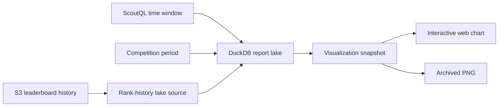

Scout can slice match history by time — rolling windows, comparisons, rank
history — while official competition standings stay exactly as they were.

Those two requirements pull against each other. Recomputing a competition over
an arbitrary window is exactly how you accidentally rewrite a result someone
already saw.

## One snapshot, two surfaces

A single versioned visualization snapshot drives both the interactive web chart
and the deterministic Discord PNG.

This is the mechanism that keeps the two honest. If the web and the bot each
computed their own view, they would drift the moment either changed, and nobody
would notice until the numbers disagreed in public.

The snapshot carries presentation intent as well as data: sample sizes, Wilson
intervals, comparison deltas, rolling or cumulative transforms, annotations,
trends, stacking, bump charts, calendar heatmaps, and sparklines.

Browser hover, crosshairs, zoom, and brushing are interaction only. They never
alter an archived result.

## Official results are preserved by default

Competitions default to `Official` — the existing competition-to-date result.
That is the standing anyone has already been shown.

`Selected period` is the exploratory mode. It intersects the requested dates
with the competition lifespan and recomputes: match criteria from lake facts, or
rank criteria from daily leaderboard snapshots. Its persisted analysis timezone
defaults to UTC.

Making exploration opt-in, rather than making the window a free parameter on the
official view, is what stops a curiosity from becoming a retroactive edit.

## Old runs keep their old rendering

Reports store their timezone in ScoutQL and support relative or inclusive
calendar windows up to 365 days, with automatic or explicit buckets and optional
equal-length comparisons.

New runs archive the exact query and visualization they used. Older runs
continue to serve their existing PNG.

So improving the renderer does not silently restyle history, and a report you
posted last year still looks like what you posted.

## Related

- [Temporal workflow inventory](/reference/temporal-workflows/) — the Scout upkeep jobs
