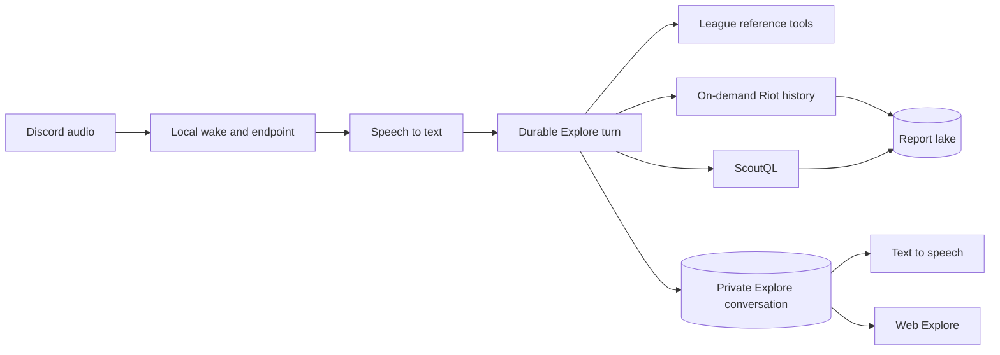

Scout Voice is an input and output adapter for Explore, not a second League
agent. Speech changes how a question enters and leaves the system. It does not
change who reasons, which tools are available, or where the answer is saved.

A separate voice agent made answers depend on the interface. It had a small
static tool set, no report-lake analysis, and no durable conversation. New
League capabilities would have needed two implementations and two prompts.

The unified boundary keeps one source of reasoning behavior. The Voice session
transcribes an utterance, starts a Voice-surface Explore turn, and synthesizes
a compact speech rendering of the persisted answer. Explore owns tools,
quotas, execution, and storage.

## Spoken turns are saved conversations

Each speaker gets one private conversation for the lifetime of a `/scout join`
session. Questions and final answers are normal Explore messages. The
conversation carries a server-owned Voice origin, which the web UI displays as
a badge. This preserves follow-up context and lets a speaker inspect the exact
answer later.

A Voice turn stores two answer renderings. `content` is the full Explore answer
and may include supporting detail, a visualization, match cards, caveats, and
follow-ups. `spokenContent` is a private delivery field with a one-to-three
sentence speech-safe summary. It is not exposed through transcript or stream
contracts. Requests such as “save a chart,” “full breakdown,” and “short
version” remain ordinary follow-up turns in the same conversation.

Disconnecting voice stops synthesis, not the Explore Workflow. The durable turn
continues and saves its answer. If reasoning takes longer than two seconds, the
adapter acknowledges the question and speaks the final answer only while the
session remains connected.

A completed answer opens a 15-second continuation window for the same speaker.
At most two utterances can omit the wake phrase. Another speaker still needs
the wake phrase, so one person's conversation cannot capture another person's
speech.

## Live Riot data becomes shared evidence

Explore can resolve the asker's current lane opponent from linked accounts and
Riot Spectator. It refuses ambiguous accounts, non-standard lobbies, hidden
identities, and uncertain lane assignments.

On demand, a Temporal Workflow ensures the newest 100 matches Riot classifies
as ranked are covered. It reuses existing lake data, permanently archives and
stages only missing matches, then folds the report lake before ScoutQL runs.
Concurrent requests for the same account coalesce within a ten-minute window.
Later requests can refresh the sample. A separate bounded Workflow can fetch
up to ten timelines selected from the latest query when an analysis needs event
order.

This makes acquired history part of [Scout's report lake](/explanation/scout-report-lake/),
not private conversation state. Future Explore questions can query the same
evidence from web, Discord, or Voice.
