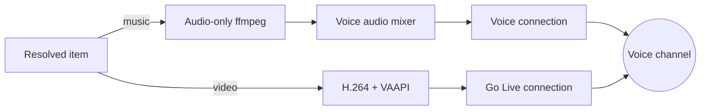

Streambot plays a song as microphone audio and a film as a Go Live stream, from the same userbot
account. The transport is chosen per item, not per session.

Both paths share one Discord voice connection that the userbot already joined. Only the media
connection carrying the item differs, so a queue can alternate between them without rejoining. The
choice is made per segment in
[`streamer/`](https://github.com/shepherdjerred/monorepo/tree/main/packages/streambot/src/streamer), from the kind the resolver settled on.

## The problem with one transport

Every item used to take the same route: an ffmpeg pipeline encoding H.264 through VAAPI into a Go
Live stream, built by
[`prepareStream`](https://github.com/shepherdjerred/monorepo/blob/main/packages/discord-video-stream/src/media/newApi.ts). That is the right shape for a film and the wrong shape for a song.

A three-minute track paid for a full video encode and a second WebRTC connection to carry content
with no picture. It also consumed one of the
[pooled userbot accounts](https://github.com/shepherdjerred/monorepo/tree/main/packages/streambot/src/pool), which are scarce — the pool's size is
what bounds how many servers can listen at once.

## What each transport is

Discord exposes two ways for a user account to emit media, and they differ in what the client shows.

|               | Music                         | Video                                |
| ------------- | ----------------------------- | ------------------------------------ |
| Connection    | the ordinary voice connection | a separate Go Live connection        |
| Speaking flag | `1`, microphone               | `2`, soundshare                      |
| Client shows  | a green ring on the avatar    | a watchable stream tile              |
| ffmpeg        | audio only, `-vn`             | decode, scale, tonemap, H.264 encode |

The microphone semantics come free.
[`BaseMediaConnection`](https://github.com/shepherdjerred/monorepo/blob/main/packages/discord-video-stream/src/client/voice/BaseMediaConnection.ts)
sends speaking flag `1`, and only
[`StreamConnection`](https://github.com/shepherdjerred/monorepo/blob/main/packages/discord-video-stream/src/client/voice/StreamConnection.ts)
overrides it to `2`, so routing through the voice connection is already what a person talking
sounds like to every client in the channel.

## Why one component owns the outbound audio

The voice connection carries a single RTP timestamp sequence, one packetizer and one SSRC, all
owned by
[`WebRtcConnWrapper`](https://github.com/shepherdjerred/monorepo/blob/main/packages/discord-video-stream/src/client/voice/WebRtcWrapper.ts). Two
writers on it do not mix — they interleave two Opus streams into noise.

That matters because the voice assistant already speaks over this connection. Music arriving as a
second writer would corrupt both, and neither writer would see an error.

So a single mixer owns every outbound frame. It forwards Opus untouched while nothing is
attenuating, and only decodes, applies gain and re-encodes while the assistant is speaking over a
track. An ESLint rule in
[`eslint.config.ts`](https://github.com/shepherdjerred/monorepo/blob/main/packages/streambot/eslint.config.ts)
rejects any other reference to `sendAudioFrame`, because the failure it prevents is silent.

## The failure mode worth knowing

An audio frame can be dropped before it reaches the wire. If no audio packetizer is installed,
[`sendAudioFrame`](https://github.com/shepherdjerred/monorepo/blob/main/packages/discord-video-stream/src/client/voice/WebRtcWrapper.ts) returns
`false` rather than raising.

The pacer keeps feeding frames at realtime and playback reports a normal end. A four-minute song
plays to complete silence and every layer above calls it a success.

Two things guard against it. The send path now reports whether a frame reached the transport, and a
watchdog fails the segment when frames stop landing while ffmpeg is still producing.

## Deciding which an item is

Classification happens at resolve time, from
[yt-dlp metadata](https://github.com/shepherdjerred/monorepo/blob/main/packages/streambot/src/sources/ytdlp.ts) and an
[ffprobe](https://github.com/shepherdjerred/monorepo/blob/main/packages/streambot/src/sources/probe.ts) of the chosen input. A `mode` option on
`/stream play` overrides it.

[ffprobe](https://github.com/shepherdjerred/monorepo/blob/main/packages/streambot/src/sources/probe.ts) is authoritative. yt-dlp reports a missing
video codec three different ways across extractors — the string `none`, `null`, or the field absent entirely — so metadata alone cannot
decide. A container with no video stream is a fact; an extractor's opinion is a hint.

The probe also settles a request that asks for the impossible, and the two cases are treated
differently on purpose. An **inferred** video guess loses to the probe and becomes music — that is
what keeps an MP3 whose metadata says nothing about its codecs playable at all.

An **explicit** `mode:video` does not. It is an instruction, either from a user or from the rollout
flag forcing the pre-split transport, so [`resolveSource`](https://github.com/shepherdjerred/monorepo/blob/main/packages/streambot/src/sources/resolve.ts)
rejects the item by name rather than switching it to audio. Silently switching would ignore the
user, and would make the flag a switch that turns nothing off.

## What this rules out

**One transport with audio-only encoding.** Go Live with no picture still costs a second connection
and shows a stream tile nobody can watch. The saving is the connection, not just the encoder.

**Choosing per session rather than per item.** A queue mixing a song and a film is ordinary. Binding
the transport at session start would force one of them onto the wrong path.

**A second bot account for music.** A Discord bot cannot Go Live, so the split would become two
identities with two failure modes, two token sets and two voice states to reconcile. The
[userbot pool](https://github.com/shepherdjerred/monorepo/tree/main/packages/streambot/src/pool) already bounds how many accounts exist.

## Related

- [Streambot voice assistant](/explanation/streambot-voice/) — the other consumer of this voice
  connection, and why its audio has to share the mixer.
