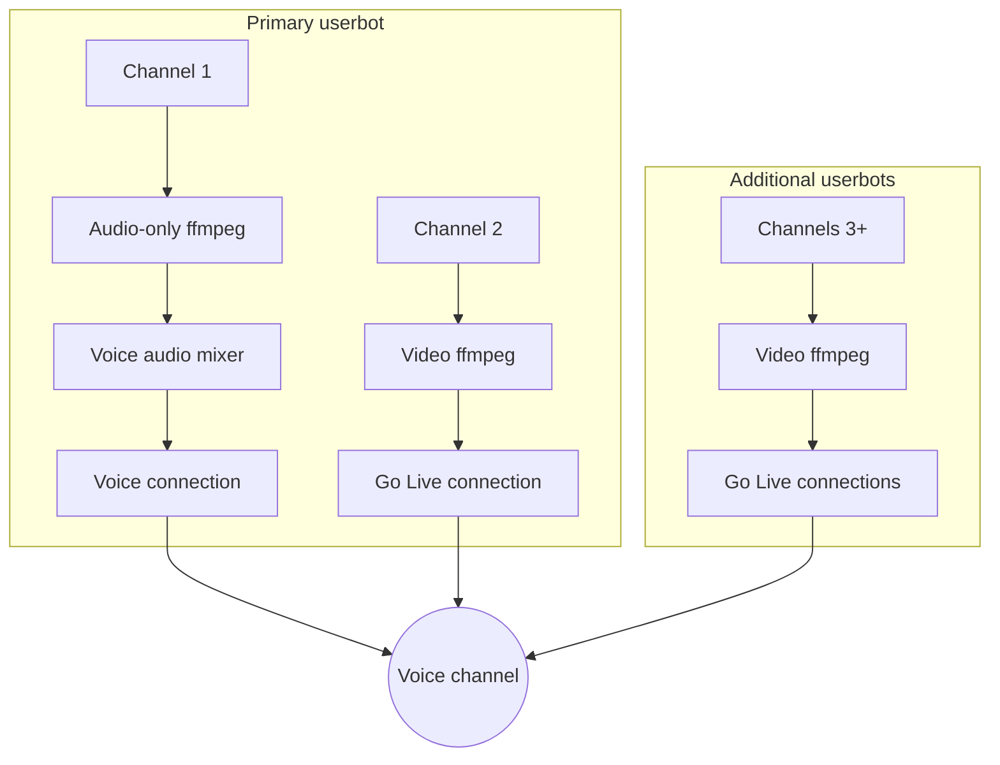

Streambot shares one userbot between microphone audio and Go Live video, with independent playback
slots inside each Discord voice channel.

A Discord account joins one voice channel at a time. Its ordinary voice connection can carry
microphone audio while a separate Go Live connection carries a film and its soundtrack. Sharing
that account saves scarce pool capacity without combining the two playback clocks or queues.
The ownership boundary lives in
[`SessionManager`](https://github.com/shepherdjerred/monorepo/blob/main/packages/streambot/src/session/session-manager.ts).

## Why channels are numbered

The number identifies a playback slot, rather than a Discord voice channel. Channel 1 carries mic
audio, channel 2 carries Go Live on the same account, and higher numbers lease additional accounts.
Several films can therefore coexist in one voice channel, while only one media queue writes to
the mic. Every film keeps its own soundtrack.

Selection belongs to the speaker and their current voice channel. Changing focus consumes no
account and never starts playback. Explicit selection makes an ordinary YouTube request predictable:
channel 1 extracts audio; a video channel requires a picture. Transport follows the selected slot,
so a spoken “watch” cannot silently create a stream on another account. The command boundary is
[`PlaybackCommandService`](https://github.com/shepherdjerred/monorepo/blob/main/packages/streambot/src/commands/playback-command-service.ts).

A slot number remains stable while neighboring streams start or stop. Player cards also carry an
instance identity, preventing an old card from controlling a replacement playback in the same slot.
Each room has one assistant, which follows the primary account when available and otherwise an
active video account. Ownership transfers after the current reply drains.

## Why a room owns the account lease

Independent players own their clocks, seeking, volume, producer failures, and queues. The room owns
shared connections and account allocation. Stopping a film must leave concurrent mic audio connected;
a Go Live failure must not disconnect the ordinary voice connection.

An account remains unavailable to other voice channels until its final playback and assistant turn
release the lease. Manual moves transfer the account's slots together. Conflicting destination slots
stop the moved playback, preserving the playback already there. These rules are enforced by
[`SessionManager`](https://github.com/shepherdjerred/monorepo/blob/main/packages/streambot/src/session/session-manager.ts).

Recovery stores all room slots in one atomic snapshot. Original sources are resolved again on
restart, since signed media URLs expire. Audio and video restore independently while reacquiring a
shared primary account. Existing mixed queues retain their transport behavior until they finish,
which prevents a rollout change from reinterpreting queued requests.

## The problem with one transport

Every item used to take the same route: an ffmpeg pipeline encoding H.264 through VAAPI into a Go
Live stream, built by
[`prepareStream`](https://github.com/shepherdjerred/monorepo/blob/main/packages/discord-video-stream/src/media/newApi.ts). That is the right shape for a film and the wrong shape for a song.

A three-minute track paid for a full video encode and a second WebRTC connection to carry content
with no picture. It also consumed one of the
[pooled userbot accounts](https://github.com/shepherdjerred/monorepo/tree/main/packages/streambot/src/pool), which are scarce — the pool's size is
what bounds how many servers can listen at once.

## What each transport is

Discord exposes two ways for a user account to emit media, and they differ in what the client shows.

|               | Music                         | Video                                |
| ------------- | ----------------------------- | ------------------------------------ |
| Connection    | the ordinary voice connection | a separate Go Live connection        |
| Speaking flag | `1`, microphone               | `2`, soundshare                      |
| Client shows  | a green ring on the avatar    | a watchable stream tile              |
| ffmpeg        | audio only, `-vn`             | decode, scale, tonemap, H.264 encode |

The microphone semantics come free.
[`BaseMediaConnection`](https://github.com/shepherdjerred/monorepo/blob/main/packages/discord-video-stream/src/client/voice/BaseMediaConnection.ts)
sends speaking flag `1`, and only
[`StreamConnection`](https://github.com/shepherdjerred/monorepo/blob/main/packages/discord-video-stream/src/client/voice/StreamConnection.ts)
overrides it to `2`, so routing through the voice connection is already what a person talking
sounds like to every client in the channel.

```mermaid
flowchart TB
  accTitle: Streambot playback transports
  accDescr: Channels 1 and 2 share one userbot. Channel 1 sends microphone audio through its voice mixer while channel 2 sends video and its soundtrack over Go Live. Higher channels use additional userbots in the same voice channel.
  subgraph P[Primary userbot]
    S1[Channel 1] --> A[Audio-only ffmpeg]
    S2[Channel 2] --> V[Video ffmpeg]
    A --> M[Voice audio mixer]
    M --> VC[Voice connection]
    V --> GL[Go Live connection]
  end
  subgraph H[Additional userbots]
    SN[Channels 3+] --> VH[Video ffmpeg]
    VH --> GH[Go Live connections]
  end
  VC --> C((Voice channel))
  GL --> C
  GH --> C
```

## Why one component owns the outbound audio

The voice connection carries a single RTP timestamp sequence, one packetizer and one SSRC, all
owned by
[`WebRtcConnWrapper`](https://github.com/shepherdjerred/monorepo/blob/main/packages/discord-video-stream/src/client/voice/WebRtcWrapper.ts). Two
writers on it do not mix — they interleave two Opus streams into noise.

That matters because the voice assistant already speaks over this connection. Music arriving as a
second writer would corrupt both, and neither writer would see an error.

So a single mixer owns every outbound frame. It forwards Opus untouched while nothing is
attenuating, and only decodes, applies gain and re-encodes while the assistant is speaking over a
track. An ESLint rule in
[`eslint.config.ts`](https://github.com/shepherdjerred/monorepo/blob/main/packages/streambot/eslint.config.ts)
rejects any other reference to `sendAudioFrame`, because the failure it prevents is silent.

## The failure mode worth knowing

An audio frame can be dropped before it reaches the wire. If no audio packetizer is installed,
[`sendAudioFrame`](https://github.com/shepherdjerred/monorepo/blob/main/packages/discord-video-stream/src/client/voice/WebRtcWrapper.ts) returns
`false` rather than raising.

The pacer keeps feeding frames at realtime and playback reports a normal end. A four-minute song
plays to complete silence and every layer above calls it a success.

Two things guard against it. The send path now reports whether a frame reached the transport, and a
watchdog fails the segment when frames stop landing while ffmpeg is still producing.

## Why probing still matters

Selection settles transport, but cannot create a video track that the source lacks.
[ffprobe](https://github.com/shepherdjerred/monorepo/blob/main/packages/streambot/src/sources/probe.ts)
validates the actual media. A video slot rejects audio-only media rather than quietly writing it to
the mic, and sports require a video slot. This preserves both the speaker's selection and the room's
single mic writer.

Legacy mixed queues still classify each item using metadata and probing. Their explicit video
requests also require a picture. The authoritative boundary remains
[`resolveSource`](https://github.com/shepherdjerred/monorepo/blob/main/packages/streambot/src/sources/resolve.ts).

## Related

- [Streambot voice assistant](/explanation/streambot-voice/) — the other consumer of this voice
  connection, and why its audio has to share the mixer.
