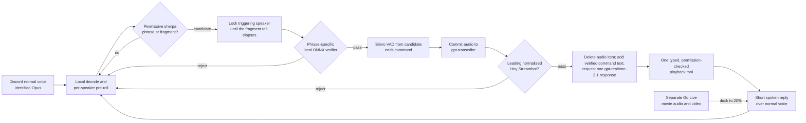

Streambot listens for voice commands only while a playback session exists. The cheap, continuous
part stays local: each pooled streamer account uses permissive sherpa fragments to nominate a
speaker, then a phrase-specific LiveKit/openWakeWord-compatible ONNX model verifies **Hey
Streambot** over the rolling audio. It opens no OpenAI connection until both local layers pass.

The whole cascade lives in
[`src/voice/`](https://github.com/shepherdjerred/monorepo/tree/6b8aa36e58656850415e2a040160ad96937e4a67/packages/streambot/src/voice),
with the per-session state machine in
[`audio-lifecycle.ts`](https://github.com/shepherdjerred/monorepo/blob/6b8aa36e58656850415e2a040160ad96937e4a67/packages/streambot/src/voice/audio-lifecycle.ts)
and the cloud turn in
[`realtime-agent.ts`](https://github.com/shepherdjerred/monorepo/blob/6b8aa36e58656850415e2a040160ad96937e4a67/packages/streambot/src/voice/realtime-agent.ts).

Endpointing cannot be purely packet-driven: Discord clients negotiate DTX and stop sending RTP at
the end of speech, so while a candidate is pending the lifecycle runs a wall-clock ticker and,
after a missing-packet gap, feeds synthetic silence through the same path real trailing silence
would take. A broken ticker degrades to the bounded max-utterance timeout, never to extra cloud
calls.

Exact variables, asset paths, and limits are in
[Streambot voice configuration](/reference/streambot-voice/).

## Trust boundaries

The design assumption is that the model is untrusted input, not an authority. Every boundary below
exists so that a compromised or merely confused model cannot exceed what the speaker could already
do with a slash command.

- Discord's SSRC mapping supplies the user identity; the model can never choose a user ID. Tools
  bind the detected speaker in
  [`voice-tools.ts`](https://github.com/shepherdjerred/monorepo/blob/6b8aa36e58656850415e2a040160ad96937e4a67/packages/streambot/src/voice/voice-tools.ts).
- `auto` searches the local library first, `local` cannot fall through, and `youtube` bypasses
  local matches. Voice tools reject URLs and expose no web search or general-purpose capability;
  the source rules live in
  [`playback-command-service.ts`](https://github.com/shepherdjerred/monorepo/blob/6b8aa36e58656850415e2a040160ad96937e4a67/packages/streambot/src/commands/playback-command-service.ts).
- Anyone may request media. Skip and seek retain requester-or-admin checks; stop remains admin-only.
  Voice reuses the same
  [permission predicates](https://github.com/shepherdjerred/monorepo/blob/6b8aa36e58656850415e2a040160ad96937e4a67/packages/streambot/src/discord/permissions.ts)
  as the slash commands rather than defining its own.
- One wake permits at most one mutating tool, enforced by `VoiceMutationGate`. Ambiguity produces a
  short retry request and no change.
- The utterance ends locally and both it and the whole cloud transaction are capped. Cloud
  verification is rate-limited per playback session by
  [`cloud-verification-rate-limiter.ts`](https://github.com/shepherdjerred/monorepo/blob/6b8aa36e58656850415e2a040160ad96937e4a67/packages/streambot/src/voice/cloud-verification-rate-limiter.ts),
  with a cooldown after a rejected transcript. All PCM and verifier features are erased after
  accepted, rejected, interrupted, and timed-out trials.

## Audio paths and privacy

The normal Discord voice connection is opt-in bidirectional for Streambot: incoming DAVE audio is
decrypted before the session receives it, and assistant Opus goes back through that same connection.
The movie continues on the independent Go Live connection. During a reply Streambot applies a
ducking multiplier, then restores the newest desired playback volume—even when volume changed while
it was speaking or the Realtime call failed. That restore-on-every-path behavior is the whole
reason ducking is a multiplier over the desired volume rather than a saved-and-replayed value; see
[`assistant-audio-output.ts`](https://github.com/shepherdjerred/monorepo/blob/6b8aa36e58656850415e2a040160ad96937e4a67/packages/streambot/src/streamer/assistant-audio-output.ts).

Model assets are pinned into the image and checksum-verified at build time by
[the Dockerfile's `voice-models` stage](https://github.com/shepherdjerred/monorepo/blob/6b8aa36e58656850415e2a040160ad96937e4a67/packages/streambot/Dockerfile).
Voice-enabled startup fails if the dedicated OpenAI key, KWS model, phrase-verifier
manifest/checksums, ONNX runtime, or Silero VAD model is invalid —
[`local-models.ts`](https://github.com/shepherdjerred/monorepo/blob/6b8aa36e58656850415e2a040160ad96937e4a67/packages/streambot/src/voice/local-models.ts)
treats every one of those as fatal rather than degrading to a weaker gate.

Each locally verified candidate is transcribed ephemerally with no prompt naming Streambot. A
local false accept therefore transmits the ~2 s pre-roll plus the utterance to the transcription
endpoint before the transcript gate rejects it and the turn closes. Queue and now-playing tool
results sent to OpenAI are requester-anonymous: no Discord user IDs leave the process. A
rejected prefix closes silently before `response.create`; an accepted prefix replaces the committed
audio item with command-only text. SDK audio history and tracing are disabled. Metrics contain only
bounded stage outcomes, usage, concurrency, and latency—never speakers, transcripts, or media
queries. The OpenAI project should use zero-data retention when that control is available.

## Launch posture

Production ships with `VOICE_ASSISTANT_ENABLED=true`; the flag is the single GitOps rollback knob
and there is no guild allowlist. The bar for shipping is correctness and boundedness, not wake-word
perfection, because the failure modes are asymmetric:

- A **missed wake** costs a repeat of "Hey Streambot". Recall on real recordings is imperfect
  (the packaged sherpa matcher recognized 8/11 cafe-noise recordings in the last live diagnostic).
- A **local false accept** costs one rate-limited transcription of ~2 s of pre-roll plus the
  utterance, which the strict transcript gate then rejects — never an action, never a spoken reply
  from the Realtime model. Per session that is bounded to a burst of two and five per minute, under
  the spend ceiling on the OpenAI project key.
- A **wrong action** requires the transcript to begin with the normalized wake phrase and the
  model to pick a permission-checked tool — the same authority the speaker already has via slash.

What must pass before merge is the deterministic suite (the full turn against a fake Realtime
transport, the lifecycle including DTX endpointing, corpus integrity) and the image's two-runtime
recognition smoke. Wake quality is **measured, not gated**: the operator-run corpus evaluation
([`corpus-evaluator.ts`](https://github.com/shepherdjerred/monorepo/blob/6b8aa36e58656850415e2a040160ad96937e4a67/packages/streambot/src/voice/corpus-evaluator.ts))
writes date-stamped reports to `packages/streambot/voice-training/reports/`, and the live
two-account e2e matrix plus the three-speaker human holdout remain available as diagnostics.
After a deploy, the Grafana voice panels (wake candidates, cloud verifications, failures, duck
transitions) are the observation surface; the emergency rollback is the kill switch back to
`false`.

The full phrase-verifier recipe and operator procedure live in
[`packages/streambot/voice-training/`](https://github.com/shepherdjerred/monorepo/tree/6b8aa36e58656850415e2a040160ad96937e4a67/packages/streambot/voice-training).
Packaging requires the minimum training counts, the complete ACAV100M general-speech artifact, and
a generated positive smoke WAV. Both local runtimes must accept that checksum-pinned smoke sample;
successfully loading an ONNX graph is insufficient.

The production image requires both sherpa runtimes and the in-process phrase-verifier graph to
complete inference as the deployment user; merely opening model files is not a successful smoke.
Corpus evaluation is deliberately not a build step: it is a multi-hour acceptance measurement an
operator runs inside the built image, with the report committed to
`packages/streambot/voice-training/reports/`. None of the 400 corpus clips ship at runtime. The
emergency rollback is the same global kill switch set back to `false`.

## Related

- [Run the Streambot voice probe](/how-to/run-the-streambot-voice-probe/) — exercise the cascade from a macOS console
- [Streambot voice configuration](/reference/streambot-voice/) — variables, model assets, and fixed limits
